# How To Backtest a Strategy?

> Source: https://fxcodebase.com/code/viewtopic.php?f=31&t=3036  
> Forum: 31 · Topic 3036 · 7 post(s)

---

## How To Backtest a Strategy?

**Nikolay.Gekht** · Wed Dec 29, 2010 2:38 pm

Upd: See also how to backtest the strategy and optimize the strategy parameters using Indicore SDK 2.0 on FXCodebase Wiki:
[http://fxcodebase.com/wiki/index.php/Op ... by_Step%29](https://fxcodebase.com/wiki/index.php/Optimizing_Strategy_Parameters_%28Step_by_Step%29)

**How to Use Backtesting?**

Notice: Hypothetical or simulated performance results have certain limitations. Unlike an actual performance record, simulated results do not represent actual trading. Also, since the trades have not been executed, the results may have under-or-overcompensated for the impact, if any, of certain market factors, such as lack of liquidity. Simulated trading programs in general are also subject to the fact that they are designed with the benefit of hindsight. No representation is being made that any account will or is likely to achieve profit or losses similar to those shown.

Notice: We strongly recommend to use 1.09.101210 or later version of the Trading Station for strategies and backtests.

Backtesting is an execution of a strategy or signal on **historical data**. So, you are “pretending” that historical prices are happening “right now” and looking at how the strategy would work if the market would be as it had already been. So, to backtest you have to choose the strategy you want to look at and the historical range you want to test your strategy on. Usually it's interesting to backtest a strategy over a long period of time, such as months and sometimes years.

---

## A Bit of Theory

**Nikolay.Gekht** · Wed Dec 29, 2010 2:39 pm

**A Bit of Theory**
First, we have to plunge a little into the theory on how the backtesting works. ([click here to skip theory](https://fxcodebase.com/code/viewtopic.php?f=31&t=3036&p=7065#p7065)) The real market is continuously changing. Each change of the price is called “a tick” and there are thousands of ticks every hour on the market. So, to test the strategy on the “exact market” as it was, we would have to load millions of ticks for testing just on a couple of days. This is a huge amount of information to load and a lot of time to process every tick. Hopefully, for the most of strategies we don’t need to simulate every tick. A number of artificial ticks, which form exactly the same candle, is good enough in most cases. Moreover, if a strategy analyses completely built candles only (and many strategies work this way), only one tick which appears when a candle is completely formed (i.e. at the end of the candle) could be good enough.

So, the backtester simulates ticks using one of the algorithm HLC (to high, to then low, then to close) or LHC (to low, then to high, then to close).

 

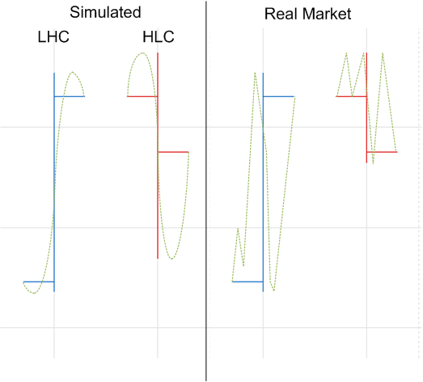

Of course, the number of ticks is pretty limited, only 10 ticks per each bar, while the typical 1 hour bar on the active market can contain up to 20,000 ticks.

Fortunately, there is an absolute negligible number of strategies which work on “pure” ticks because tick-based strategies are too “noisy”, i.e. can produce a lot of false signals. Most of strategies use statistical (aggregated) data, mostly candles, to eliminate this noise, so, since the simulated ticks produce exactly the same candles, the strategy works pretty similar on the simulated data.

The simulation rather affects conditional orders. Look at the left candle in the example above. If we had sell stop and sell limit orders both inside the candle range, in the simulation the stop order would be filled first because the simulator shows downward movement first, while on the actual market the limit order would be filled first, because the actual market moved upward inside this candle. However, it is statistically proved that the candles rather follow HLC for descending candles and LHC for ascending candles, so, the market will move rather using this pattern than in other way. However, even exact market simulation can never guarantee that further market will move in the same way even if the same candle will appear again.

---

## Let’s Get Back to Practice. Configuring Backtester

**Nikolay.Gekht** · Wed Dec 29, 2010 2:42 pm

**Start New Backtest Session**

To start a new backtest session, please go to Marketscope, and then click on "Backtest Strategy" command in "Alerts and Trading Automation" menu.

Please note that the command is also availble when you are logged out. To be able to backtest a strategy in this case, you should have the market data loaded and stored on your computer. You have the data if you backtested strategies earlier since the data are saved automatically. Note that only previously saved data (per symbol and time interval) can be used when you are logged out.

 

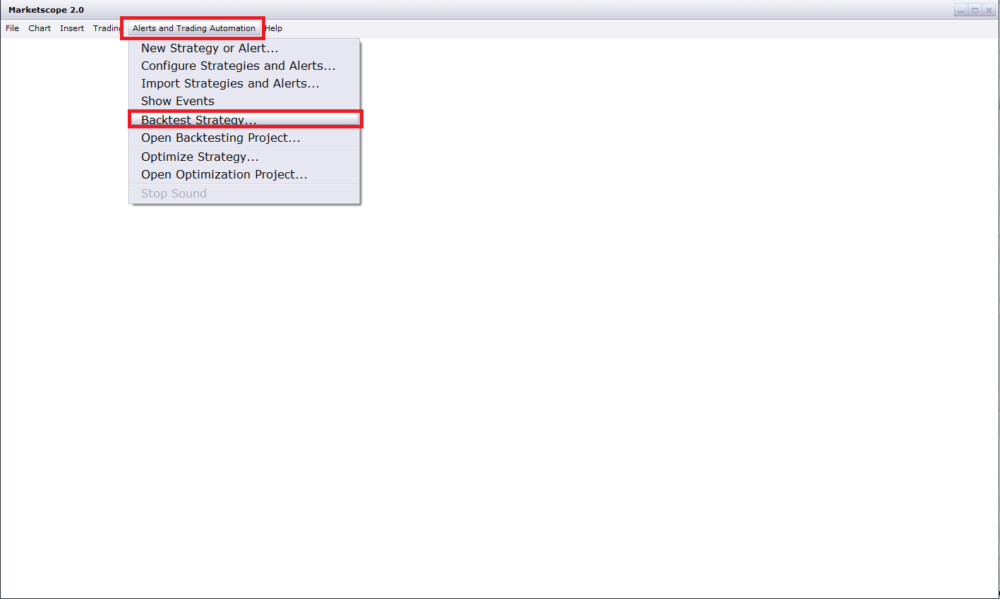

**Choosing Strategy**

The backtester window will be promptly opened and a new backtester session wizard is started. On the first page you can choose a strategy or an alert to backtest. You can use a Find field above the strategy list to filter the strategies. Entry any part of the strategy name, identifier or description into the filter and only the strategy (alert) which contains the entered text will be shown.

When a strategy (an alert) is selected, the next button becomes active.

Let's choose the Moving Average Advisor, the strategy which is probably most cited in trading books. (To read how the Moving Average Advisor works please read [Simple Moving Average (MVA, SMA) article](https://fxcodebase.com/wiki/index.php/Simple_Moving_Average_(MVA,_SMA))).

 

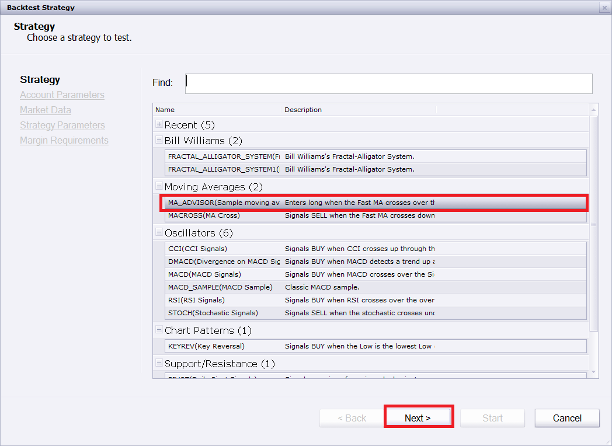

**Configuring Account**

At the next step you can configure the account for backtesting. You can choose:

- The account currency. The Gross Profit Loss of the trades, Margins, Equity and Balance will be calculated in chosen currency. By default, the currency of the first account of the current trading session is chosen.
- The initial balance on the account expressed in the account currency. By default, the typical demo account size (50,000) is chosen.
- The lot size for the account. Three options are available:
 o A micro account (1000 lot size)
 o A 10K (mini) account (10,000 lot size)
 o A 100K (standard) account (100,000 lot size)
 By default, the lot size of the first account of the current trading session is chosen.
- The set of the trading rules applied on the account. Three options are available:
 o FIFO (US account). In this case close orders (market close, stop and limit orders) are forbidden. The opposite open (or entry) order closes the the oldest existing positions first. Hedging (an ability to keep opposite position in the same time) is forbidden.
 o Non FIFO account without hedging. In this case, the close orders are allowed, the positions can be closed in any order. Hedging is forbidden.
 o Non FIFO account with hedging. In this case, the close orders are allowed, the positions can be closed in any order. Hedging is allowed.
 By default, the trading rules of the first account of the current trading session are chosen.
Fill the options as you wish or leave the default values and click Next.

 

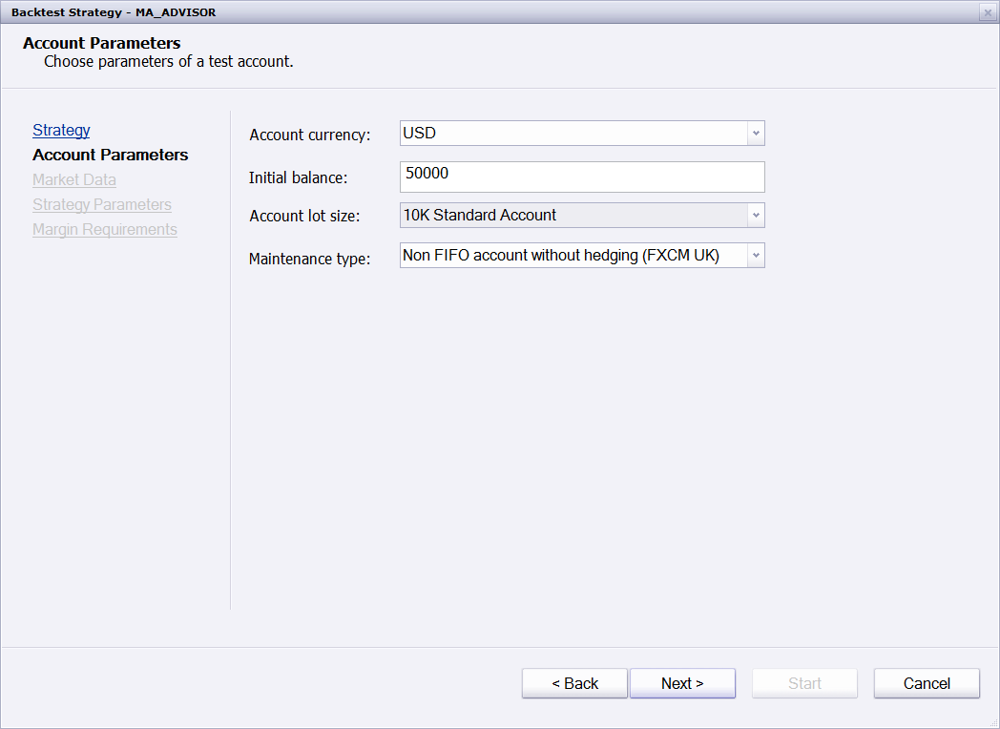

**Configuring Market Data**

At the next step you can configure the data and time range for backtesting and the instruments to test the chosen strategy (alert) for.

Use the date/time selectors to specify the date ranges. The backtesting always starts and ends at the trading day border (17:00 New York Time) of chosen dates.

You can also choose one or more instruments to back test. Choosing of the multiple instruments may be useful for testing strategies developed for Indicore 2.0 which allows multi-instrument strategies.

You can filter the instrument list using the Find field above the instrument list. Enter any part of the instrument name there and only the instruments which contains the entered text will be shown.

 

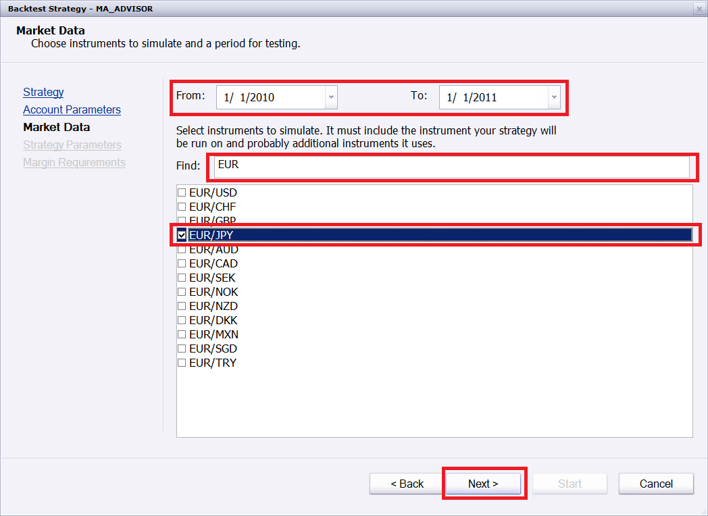

**Loading Market Data**

The backtester uses the quote manager server to load the 1-minute quote data for the chosen instrument in chosen period. The quote manager is much faster than the chart server and loading of the whole year of the 1-minute data for an instrument (approx 300K candles) usually takes less than 30 seconds.

You can load the data immediately or choose to load the data before starting the backtester. Let's load the data now.

 

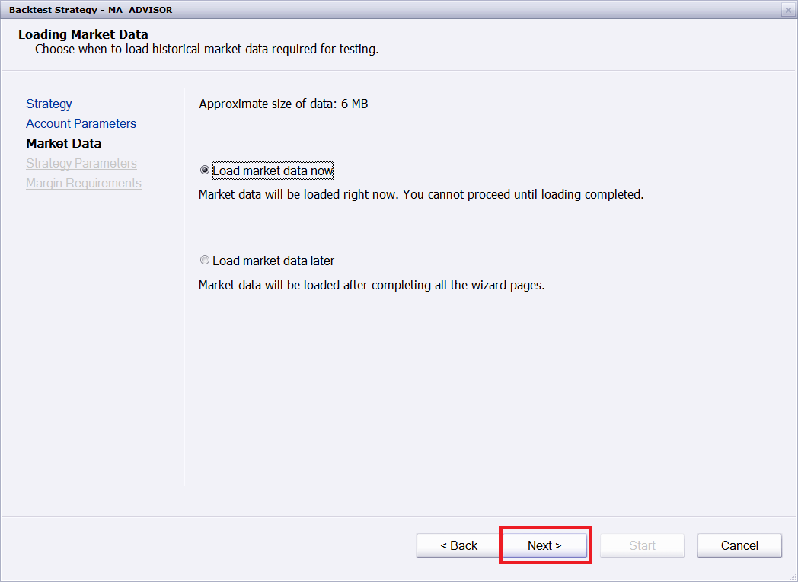

Click next and wait a bit while the data is loaded:

 

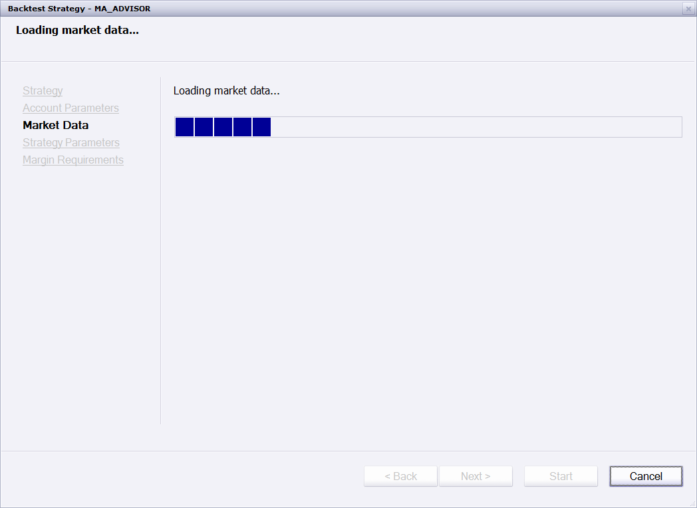

---

## Configuring Strategy

**Nikolay.Gekht** · Wed Dec 29, 2010 2:45 pm

**Configuring Strategy**

When data is loaded, the strategy parameters are shown. The page looks very close to the strategy configuration parameters shown when you starts the strategy on the real market. Just fill the parameters as you need.

The backtester turns "allow trading" parameter to "yes" and choses the proper account for backtesting automatically. Please pay attention that some old strategies do not mark the "Allow Trading" parameters properly, you may need to allow them to trade manually. Looks trough the parameter list carefully and if there is such parameters turn it to "yes".

When parameters are configured - click next.

 

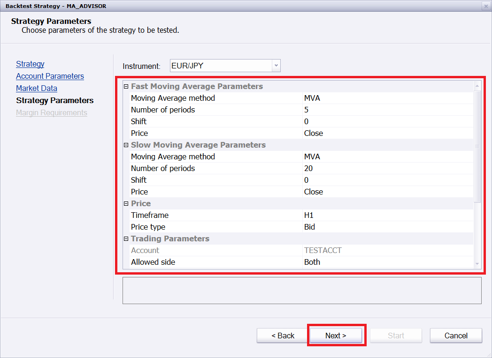

**MMR Information**

At the last page the MMR (maintenance margin requirement per 1 lot of the contract, expressed in the base account currency) will be shown.

Meditate a bit on MMR data to clear your mind before the next step and click "Start" to backtest.

 

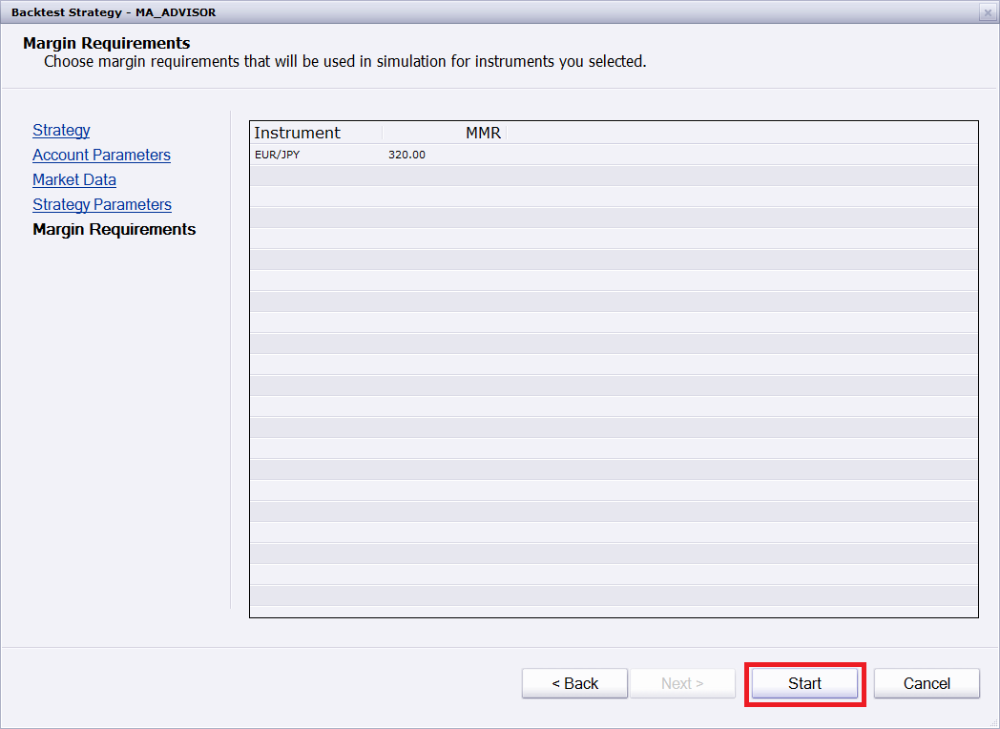

**Running Backtesting**

When backtester is started, the simulation of the market starts. During the simulation, the backtester simulates ticks for each 1-minute candle of chosen instrument(s), activates the chosen strategy (alerts) and simulates the behavior of the orders and trades.

The well-written strategy must be tested in 10 seconds - 1 minute on 1 year history on 3GHz PC. If it takes longer:

- If you are the developer of the strategy, please read [Strategy Optimization](https://fxcodebase.com/wiki/index.php/Strategy_Optimization) article and review the code you according the recommendations.
- If you are the user - ask developer to do the above mentioned step.

---

## Reading the Result

**Nikolay.Gekht** · Wed Dec 29, 2010 2:47 pm

**Reading the Result**

When (and if) backtesting is successfully finished, the following information appears in the backtester window:

- The chart displaying the whole price history. By default, the timeframe is chosen as the shortest of the timeframes chosen in the strategy parameters. However, you can change it to any time frame in range of 1 minute to 1 month. The tick chart cannot be shown. Also, 15,000 candle limitation does not apply to the backtester charts. For 3-years backtesting you will be able to see all 1,000,000 1-minutes candles on the chart.
- The equity and balance curves.
- The information area, which includes:
 o Tick log, where all simulated ticks and actions taken on ticks are listed
 o Statistics, which displays the overall strategy performance
 o Trace log, which can be used to check whether the strategy raised any exception or warnings

 

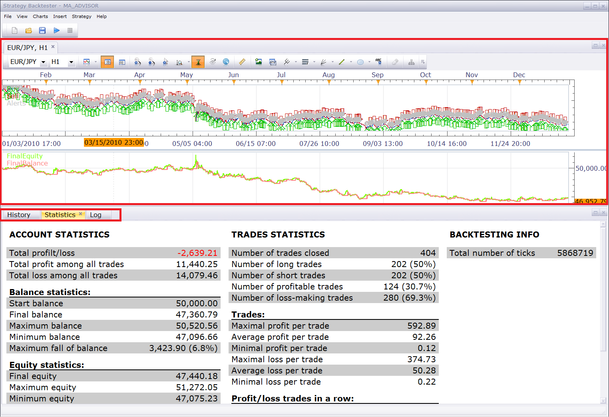

**The Chart**

The chart also displays all sells, buys and alerts executed by the strategy:

- The up arrow on the bar shows that at least one buy was made during the bar. The arrow points on average weighted price of all buys.
- The down arrow on the bar shows that at least one sell was made during the bar. The arrow points on average weighted price of all sells.
- The small circle with the number inside shows that at least one alert was raised during the bar.
To see details just move the mouse cursor over up arrow, down arrow or circle and tooltip with explanation will appear shortly.

 

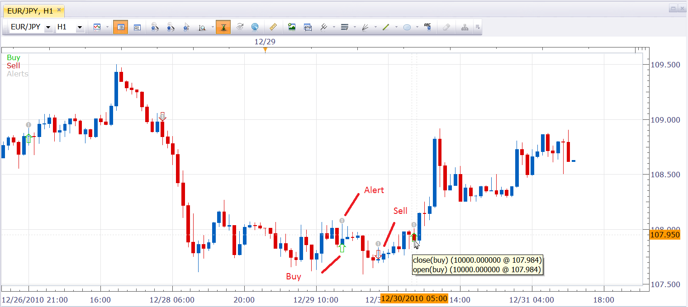

**The Overall Statistics**

The overall statistics is located below the chart, under "Statistics" tab.

 

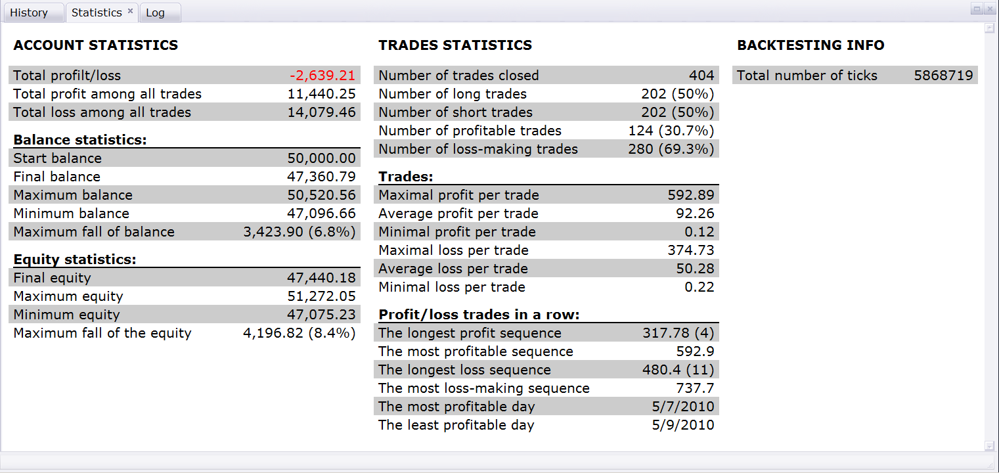

**The Log**

The log shows all the ticks simulated.

Over the log you can see three buttons:

- The first (filter) button filters the tick log, so only the ticks on which any action (sell, buy, order creation, alert) has been taken.
- The next two buttons (up and down arrows) let you search for the previous or the next next at which any action has been taken.
Hints:

- When you use next/previous tick button or double click at any tick in the log, the candle which contains this tick is selected on the chart.
- When you put the mouse cursor over the "Events" column of the tick log, the tooltip with the full list of the events appears.
- Also, you can right-click at any bar of the chart and then choose "Show in History" command. The first ticks which belongs to the chosen candle will be shown in the log.

 

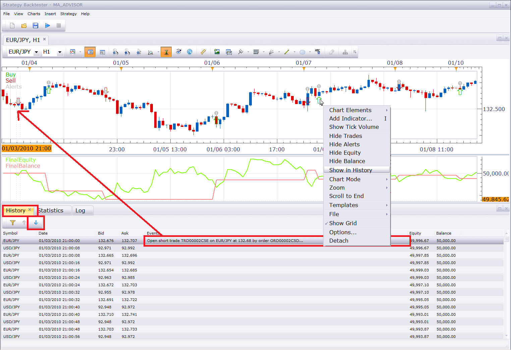

Note: You can see that EUR/JPY and USD/JPY ticks are simulated. The EUR/JPY is the instrument we chosen for backtesting. But we chosen the account is USD, so the market simulator could not calculate the Equity and Balance in the U.S. dollar unless it knows how to convert EUR or JPY into the dollars. This is why the additional, cross instrument is added into the market simulation.

---

## Other Useful Things

**Nikolay.Gekht** · Wed Dec 29, 2010 2:47 pm

**Other Useful Things**

- You can operate the chart almost in the same way as the regular chart. For example, you can apply the indicators (MVA(5) and MVA(20)) and check whether the strategy works properly.
- You can save the backtesting project using "File->Save" command for further usage. To start the backtesting from the save project use "Open Backtesting Project" command of the "Alerts and Trading Automation" menu in Marketscope.
- You can also restart the backtesting for the same strategy.

 

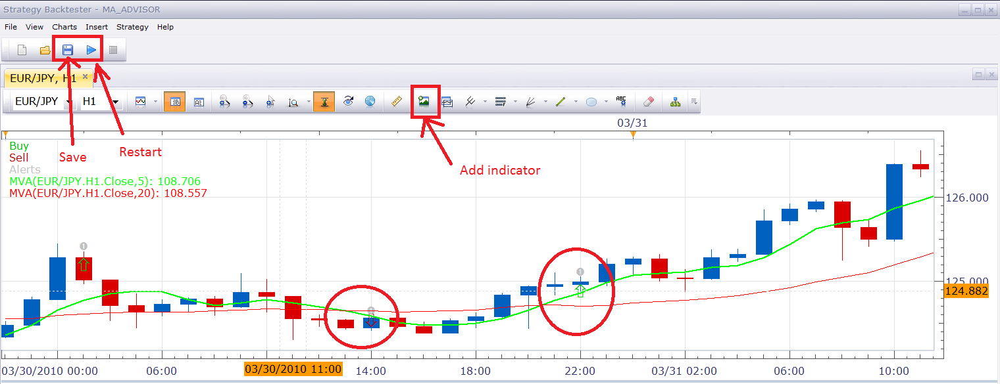

---

## Have a question?

**Nikolay.Gekht** · Wed Dec 29, 2010 2:50 pm

Have a question? Welcome to the article discussion here:
[viewtopic.php?f=25&t=3037](https://fxcodebase.com/code/viewtopic.php?f=25&t=3037)
