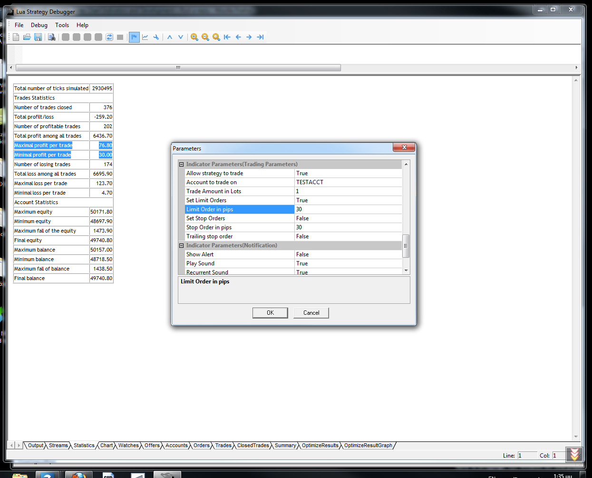
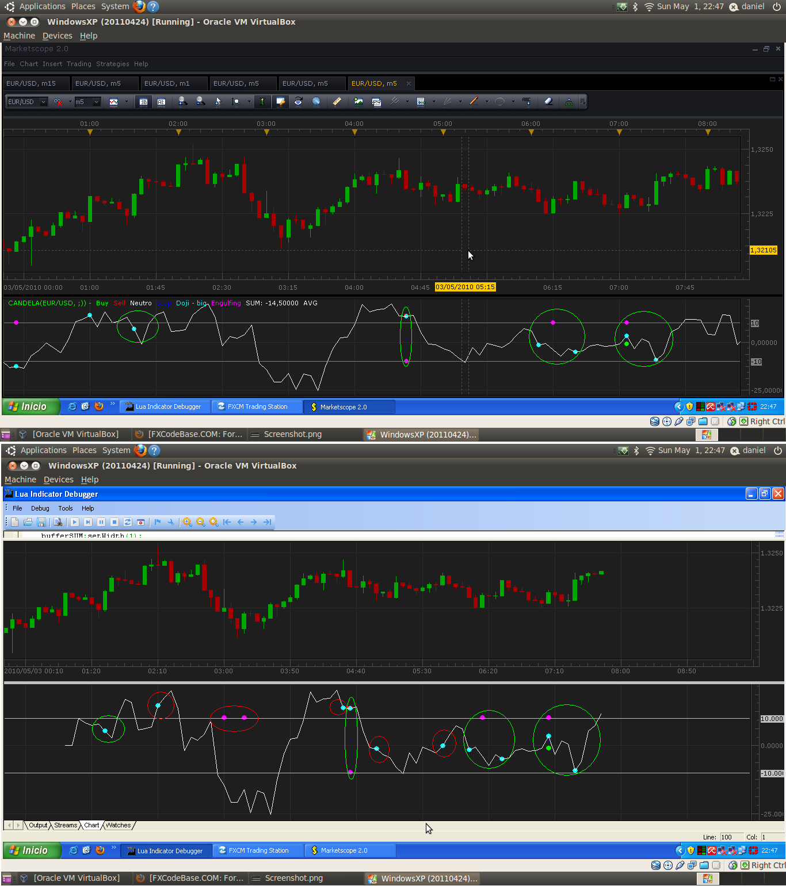

# How to Backtest and Optimize Parameters using SDK 2.0?

> Source: https://fxcodebase.com/code/viewtopic.php?f=31&t=3862  
> Forum: 31 · Topic 3862 · 18 post(s)

---

## Re: How to Backtest and Optimize Parameters using SDK 2.0?

**alepan72** · Wed Apr 20, 2011 11:07 am

Good work, as always!!!
The new SDK is simple and mutch better than older one.
I have all historical archives from
[http://fxcodebase.com/wiki/index.php/Co ... ce_Archive](https://fxcodebase.com/wiki/index.php/CodeBase_Price_Archive)

and I wonder if it's possible to have the price archive for 2009. I observed that between two years (2009 and 2010) there is big difference in the way that price go on.
So, if we can backtesting both years we draw useful conclusions on the strategy that we use.
Thanx in advance and best regards for your services!!!

---

## Re: How to Backtest and Optimize Parameters using SDK 2.0?

**mfoste1** · Fri Apr 22, 2011 1:31 pm

i think something might be wrong with indicoresdk download....i try to open strategy debugger to backtest and it keep saying "no one strategy can be found"

could someone please tell me what is wrong or what im doing incorrectly?

thanks

---

## Re: How to Backtest and Optimize Parameters using SDK 2.0?

**sunshine** · Sat Apr 23, 2011 2:06 am

> **alepan72 wrote:**
> Good work, as always!!!
> The new SDK is simple and mutch better than older one.
> I have all historical archives from
> [http://fxcodebase.com/wiki/index.php/Co ... ce_Archive](https://fxcodebase.com/wiki/index.php/CodeBase_Price_Archive)
>
> and I wonder if it's possible to have the price archive for 2009. I observed that between two years (2009 and 2010) there is big difference in the way that price go on.
> So, if we can backtesting both years we draw useful conclusions on the strategy that we use.
> Thanx in advance and best regards for your services!!!

Hi alepan72,

Thanks for your feedback.

I've asked fxcodebase developers to upload the historical data for 2009. I'll post link here once the data will be available.

---

## Re: How to Backtest and Optimize Parameters using SDK 2.0?

**sunshine** · Sat Apr 23, 2011 2:15 am

> **mfoste1 wrote:**
> i think something might be wrong with indicoresdk download....i try to open strategy debugger to backtest and it keep saying "no one strategy can be found"
>
> could someone please tell me what is wrong or what im doing incorrectly?
>
> thanks

Hi mfoste1,

You should copy the strategy you are going to optimize to the **strategies** folder. This folder is located in the folder where the Indicore SDK 2.0 is installed. By default the path is:

C:\Gehtsoft\IndicoreSDK\strategies

Just place your strategy to this folder and the error won't appear.

---

## Re: How to Backtest and Optimize Parameters using SDK 2.0?

**mfoste1** · Sat Apr 23, 2011 9:33 am

> **sunshine wrote:**
>
>
> > **mfoste1 wrote:**
> > i think something might be wrong with indicoresdk download....i try to open strategy debugger to backtest and it keep saying "no one strategy can be found"
> >
> > could someone please tell me what is wrong or what im doing incorrectly?
> >
> > thanks
>
>
>
> Hi mfoste1,
>
> You should copy the strategy you are going to optimize to the **strategies** folder. This folder is located in the folder where the Indicore SDK 2.0 is installed. By default the path is:
>
> C:\Gehtsoft\IndicoreSDK\strategies
>
> Just place your strategy to this folder and the error won't appear.

yea i tried this and its still giving me that same message

---

## Re: How to Backtest and Optimize Parameters using SDK 2.0?

**oceanus1** · Mon Apr 25, 2011 3:23 pm

I have come across data from forextester.com that is in a *.txt format and appears to be complete in 1m duration and from 2001 through 2011. Is there any way that this data can be converted to work in SDK?

Here is the first part of the data
<TICKER>,<DTYYYYMMDD>,<TIME>,<OPEN>,<HIGH>,<LOW>,<CLOSE>,<VOL>
EURUSD,20010102,230100,0.9507,0.9507,0.9507,0.9507,4
EURUSD,20010102,230200,0.9506,0.9506,0.9505,0.9505,4
EURUSD,20010102,230300,0.9505,0.9507,0.9505,0.9506,4
EURUSD,20010102,230400,0.9506,0.9506,0.9506,0.9506,4
EURUSD,20010102,230500,0.9506,0.9506,0.9506,0.9506,4
EURUSD,20010102,230600,0.9506,0.9506,0.9506,0.9506,4
EURUSD,20010102,230700,0.9505,0.9507,0.9505,0.9507,4
EURUSD,20010102,230800,0.9507,0.9507,0.9507,0.9507,4
EURUSD,20010102,230900,0.9507,0.9507,0.9507,0.9507,4
EURUSD,20010102,231000,0.9507,0.9507,0.9507,0.9507,4
EURUSD,20010102,231100,0.9507,0.9507,0.9506,0.9507,4
EURUSD,20010102,231200,0.9507,0.9507,0.9507,0.9507,4
EURUSD,20010102,231300,0.9507,0.9507,0.9507,0.9507,4
EURUSD,20010102,231400,0.9507,0.9507,0.9507,0.9507,4
EURUSD,20010102,231500,0.9507,0.9507,0.9507,0.9507,4

Thanks for the help in advance

---

## Re: How to Backtest and Optimize Parameters using SDK 2.0?

**vstrelnikov** · Mon Apr 25, 2011 6:04 pm

2009 archive uploaded at [http://fxcodebase.com/wiki/index.php/Co ... ce_Archive](https://fxcodebase.com/wiki/index.php/CodeBase_Price_Archive)

---

## Re: How to Backtest and Optimize Parameters using SDK 2.0?

**alepan72** · Tue Apr 26, 2011 3:07 am

Simple the best!!!
Thank you very much

---

## Re: How to Backtest and Optimize Parameters using SDK 2.0?

**alepan72** · Tue Apr 26, 2011 3:30 am

Hello again,
what means the numbers of "K" and "L" colunnes?
e.g.
DAT	02.01.2009 00:26:00	138.699	138.709	138.676	138.677	138.736	138.736	1.387	138.716**56	56**

---

## Re: How to Backtest and Optimize Parameters using SDK 2.0?

**sunshine** · Tue Apr 26, 2011 9:33 am

Hi,
The values mean Bid Volume and Ask Volume respectively.

---

## Re: How to Backtest and Optimize Parameters using SDK 2.0?

**alepan72** · Fri Apr 29, 2011 6:15 am

Hi all,
As you can see below (I tested MA_crossover on EURUSD 5m chart) I have check the limit profit to 30 pips. But in statistic area gave me the follow results
Maximal profit per trade 76.80
Minimal profit per trade 30.00
Where is th prob?

 

---

## Re: How to Backtest and Optimize Parameters using SDK 2.0?

**hockeydea** · Sun May 01, 2011 11:18 pm

Hello ...

I have a diference between data shown in SDK and Marketscope related to my custom indicator. My indicator shows dots on a posible buy or sell based on candlestick. The image below shows the diferences, green circles are ok and red circles are not.

 

It is anything in new core of indicoreV2.0 that explains this behavior?

Thanks in advance for the help

PD: Apologize for my english

---

## Re: How to Backtest and Optimize Parameters using SDK 2.0?

**hockeydea** · Mon May 02, 2011 11:03 am

Thank you Nikolay, links you posted helped a lot, i will update the indicator when candle closes

---

## Re: How to Backtest and Optimize Parameters using SDK 2.0?

**mcarr005** · Wed May 23, 2012 12:34 pm

Please update CodeBase Price Archive FXCM 1-Min Data

---

## Re: How to Backtest and Optimize Parameters using SDK 2.0?

**guangho** · Tue Jan 01, 2013 5:00 am

Happy New Year。。。
I'm very sorry, because I can not open a new post questions, so only here to ask questions.
I think through reference to existing positions opening to limit the next opening when the opening price. My strategy for the preparation of a problem, I would like to ask how to write.

 local trades = core.host:findTable("trades");
 local haveTrades = (trades:find('AccountID', Account) ~= nil)
 if (haveTrades) then
 local enum = trades:enumerator();
 while true do
 local row = enum:next();
 if row == nil then break end
 local OrderPL=row.PL;
 if row.AccountID == Account and row.OfferID == Offer then
 local MaxB=0;
 local MinS=100000000;
 if row.BS == 'B' then
 MaxB=math.max(MaxB,row.Open);
 elseif row.BS == 'S' then
 MinS=math.min(MinS,row.Open);
 end

My goal is to refer to the existing largest and smallest positions opening price opening price and assigned to " MaxB " and " MinS ". Ask how to modify?

Thanks a million！

---

## Re: How to Backtest and Optimize Parameters using SDK 2.0?

**Apprentice** · Tue Jan 01, 2013 6:32 am

If I understand you.
You want to store minimum and maximum price at the opening,
for all active positions.

---

## Re: How to Backtest and Optimize Parameters using SDK 2.0?

**guangho** · Tue Jan 01, 2013 11:54 am

> **Apprentice wrote:**
> If I understand you.
> You want to store minimum and maximum price at the opening,
> for all active positions.

HI Apprentice：
I just want to have the highest bid opening price and sell the lowest opening price assigned to " MaxB " and " MinS ", and then use the two numerical limit after the opening price not higher (or lower ) the standard.

Excuse me, how should I write this command? Thank you.

---

## Re: How to Backtest and Optimize Parameters using SDK 2.0?

**guangho** · Tue Jan 01, 2013 1:20 pm

> **Apprentice wrote:**
> If I understand you.
> You want to store minimum and maximum price at the opening,
> for all active positions.

Yes, just as what you said. That should be how to write this command? Please help me. Thank you！
