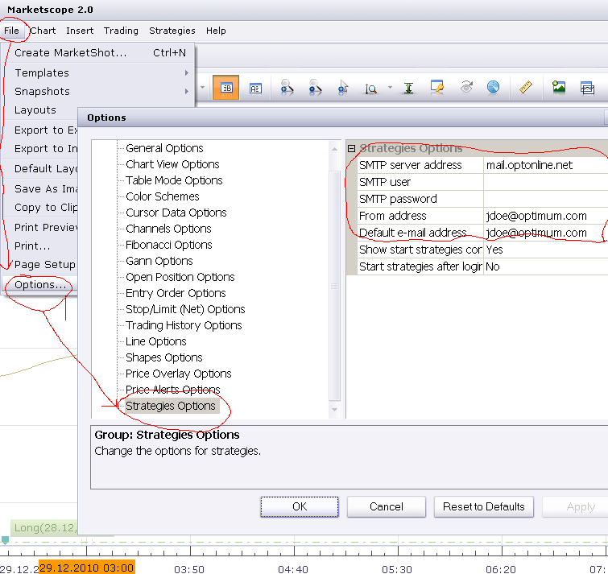
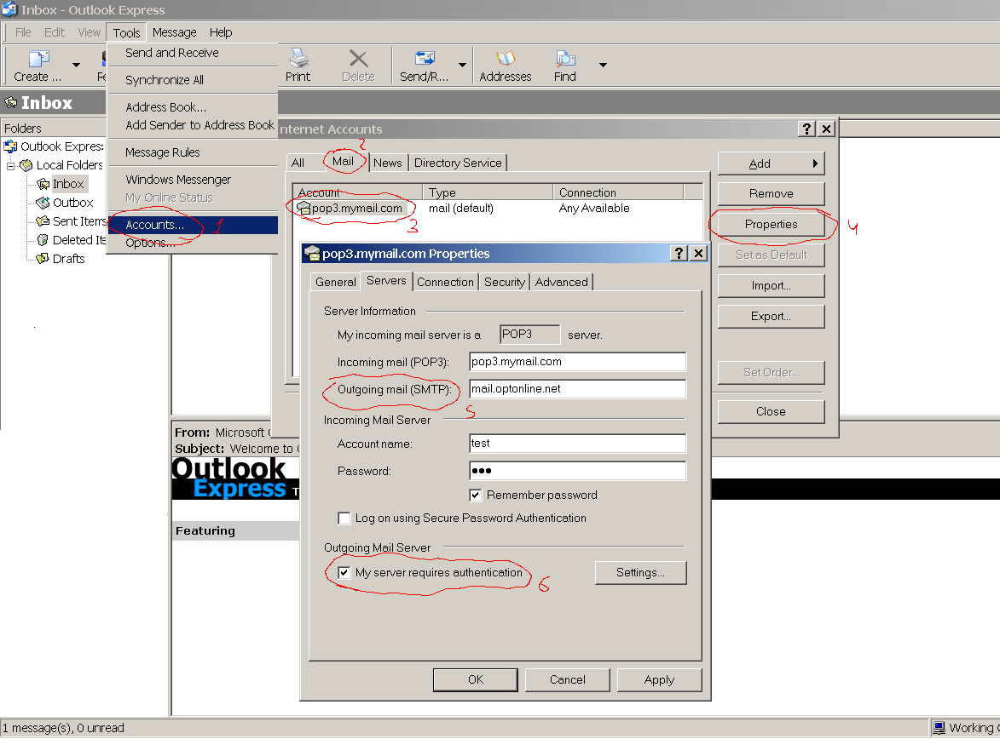

# How to configure send e-mail alert properly

> Source: https://fxcodebase.com/code/viewtopic.php?f=31&t=3034  
> Forum: 31 · Topic 3034 · 7 post(s)

---

## How to configure send e-mail alert properly

**Nikolay.Gekht** · Wed Dec 29, 2010 10:57 am

The email alerts are sent using SMTP (simple mail transfer protocol). You must have an email account in order to use the the e-mail alert functionality. So, before using "send email alert" in any strategy you must configure the SMTP setting properly.

To configure you must know:
1) The host name of the outgoing mail server.
2) The port of the outgoing mail server (if it is different from the standard STMP port: 25).
3) The user name and password (if the server requires authorization).

We will discuss how to find the proper mail server and its parameters below.

When the outgoing mail server and its parameters are know, please go to the Marketscope, then choose File->Options menu and then go to the "Strategies Option" option section:

 

1) Enter the name of the outgoing mail server into SMTP server address. If the specific port is required, enter port after a colon character, e.g. `myserver.mydomain.com:**465**`

2) If authorization is required - enter the user name and password into into SMTP user and SMTP password. If authorization is not required - just leave these options empty.

3) Enter the email address you want to send the emails from. Please note that some servers does not send emails if the "from" address does not registered on this server.

4) Enter the email address you want to send the emails to by default. This address will be used as a default value of the email parameters in the strategies. If you plan to send the email alerts to the same address all the time, just enter it here and you won't enter it every time when a new strategy or signal is started.

---

## How to get the SMTP settings?

**Nikolay.Gekht** · Wed Dec 29, 2010 11:06 am

The most of email providers have detailed instruction on how to setup off-line email clients, for example outlook. Just google "how to setup outlook your email provider", for example ["how to setup outlook bluehost"](https://www.google.com/#sclient=psy&hl=en&q=how+to+setup+outlook+bluehost+). [The first search result](http://helpdesk.bluehost.com/index.php/kb/article/000393) is exactly the information we are looking for.

These configuration instructions contains all the information you need to set up alerts in Trading Station as well: outgoing email server address and information whether authorization is required.

**Note**: Do not forget to read the next part and check first whether your Internet provider requires special SMTP server to be used.

Please find the SMTP setup parameters for popular web-based email services:

**Hotmail**
SMTP server address: smtp.live.com
SMTP user/SMTP password: Type your e-mail address registered in Hotmail and your e-mail password.

**Yahoo!**
SMTP server address: smtp.mail.yahoo.com
SMTP user/SMTP password: Type your e-mail address registered in Yahoo! and your e-mail password.

**Google Gmail**
SMTP server address: smtp.gmail.com
SMTP user/SMTP password: Type your e-mail address registered in Google Mail and e-mail password.

**MSN Mail**
SMTP server address: smtp.email.msn.com
SMTP user/SMTP password: Type your e-mail address registered in MSN Mail and e-mail password.

**Lycos mail**
SMTP server address: smtp.mail.lycos.com
SMTP user/SMTP password: Type your e-mail address registered in Lycos and e-mail password.

**AOL mail**
SMTP server address: smtp.aol.com
SMTP user/SMTP password: Type your e-mail address registered in AOL and e-mail password.

---

## How to get the SMTP settings? Part II

**Nikolay.Gekht** · Wed Dec 29, 2010 11:20 am

Pretty easy, yeah? Unfortunately, not so. Many cable or broadband Internet providers forbid using STMP servers except their own SMTP server, regardless which email provider you are actually using. So, it is good idea to check first whether your Internet provider requires any specific settings for off-line email clients. Just google "how to setup outlook your provider name", for example [how to setup outlook optimum](https://www.google.com/#sclient=psy&hl=en&q=how+to+setup+outlook+optimum).

The information provided in provider's knowledge base or custom support guides is usually contains the same information: the address of outgoing mail server and information whether authentication is required. Please, also note that provider's mail servers are usually works only if you are sending mail from inside of their network. For example, if you use optimum home and at&t wireless at road you have to change the email settings depending on the provider you are currently use. Not pretty convenient, huh?

Please find a configuration information for a number of popular Internet providers below:

**AT&T (Broadband, Dialup)**
SMTP server address: smtp.att.yahoo.com
SMTP user/SMTP password: Full AT&T e-mail address, including domain (e.g., [[email protected]](https://fxcodebase.com/cdn-cgi/l/email-protection#c0b4a5b3b480a1b4b4eeaea5b4), [[email protected]](https://fxcodebase.com/cdn-cgi/l/email-protection#66120315122604030a0a150913120e48080312)) and the password.

**AT&T (Wireless)**
SMTP server address: AT&T wireless customers should use "cwmx.com"
Former AT&T Wireless customers should use "smtp.mymmode.com"
SMTP user/SMTP password: leave it blank.

**Comcast**
SMTP server address: smtp.comcast.net
SMTP user/SMTP password: Type the username and the password the ISP has given you.

**Optimum Online**
SMTP server address: mail.optonline.net or mail.optimum.net
SMTP user/SMTP password: leave it blank.

**Quest Internet Service**
SMTP server address: pop.dnvr.qwest.net
SMTP user/SMTP password: Type the username and the password the ISP has given you.

**RoadRunner (Time Warner Cable)**
SMTP server address: smtp-server.sw.rr.com
SMTP user/SMTP password: Type the username and the password the ISP has given you.

**Verizon Internet Services**
SMTP server address: outgoing.verizon.net, outgoing.verizon.net:587 or smtpout.verizon.net:587
SMTP user/SMTP password: Type the username and the password the ISP has given you.

**Shaw Cablesystems GP**
SMTP server address: mail.shawcable.com
SMTP user/SMTP password: live it blank.

**Rogers Cable Communications Inc.**
SMTP server address: smtp.broadband.rogers.com
SMTP user/SMTP password: Type the username and the password the ISP has given you.

**Vidéotron Ltée**
SMTP server address: relais.videotron.ca
SMTP user/SMTP password: Live it blank

**Cogeco Cable**
SMTP server address: smtp.cogeco.ca
SMTP user/SMTP password: Type the username and the password the ISP has given you.

**AOL Broadband (TalkTalk)**
SMTP server address: smtp.aol.com
SMTP user/SMTP password: Type the username and the password the ISP has given you.

**Virgin Media**
SMTP server address: smtp.virginmedia.com
SMTP user/SMTP password: Type the username and the password the ISP has given you.

**BT Broadband**
SMTP server address: mail.btinternet.com
SMTP user/SMTP password: Type the username and the password the ISP has given you.

---

## Corporate emails and looking the settings in mail clients

**Nikolay.Gekht** · Wed Dec 29, 2010 11:24 am

**Corporate email restrictions**

Please, do not forget that, in addition to the Internet service provider restriction, many companies also restrict usage of the mail servers inside their networks. Often only the corporate mail server and corporate email can be used inside the company network. There is no common recommendation on how get the company's email settings. The best way is to ask the system administrator about the email settings.

**Looking for the settings in email applications**

Also, you can try to find the email settings in the email application you currently use (if any exist). As we said before, the Trading Station works as a regular email client, so the same configuration settings are used.

If you use Outlook express, you can find the email client settings here:

 

(click on image to enlarge)
1) Click "Tools->Accounts"
2) Click "Mail" tab
3) Choose the account you want to use in the Trading Station.
4) Click "Properties"
5) Find **Outgoing mail (SMTP)** server address. Use this value for SMTP server address option of the Trading Station.
6) Check whether "My Server Requires Registration" of "Outgoing Mail Server" section is checked.
If it is not checked - leave SMTP user and SMTP password options of the Trading Station blank.
If it is checked - click Settings button next to My Server Requires Registration checkbox and look for the user name and password there.

---

## Part III. How to send SMS?

**Nikolay.Gekht** · Mon Jan 03, 2011 9:07 am

Now, when the email alerts are configured and works, you can also send an alert to your cell phone using SMS. Almost all operators supports "SMS Gateways", a kind of email services you can send your email to and get the message to your cell phone.

The list of the SMS Gateways for many popular wireless provides can be found here: [Wiki: List of SMS gateways](https://en.wikipedia.org/wiki/List_of_SMS_gateways)

For example you want to send your email to AT&T Mobile phone (123) 456-7890. So, just use the following email address [[email protected]](https://fxcodebase.com/cdn-cgi/l/email-protection#a190939295949796999891e1d5d9d58fc0d5d58fcfc4d5)

---

## Have a question?

**Nikolay.Gekht** · Wed Jan 19, 2011 2:51 pm

Ask questions and discuss this topic here:
[http://fxcodebase.com/code/viewtopic.php?f=25&t=2232](https://fxcodebase.com/code/viewtopic.php?f=25&t=2232)

---

## Re: How to configure send e-mail alert properly

**sunshine** · Wed Sep 12, 2012 8:45 pm

Please read also:
[Email configurator: simplest way to configure e-mail alerts](https://fxcodebase.com/code/viewtopic.php?f=31&t=23349)
