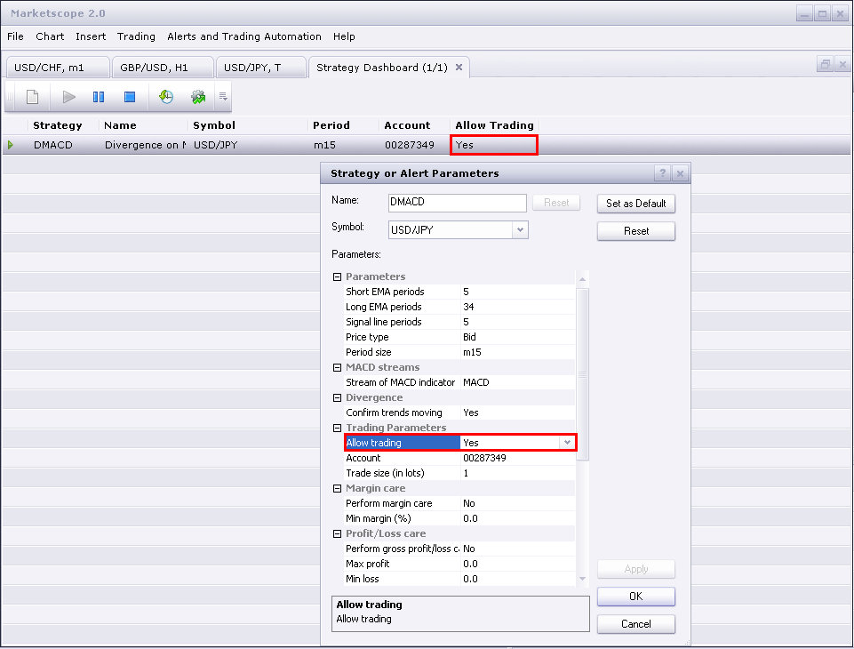

# How to Download and Install a Custom Signal/Strategy

> Source: https://fxcodebase.com/code/viewtopic.php?f=31&t=2310  
> Forum: 31 · Topic 2310 · 25 post(s)

---

## Re: How to Download and Install a Custom Signal/Strategy

**amgalanbaatar** · Wed Dec 01, 2010 7:45 am

Hello,
 I am a beginner in forex. I wanted to download your custom indicators and strategies,but somehow I couldn't. I tried the way you showed like "right click and then save target as". When right click on my mouse, there is no command "save target as or save" in the dropdown. It says like copy link, it is all about links not the saving files. Please, advise me on this.
 One more question, On metatrader 4, I could download some interesting scripts like stoploss, close order, take all profit, dayborder, reverse order and trailing stop. Is there any scripts like this for marketscope? The reason why I am asking is that I prefer marketscope platform and want to get used to it and also to learn it completely. Please also advise on this. If you have little bit time, I would like to know where to start. For example, indicators, scripts, strategies,analysis and EA. I really need a teacher or somebody who has experience. I know you are busy. Thank you for your time

---

## Re: How to Download and Install a Custom Signal/Strategy

**Apprentice** · Wed Dec 01, 2010 10:12 am

1. You do not need "save target as"
Simply click on Link.
Operating system will save the file in the default download folder.

2.On marketskope platform we do not have scripts.
But we have, or we can write, Strategies that can perform all of the above

3. Probably the best way to learn the basics of Lua scripting language.
Then the basics of SDK development package.

Unfortunately there is a video lecture on the subject.

Contacted me on my private mail, maybe I can help you start.

---

## Re: How to Download and Install a Custom Signal/Strategy

**7510109079** · Tue Oct 04, 2011 2:45 pm

I have back tested a strategy and would like to use it for automated trading. How do i do this?

I note that whilst using the back test, the "Account to Trade on" is TESTACC_ID.

Then when I go to 'Manage Strategies' pull down menu and add the strategy I want to trade on and look under its 'properties' my live acct no. is listed. However when the strategy is started, no auto entries occur and no alerts come up or are plotted on the chart.

what am i missing here??

thx

---

## Re: How to Download and Install a Custom Signal/Strategy

**sunshine** · Wed Oct 05, 2011 12:02 am

Please check the "Allow Trading" parameter in the strategy properties. Usually, it is set to No by default, so the strategy don't trade. To enable autotrading, you should set the parameter to Yes.
Please also tell me which strategy you use?

---

## Re: How to Download and Install a Custom Signal/Strategy

**khoainha** · Tue Nov 15, 2011 10:51 am

I can't install indicators and strategies.
I can download its to my computer (click the "Save" button, the signal/strategy is saved). But when i Install the signal/strategy , in "Results of loading" item Result : Error, Comment : Error in the file C:\ichimoku RSI strategy.lua : The second parameter must be a number.
Who can help me?

---

## Re: How to Download and Install a Custom Signal/Strategy

**sunshine** · Wed Nov 16, 2011 7:46 am

Ichimoku RSI Strategy can be used only in the new version of FX Trading Station /Marketscope. You can download it from FXCM site.

---

## Problems with the new upgrade

**7510109079** · Mon Nov 21, 2011 4:38 pm

quite a few of the downloaded strategies do not fully function since the upgrade was performed this Sunday. For example the CCI strategy will initiate only one buy at the very start of the backtest and never closes out this trade so others can be opened.
Also strangely in the log there appears to be a task to do with the GBP/EUR pair which i do not even work with or have open in any chart or specified in any backtest params

Anyone else having similar probs?

---

## Re: Problems with the new upgrade

**sunshine** · Tue Nov 22, 2011 6:06 am

> **7510109079 wrote:**
> quite a few of the downloaded strategies do not fully function since the upgrade was performed this Sunday. For example the CCI strategy will initiate only one buy at the very start of the backtest and never closes out this trade so others can be opened.

I've backtested the [CCI strategy](https://fxcodebase.com/code/viewtopic.php?f=31&t=2202&hilit=cci+strategy#p4579) and I have no such an issue. I have a lot of trades created.
In statistics, number of trades closed: 28 (for the last month, TF = H1). Please tell me which parameters you used.

> **7510109079 wrote:**
> Also strangely in the log there appears to be a task to do with the GBP/EUR pair which i do not even work with or have open in any chart or specified in any backtest params

The reason this pair is displayed in the log is that it is required for cross calculations.
For example, you backtest on EUR/USD but your account is in GBP. In this case Backtester needs data for GBP/USD and will load it automatically.

---

## Re: How to Download and Install a Custom Signal/Strategy

**learner** · Tue Jan 10, 2012 2:53 pm

Hello,
Can anyone tell me...
Are strategies only active when my computer is logged on to the trading site?
The reason I ask is that I have back tested the DMACD strategy and it makes 5 or 6 trades a day, but when I activated it on my demo account it did nothing for the whole day.
Sorry if I'm being a bit silly.

---

## Re: How to Download and Install a Custom Signal/Strategy

**sunshine** · Wed Jan 11, 2012 12:14 am

Thank you for your post. Welcome to the forum community!

> Are strategies only active when my computer is logged on to the trading site?

Yes. When you are logged out, your strategies are inactive.

> The reason I ask is that I have back tested the DMACD strategy and it makes 5 or 6 trades a day, but when I activated it on my demo account it did nothing for the whole day.

Please make sure that you have the Allow Trading parameter set to "Yes":

 

---

## Re: How to Download and Install a Custom Signal/Strategy

**Ricksan** · Thu Jan 12, 2012 11:18 am

Hi all, can any tell me how to change a fxd back to lua?

---

## Re: How to Download and Install a Custom Signal/Strategy

**learner** · Thu Jan 12, 2012 5:19 pm

Thanks for your reply sunshine.
I did have the allow to trade set to yes, but i wasn't logged on

Also, is there a way of setting strategies to only open one position at a time, ie. not to open another until the current one has closed?
I'm experimenting with DMACD at present, but I would like to know this for strategies generally, as well as this one.
If not, can this be progammed in?

---

## Re: How to Download and Install a Custom Signal/Strategy

**Apprentice** · Tue Jan 24, 2012 3:41 am

This depends on the strategy to strategy.
For some time I use this functionality in my new strategies.
If you use some of the old strategys, written by other authors, ther is possible that they do not have it.
But they can be added on a case by case basis.

---

## How to create custom strategy

**VijayanAshokan** · Fri Jul 27, 2012 2:13 am

I am Vijayan and new to here can any one help me ,how to create a custom strategy that trade automatically when my condition is met,give me simple example.

Thanks

---

## Re: How to Download and Install a Custom Signal/Strategy

**Ekaterina** · Mon Jul 30, 2012 1:09 am

Hi Vijayan,

Please read the article that describes the simple strategy creation: [Moving Average Cross.](https://fxcodebase.com/wiki/index.php/Simple_Strategy_-_Moving_Average_Cross)
And I think this section will also be useful for you: [Indicore Step-By-Step Instructions](https://fxcodebase.com/wiki/index.php/Category:Indicore_Step-By-Step_Instructions).

Best regards,
Ekaterina

---

## Re: How to Download and Install a Custom Signal/Strategy

**VijayanAshokan** · Tue Jul 31, 2012 9:37 pm

Thanks Ekaterina

Vijayan A

---

## Re: How to Download and Install a Custom Signal/Strategy

**guangho** · Fri May 17, 2013 1:51 am

Because the level is insufficient, cannot send the posts, so here to post questions, sorry...

I would like to ask a question: on the use of "period":

For example:
Source=ExtSubscribe(1,nil,instance.parameters.TF,true,"bar");
Indicator[1]=core.indicators:create("MVA",Source.close,5);
Short["A1"]=Indicator[1]:getStream(0);

I would like to ask:
 "Short[" A1 "][period]"、"Short[" A1 "]（period）"、"Short[" A1 "].period"、"Short[" A1 "]（period-1）"
 represent what meaning? If the application in Ma wear should use? To output numerical comparison and should use?

thank you！

---

## Re: How to Download and Install a Custom Signal/Strategy

**jonboysez** · Sun Jul 28, 2013 1:29 pm

Hi,
I'm trying to backtest the breakout strategy with GMMACD filter but for some reason its not letting me set a parameter to allow trading - the parameter is missing. (I have backtested the simple breakout strategy and that works fine -the trading parameter is there and can be set to yes). I have included the GMMA and GMMACD indicators on the chart but it won't show any trades when backtesting. Am I doing something wrong?

---

## Re: How to Download and Install a Custom Signal/Strategy

**cmpblsmith** · Tue Oct 22, 2013 3:04 am

Hi, I am currently running several strategies but they are not trading as they should. Some pairs have placed trades while most have not. Trading Station is running trading is allowed. I am wondering if there is anything I can do to make it more reliable. I was looking at changing the lua setting to just in time or other but I am not really sure what this means. If anyone is able to help or has any answers could you please let me know.

Thank you,
Campbell

---

## Re: How to Download and Install a Custom Signal/Strategy

**GBitaly** · Tue Feb 18, 2014 10:55 am

I have a problem to test some strategies
When I goes in "Backtest" or "Optimize" a strategy that I wan't to use (for ex. MA slope oscilator strategy) have automatically : "Account to trade on" TESTACCT and disappear the parameter Allow to trade
When I go in "new strategy or alert" appears "Allow strategy to trade " and in "Account to trade on" there is my number of account
Can you tell me why ???

thanks in advance
Guido

---

## Re: How to Download and Install a Custom Signal/Strategy

**Apprentice** · Wed Feb 19, 2014 4:08 am

If u use Test Account.
Allow strategy to trade is by default set to yes.
Also in this mode, u can not select any account number, and you use a simulated account.

---

## MA_Advisor Out of The Box - Bactest yes, on Demo account No

**AuthenticTrader** · Wed Nov 12, 2014 8:19 am

Backtesting Ma_Advisor works fine - 42 trades placed

Running same strategy, with same settings, account enabled for trading, no trades are triggered. Account number is correct, trading is enabled. On one chart indicators were all inserted, on another there weren't. Made no difference.

What am I a missing? ( Besides the 280 pips that I should have got when the cross triggered at 0500 this morning while I slept ! EUR/AUD )

Using Marketscope 2.0

Thank you,

Kevin

---

## Re: How to Download and Install a Custom Signal/Strategy

**AuthenticTrader** · Wed Nov 12, 2014 10:37 am

Update to my previous post(not yet approved) about strategy not executing. I changed the Timeframe setting to m1, just to see if It could trigger a sell signal.

It did on the EUR/AUD, BUT, it triggered it BEFORE the cross happened -= about 2 pips before. Price setting was set to BID. I also have it set like this on the GBP/AUD, and no order was triggered.

Thank you,

Kevin

---

## Re: How to Download and Install a Custom Signal/Strategy

**p_maltsev** · Mon Nov 17, 2014 9:24 am

Hi AuthenticTrader,

I have answered you in [this thread](https://fxcodebase.com/code/viewtopic.php?f=18&t=61428#p97107)

---

## Re: How to Download and Install a Custom Signal/Strategy

**a10games** · Wed Jun 07, 2017 11:44 pm

Know that your good knowledge in playing with all the pieces was very helpful. I notify that this is the first place where I find issues I've been searching for.
