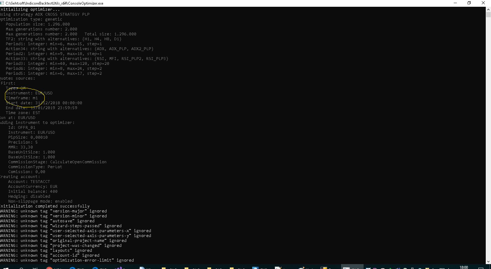

# How to Use Console Optimizer?

> Source: https://fxcodebase.com/code/viewtopic.php?f=52&t=38704  
> Forum: 31 · Topic 38704 · 40 post(s)

---

## How to Use Console Optimizer?

**sunshine** · Tue May 21, 2013 8:18 am

Console Optimizer is Windows 64 console application for optimizing strategies that are written in Lua and can be used in FX Trading Station II with Marketscope 2.0.

Console Optimizer can be used for optimization on large time intervals. While, in case of Marketscope 2.0 and Indicore SDK, the time interval for optimization is limited to 42 months (or even less if you optimize on more than one symbol or cross symbol is required for calculations), Console Optimizer allows optimizing on larger time intervals depending on the available RAM capacity.

Please find the download link and step-by-step instructions on how to start working with Console Optimizer here:
[http://fxcodebase.com/wiki/index.php/Console_Optimizer](https://fxcodebase.com/wiki/index.php/Console_Optimizer)

---

## Re: How to Use Console Optimizer?

**mstreck** · Wed May 29, 2013 2:26 pm

Thanks for this tool, very much needed and appreciated.

Is there a way to configure it for multi-core execution, similar to the 32-bit Version and MarketScope?

Cheers,
Martin

---

## Re: How to Use Console Optimizer?

**sunshine** · Thu May 30, 2013 1:36 am

Thanks for your feedback.

Console Optimizer uses settings that are specified in the Indicore project file. So, for example, if you specify 7 threads in your project file, Console Optimizer will use this setting.

---

## Re: How to Use Console Optimizer?

**mstreck** · Sun Jun 09, 2013 12:36 pm

Hi,

I have used the console optimiser for a couple of longer term optimisations. I have two request for adding a feature and one question for a problem I have:

1. Is it possible to add a sorting Option such that the output file ranks the passes according to the optimisation criteria used. For example, when optimising for final balance, that the output file shows the the ranked results from the best top down to the worst.
That way, I can look to get the best trade-off between the return and draw-down.

In terms of the draw-down, it would be really helpful (actually as well in the 32-bit backtester of MarketScope and SDK) to get the worst relative draw-down in percent over the entire time period tested. This should be easy to add for you and it saves all users from the pain to calculate it themselves.

2. I have tested the results of 32-bit against 64-bit optimiser. They are exactly the same except for one strategy (which I cannot send you the code for testing unfortunately), where the results really differ dramatically. Do you have any hint which lua programming aspect may cause an issue going from 32-bit to 64-bit (maybe some data type getting translated into an integer of different lengths?).

Thanks,
Martin

---

## Re: How to Use Console Optimizer?

**sunshine** · Mon Jun 10, 2013 8:17 am

Hi Martin,

> **mstreck wrote:**
> 1. Is it possible to add a sorting Option such that the output file ranks the passes according to the optimisation criteria used. For example, when optimising for final balance, that the output file shows the the ranked results from the best top down to the worst.
> That way, I can look to get the best trade-off between the return and draw-down.

Do you mean adding sorting to .html file with optimization results which is generated from .xml file? If so, it should be possible. I have forwarded your request to the developers. They will take a look.

> **mstreck wrote:**
> 2. I have tested the results of 32-bit against 64-bit optimiser. They are exactly the same except for one strategy (which I cannot send you the code for testing unfortunately), where the results really differ dramatically. Do you have any hint which lua programming aspect may cause an issue going from 32-bit to 64-bit (maybe some data type getting translated into an integer of different lengths?).

Unfortunately, we have failed to reproduce the issue.
It would be great if you could provide some test sample which demonstrates the issue.

---

## Re: How to Use Console Optimizer?

**Kingpin** · Wed Jun 12, 2013 4:35 am

Big thanks for this program!!! Works pretty well.

For getting nearly (not exactly) the same results as marketscope I have to turn non-slippage mode off and use empty history.

How I get exactly the same results as marketscope?

But I miss the hyper threating support like marketscope has...

---

## Re: How to Use Console Optimizer?

**Kingpin** · Fri Jun 14, 2013 1:41 pm

I use a Core i7-2700K in my desktop and a Core i7 3520M in my laptop. The 2700K has 4 physical cores, the 3520M 2, both are using hyper threading. So they can handle 8 and 4 Threads. But only my laptop uses hyper threading with all 4 threads when I'm optimizing. The Desktops does only handle 4 threads. Which number of agents I have to choose for using hyper threading with all cores on my desktop? I'v choosen 8 agents at the moment. On my Laptop and my Desktop.

WBR

---

## Re: How to Use Console Optimizer?

**Kingpin** · Mon Jun 17, 2013 10:17 am

That's ridiculous. The 32bit SDK is running on 8 threads, the 64bit console optimizer only on 4 (same project and on my desktop Core i7 2700k). What's the reason for this?

How many threads and cores does the console optimizer support? Does it support dual- or multi-cpu-systems like dual-/quad-xeon-workstations?

Thx

---

## Re: How to Use Console Optimizer?

**mstreck** · Fri Jun 21, 2013 2:45 pm

Hi sunshine,

it looks like the difference was not present when the empty history was chosen in the Quote Manager. So this looks fine.

Have you had a chance to look at the sorting of the results, this could even be done in the batch file, I guess, in the conversion process to hmtl.
This would be very, very helpful for me, and also for other user I am pretty sure.

Thanks,
Martin

---

## Re: How to Use Console Optimizer?

**dtb71fxcm** · Sat Jun 22, 2013 10:26 pm

Kingpin,
Have you tried using Windows PowerShell (the x64 PowerShell)?
I run Console Optimizer in PowerShell and it uses all available threads... for me anyway

---

## Re: How to Use Console Optimizer?

**Kingpin** · Mon Jun 24, 2013 12:46 pm

dtb71fxcm:

I´ve tried PowerShell. The 64bit is using all 4 cores but NOT all 8 threads (Intel Hyper Threading). 32bit SDK is using all 8 threads...

Do you have a CPU with Hyper Threading?

---

## Re: How to Use Console Optimizer?

**Kingpin** · Thu Jun 27, 2013 4:54 am

I found another problem. The link on fxcodebase.com is for the old version of SDK (V2.1: [http://www.fxcodebase.com/documentation.php](http://www.fxcodebase.com/documentation.php)).

The link on fxcodebaseWIKI is the new one (V2.2: [http://fxcodebase.com/wiki/index.php/Wh ... re_SDK_2.2](https://fxcodebase.com/wiki/index.php/What%27s_New_in_Indicore_SDK_2.2)). Please adjust the link on FXCodebase.com

I´ve installed SDK V2.2, but now even this is working only on 4 cores/threads no more on 8 The 64bit SDK is also working only on 4 cores/threads like the old one.

Thx

---

## Re: How to Use Console Optimizer?

**sunshine** · Fri Jul 05, 2013 7:27 am

> **Kingpin wrote:**
> I found another problem. The link on fxcodebase.com is for the old version of SDK (V2.1: [http://www.fxcodebase.com/documentation.php](http://www.fxcodebase.com/documentation.php)).

Indicore SDK 2.2 currently is in the beta stage. The URL you specified is the link to the production version.

---

## Re: How to Use Console Optimizer?

**sunshine** · Fri Jul 05, 2013 7:27 am

The new version of Console Optimizer is released.
Changes:

- Increased time interval for optimization (27 years for one instrument);
- Ability to optimize on more than 3 instruments. Additional instruments can now be specified in the command line. For more information, see .chm help file.
- The fix of the issue with not using of all threads.
The download link is the same.

---

## Re: How to Use Console Optimizer?

**mstreck** · Thu Aug 22, 2013 7:02 am

Hi,

I would like to repeat my request to have a sorting added for ranking the Output results. Is this possible near-term?

Also, if you could finally add a relative draw-down percentage and Output the Maximum this would be great since this is my most important design Parameter for my risk Management.

In the 32-bit Versions for backtesting, a graph of relative draw-down would be most appreciated!

I know that these are a lot of requests, but they are really essential to work with automated strategy design.

Best regards,
Martin

---

## Re: How to Use Console Optimizer?

**Kingpin** · Thu Sep 12, 2013 5:45 am

I want msstreck´s requests (sorting results in the browser after output and max drawdown in percent) too.

It is possible to include an option for completely ignoring negative results for faster optimization and using less hardware resources like in MT4?

WBR

---

## Re: How to Use Console Optimizer?

**rrrix1** · Thu Sep 12, 2013 2:46 pm

Hi guys,

Attached is a zip with replacement .XSL file with a JQuery plugin .js file. The JQuery main plugin is pulled from Google CDN.

The new .XSL file automatically sorts results by the "RESULT" column.

The .js file is for dynamic sorting, just click the column header to switch sorting ascending/descending on that column.

Also, this .xsl only picks the top 500 results, and always ignores results where the final balance is less than the initial balance.

let me know if this helps or you want a change.

---

## Re: How to Use Console Optimizer?

**Kingpin** · Tue Sep 17, 2013 1:14 am

Thx rrrix1

How I have to install this?

---

## Re: How to Use Console Optimizer?

**rrrix1** · Thu Sep 19, 2013 2:15 pm

Unzip into the ConsoleOptimizer64 directory, and replace the existing .xslt file.

---

## Re: How to Use Console Optimizer?

**mstreck** · Fri Sep 27, 2013 1:41 am

Hi rrix1,

thank you for this tool. It makes the Analysis of the results really that much easier for me, and I am sure for others using the 64-bit optimiser as well!

Cheers,
Martin

---

## Re: How to Use Console Optimizer?

**Kingpin** · Sun Oct 13, 2013 6:35 am

There´s a big problem with the market data for SDK and Console Optimizer:
If I want to load the data I receive this error message:
" Loading market data failed. Details:
Instrument catalog file parsing failed. Parser met unexpected tag='timeframes' expected tag is 'symbol'

---

## Re: How to Use Console Optimizer?

**sunshine** · Mon Oct 14, 2013 6:06 am

Hi Kingpin,

The installation files have been updated. Please try to re-install SKD and Console Optimizer using the same download links:
[http://fxcodebase.com/bin/IndicoreSDK-2 ... -win64.exe](https://fxcodebase.com/bin/IndicoreSDK-2.2-beta/ConsoleOptimizer-win64.exe)
[http://fxcodebase.com/bin/IndicoreSDK-2 ... oreSDK.exe](https://fxcodebase.com/bin/IndicoreSDK-2.2-beta/IndicoreSDK.exe)

---

## Re: How to Use Console Optimizer?

**Kingpin** · Sun Feb 23, 2014 9:41 am

And again the same problem like at the last update:

Loading market data failed. Details:
Instrument catalog file parsing failed. Tag 'symbol' does not contain attribute 'start.....

---

## Re: How to Use Console Optimizer?

**Valeria** · Mon Feb 24, 2014 2:36 am

Hi Kingpin,

Please let me know whether the issue persists or not. It looks like there was the issue on the server side.

---

## Re: How to Use Console Optimizer?

**jetaro** · Fri Nov 25, 2016 2:57 pm

I don't think this works anymore. Is there a newer version available somewhere?

---

## Re: How to Use Console Optimizer?

**jetaro** · Sat Nov 26, 2016 10:39 am

Hi apprentice, is that your polite way of telling me to RTFM? lol

the only download I saw for the console was for the old version of the sdk 2.x.

Are you saying I can use the 2.x console on the newer marketscope? I wouldn't think that is possible.

---

## Re: How to Use Console Optimizer?

**Georgiy** · Tue Nov 29, 2016 8:31 am

Hello jetaro,

> the only download I saw for the console was for the old version of the sdk 2.x.

The release of the new version is planned on December 2016.

---

## Re: How to Use Console Optimizer?

**jetaro** · Tue Nov 29, 2016 8:48 am

that's great news, thanks Georgiy!

---

## Re: How to Use Console Optimizer?

**Kingpin** · Thu Jan 19, 2017 9:42 am

Which programm have you released in December 2016?

A new version of console optimizer / Indicore SDK3 or Indicore SKD2 or Marketscope?

---

## Re: How to Use Console Optimizer?

**Bradwell** · Tue Jan 24, 2017 6:45 am

Before start the optimization with Console Optimizer, you should create an optimization project file for your strategy in Indicore SDK. This file will be used as an input file for Console Optimizer.

---

## Re: How to Use Console Optimizer?

**Kingpin** · Wed Feb 08, 2017 10:05 am

I know this. Did this the last years in the SDK 2.0. But how do I create a optimization project file in the SDK 3.3.0? I can only create a backtesting project file

---

## Re: How to Use Console Optimizer?

**Konstantin.Toporov** · Thu Feb 09, 2017 11:21 am

Hello Kingpin

Indicore SDK 3.3.0 now includes Console Optimizer.
You can use an optimizer project file from FX Trading Station or create your own with a simplified human friendly format.
The details of the format are here:
[http://fxcodebase.com/bin/products/Indi ... mizer.html](https://fxcodebase.com/bin/products/IndicoreSDK/3.3.0/help/JS/web-content.html#Console_Optimizer.html)

Also Indicore SDK now contains a bunch of samples (including for Console Optimizer) and you can use them as templates for your own projects.

---

## Re: How to Use Console Optimizer?

**Konstantin.Toporov** · Thu Feb 09, 2017 11:26 am

Also I wrote an [article](https://fxcodebase.com/code/viewtopic.php?f=16&t=64424) about a useful application of Console Optimizer.
Feel free to ask any questions.

---

## Re: How to Use Console Optimizer?

**lavolpe** · Mon Dec 03, 2018 1:27 pm

I think there is a problem on the last consoleoptimizer (version 3).

changing values of genetic passes limit, the process continue processing all the combinations without stop.

for eaxmple:
<genetic-passes-limit value="100" />
<genetic-population-size value="100" />
<genetic-generations-limit value="5000" />

it process all 5000 combinations and not 100 as desired. I have tried to change all value setting population-size to 0 (like default) or generations-limit to 100 and so on, always with the same result... process don't stop.

I run it on windows 10 console as administrator. The same file works perfectly on trading station optimizer.
i can attach my opj file.

can you help me?

---

## Re: How to Use Console Optimizer?

**lavolpe** · Thu Dec 06, 2018 8:33 am

> **lavolpe wrote:**
> I think there is a problem on the last consoleoptimizer (version 3).
>
> changing values of genetic passes limit, the process continue processing all the combinations without stop.
>
> ...

Same problem using IndicoreBacktestUtils 32 and 64 bit version.
It's not yet supported?

---

## Re: How to Use Console Optimizer?

**PetroIV** · Tue Jan 08, 2019 12:31 am

> **lavolpe wrote:**
>
> I run it on windows 10 console as administrator. The same file works perfectly on trading station optimizer.
> i can attach my opj file.
>
> can you help me?

Hello, lavolpe
Yes, Please attach your opj file.

I launched the optimization for MA_ADVISOR(attached MA_ADVISOR.opj), for a lot of parameters. The number of combinations was more than 5000(see combinations_count.png ). The genetic algorithm performed about 150 passes. MA_ADVISOR.opj and combinations_count.png contains in MA_ADVISOR.zip

---

## Re: How to Use Console Optimizer?

**lavolpe** · Mon Jan 14, 2019 2:09 pm

Sorry in advance for english, i try to explain...

I noticed that the number of combinations is wrong only when less than 200 (or close). But now i don't care becouse i have a large number of combinations and 200 is far from my minimum value.

But i have another big problem... comparing result from consoleoptimizer and FXCM trading station (same obj file) and developing all the possible combinations (herefore with the same processing) i have totally different results.

Could it be possible that the trading station works on m5 as set on the obj in the TF1 parameter, and instead the consoleoptimizer use another timeframe (like m1 as default)?

just as additional information: I'm not using simplified process, so i haven't the <simplified-format value="1"/> line in my obj file for compatibility with trading station, and i have tried to set <default-period value="" /> with m5 but the process in this case breaks down.

can you help me? i attach my obj

thanks!

---

## Re: How to Use Console Optimizer?

**lavolpe** · Thu Feb 14, 2019 4:50 pm

> **sunshine wrote:**
> Console Optimizer is Windows 64 console application for optimizing strategies that are written in Lua and can be used in FX Trading Station II with Marketscope 2.0.
> Optimizer here:
> [http://fxcodebase.com/wiki/index.php/Console_Optimizer](https://fxcodebase.com/wiki/index.php/Console_Optimizer)

This is the result of my test:

same OPJ file executed with consoleoptimizer.exe (64bit version) and FXCM trading station.

result from consoleoptimizer with an initial balance of 400€ (as you can see in attached EURGBP_OPTIMIZER.zip file):

<14-02-2019 20:30:32> Pass 1 : 22 -> 439.58
<14-02-2019 20:30:35> Pass 2 : 20 -> 439.58
<14-02-2019 20:30:35> Pass 3 : 21 -> 439.58
<14-02-2019 20:30:35> Pass 4 : 19 -> 439.58
<14-02-2019 20:30:35> Pass 5 : 18 -> 439.58

result from trading station with an initial balance of 400€ (as you can see in attached EURGBP_FXCM.zip file):

<backtest-result pass-number="0" result="397.0321165" interrupted="false">
<backtest-result pass-number="1" result="397.0321165" interrupted="false">
<backtest-result pass-number="2" result="397.0321165" interrupted="false">
<backtest-result pass-number="3" result="397.0321165" interrupted="false">
<backtest-result pass-number="4" result="397.0321165" interrupted="false">

so with consoleoptimizer i have a profit (39.58€) and with trading station i have a loss (2.968€)
same custom indicators (files copied before in C:\Gehtsoft\IndicoreBacktestUtils_x64\indicators\custom folder to be sure), same strategy (copied in C:\Gehtsoft\IndicoreBacktestUtils_x64\strategies\custom folder).

---

## Re: How to Use Console Optimizer?

**Konstantin.Toporov** · Fri Feb 15, 2019 12:59 am

We will investigate this discrepancy.

---

## Re: How to Use Console Optimizer?

**sbancario** · Wed Aug 26, 2020 5:31 am

hi konstantin,
it's a really useful tool but I'm having problems with INDEX even with the latest version (ger30, us30, etc.).

are there still known problems? is there a working beta version to test?

thanks
