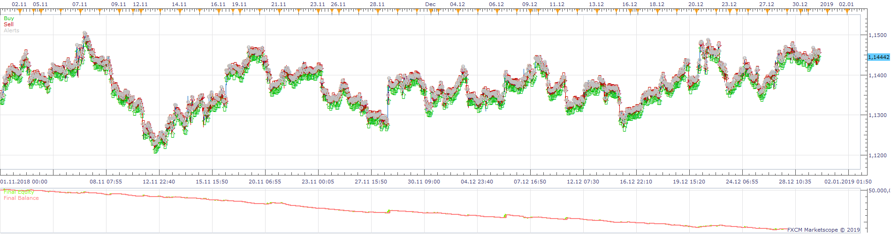
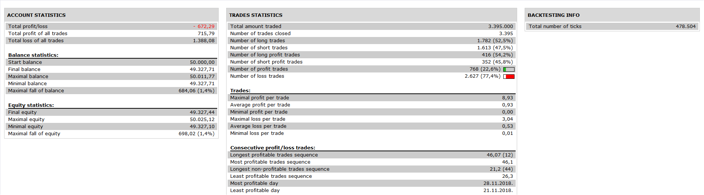

# Hull_and_Heiken_Ashi_Strategy

> Source: https://fxcodebase.com/code/viewtopic.php?f=31&t=69154  
> Forum: 31 · Topic 69154 · 6 post(s)

---

## Hull_and_Heiken_Ashi_Strategy

**Apprentice** · Fri Nov 22, 2019 8:09 am

 

Based on request.
[viewtopic.php?f=27&t=69150](https://fxcodebase.com/code/viewtopic.php?f=27&t=69150)

 [Hull_and_Heiken_Ashi_Strategy.lua](files/129894/Hull_and_Heiken_Ashi_Strategy.lua)

HMA
[viewtopic.php?f=17&t=1659](https://fxcodebase.com/code/viewtopic.php?f=17&t=1659)

---

## Re: Hull_and_Heiken_Ashi_Strategy

**mabus23** · Tue Nov 26, 2019 9:50 pm

hi apprentice, thankyou for this.

i'm not sure if we have the rules quite right, i started running it this morning and it took a long position on AUS200 on 30min chart when it should have taken a short (hull MA turned down)

---

## Re: Hull_and_Heiken_Ashi_Strategy

**mabus23** · Tue Nov 26, 2019 10:15 pm

here is the example

---

## Re: Hull_and_Heiken_Ashi_Strategy

**Apprentice** · Wed Nov 27, 2019 6:09 am

Your request is added to the development list.
Development reference 364.

---

## Re: Hull_and_Heiken_Ashi_Strategy

**Apprentice** · Wed Nov 27, 2019 8:46 am

[Hull_and_Heiken_Ashi_Strategy.lua](files/129969/Hull_and_Heiken_Ashi_Strategy.lua)

Added logging. You can turn on logging using the "Add log info to signals" parameter. The strategy will print all its decisions.

Let's just double-check.
Can you redefine Entry / Exit rules?

---

## Re: Hull_and_Heiken_Ashi_Strategy

**mabus23** · Thu Nov 28, 2019 7:27 am

thanks apprentice

rules:
go long when the hull ma slope increases, and Heiken Ashi candle is above the Hull

opposite for short trades

exit trades when the hull ma slope changes direction at close of candle
