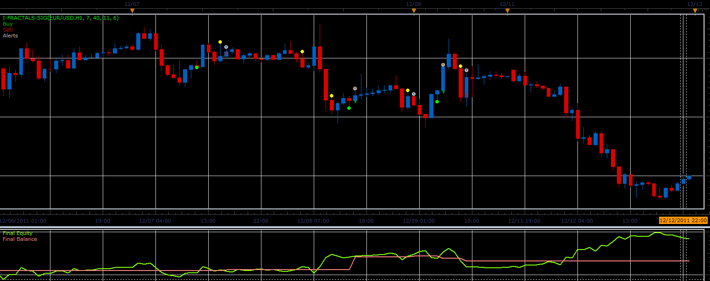

# i-Fractals-sig strategy

> Source: https://fxcodebase.com/code/viewtopic.php?f=31&t=10448  
> Forum: 31 · Topic 10448 · 2 post(s)

---

## i-Fractals-sig strategy

**Alexander.Gettinger** · Mon Dec 26, 2011 6:59 am

This strategy based on i-Fractals-sig indicator: [viewtopic.php?f=17&t=10396](https://fxcodebase.com/code/viewtopic.php?f=17&t=10396)

 

Download strategy:

 [i-Fractals-sig_Strategy.lua](files/21678/i-Fractals-sig_Strategy.lua)

For this strategy must be installed i-Fractals-sig indicator ([viewtopic.php?f=17&t=10396](https://fxcodebase.com/code/viewtopic.php?f=17&t=10396)).

The Strategy was revised and updated on November 21, 2018.

---

## Re: i-Fractals-sig strategy

**Apprentice** · Sun Dec 04, 2016 6:10 am

Bump up.
