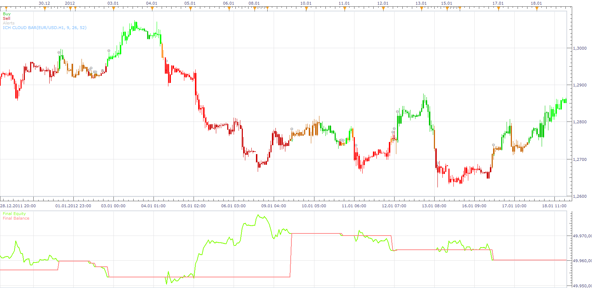

# ICH Strategy

> Source: https://fxcodebase.com/code/viewtopic.php?f=31&t=12319  
> Forum: 31 · Topic 12319 · 4 post(s)

---

## ICH Strategy

**Apprentice** · Fri Jan 27, 2012 1:03 pm

buying conditions :
1.SA > SB
2. price> max(SA, SB)

selling conditions:
1. SA<SB
2.price< min(SA, SB)

 [ICH Strategy.lua](files/24385/ICH%20Strategy.lua)

---

## Re: ICH Strategy

**superleo** · Sat Jan 28, 2012 4:42 am

sir,
this is not my idea. but it seems very good. it gives buy entry when price goes above the the cloud. and sell entry when price cross under cloud. if we correlate the signal with other parameters like ema , zigzag , and other time frames we surely get good results. thank you once again for this great strategy.

---

## Re: ICH Strategy

**Apprentice** · Fri Feb 10, 2012 2:56 pm

buy:
ichimoku cloud line bar of h1 changes from yellow/red to green
{ ichmoku cloud line bar color[period][h1] ------ green
ichimou cloud line bar color[ period-1][h1] ---- yellow/ red}
[ and ]

ichimoku cloud line bar color h4,h8,d1 ----- green

sell:

ichimoku cloud line bar of h1 changes from yellow/green to red
{ichimoku cloud line bar color[period][h1]------red and
ichimoku cloud line bar color[period-1] [h1]-----yellow/green}

[ and]

ichimoku cloud line bar color[h4,h8,d1]-------red

 [MTF ICH CLOUD Strategy.lua](files/25667/MTF%20ICH%20CLOUD%20Strategy.lua)

You Need to Install ICH CLOUD BAR OSCILLATOR from here.
[viewtopic.php?f=17&t=12428](https://fxcodebase.com/code/viewtopic.php?f=17&t=12428)

---

## Re: ICH Strategy

**Apprentice** · Wed Jan 31, 2018 7:46 am

The strategy was revised and updated.
