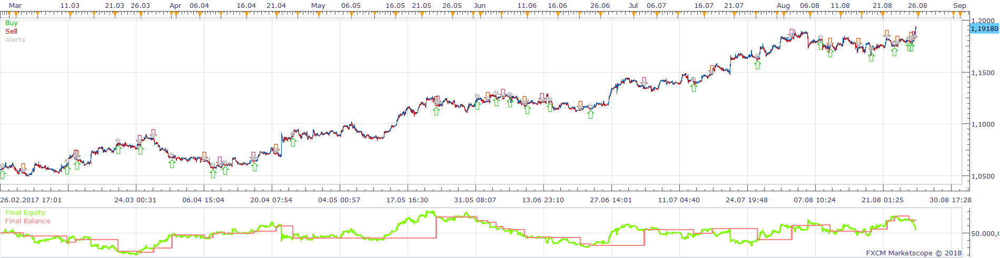
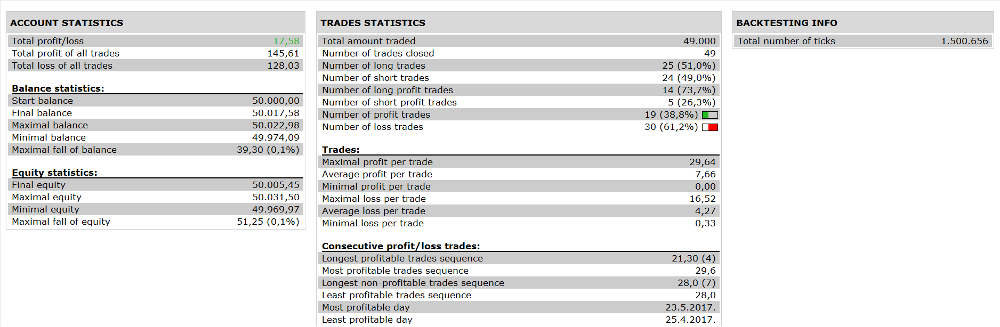

# Ichimoku_HA_Cloud_Strategy

> Source: https://fxcodebase.com/code/viewtopic.php?f=31&t=65771  
> Forum: 31 · Topic 65771 · 5 post(s)

---

## Ichimoku_HA_Cloud_Strategy

**Apprentice** · Mon Feb 26, 2018 4:39 pm

 

Based on the request.
[viewtopic.php?f=27&t=62477](https://fxcodebase.com/code/viewtopic.php?f=27&t=62477)

 [Ichimoku_HA_Cloud_Strategy.lua](files/117912/Ichimoku_HA_Cloud_Strategy.lua)

---

## Re: Ichimoku_HA_Cloud_Strategy

**octaviomejia** · Wed Apr 11, 2018 11:56 pm

*Bullish signals with price crossing above Kumo, Kumo edges sloping upwards, Kijun Sen & Tenkan Sen sloping upwards too.*

 

*Bullish signals with price crossing above Kumo, Kumo edges sloping upwards, Kijun Sen & Tenkan Sen sloping upwards too.*

 

*Bearish signals with price crossing below Kumo, Kumo edges sloping downwards, Kijun Sen & Tenkan Sen sloping downwards too.*

 

*Bearish signals with price crossing below Kumo, Kumo edges sloping downwards, Kijun Sen & Tenkan Sen sloping downwards too.*

Apprentice,

Thank you for the strategy! To improve the odds of success could it be possible to add the following conditions to the basic strategy:

Using a modified Ichimoku cloud (6, 15, 34)
and Heikin-Ashi candles to identify the trend.

When the price (Candles) crosses through the Kumo Cloud and almost at the same time Chinkou crosses the Kumo cloud, it becomes an opportunity to enter the market (buy/sell)

A) Selling Opportunity
Bearish Signals:
1.- When Price and Chinkou cross below the Kumo Cloud almost at the same time.
2.- Kijun Sen and Tenkan Sen are slopping downward (negative slope).
3.- Kumo edges (Senkou Span A & Senkou Span B) are sloping downward (negative slope)
4.- Senkou Span B is almost flat (Optional) in the point where price is crossing the Kumo.

B) Buying Opportunity
Bullish Signals:
1.- Price and Chinkou cross above the Kumo Cloud almost at the same time.
2.- Kijun Sen and Tenkan Sen are sloping upward (positive slope)
3.- Kumo edges (Senkou Span A & Senkou Span B) are sloping upward (positive slope)
4.- Senkou Span B is almost flat (Optional) in the point where price is crossing the Kumo.

---

## Re: Ichimoku_HA_Cloud_Strategy

**Apprentice** · Mon Apr 23, 2018 5:19 am

Your request is added to the development list under Id Number 4118

---

## Re: Ichimoku_HA_Cloud_Strategy

**Apprentice** · Mon Apr 30, 2018 4:53 pm

[Ichimoku_HA_Cloud_Strategy.lua](files/118893/Ichimoku_HA_Cloud_Strategy.lua)

Try this version.

---

## Re: Ichimoku_HA_Cloud_Strategy

**octaviomejia** · Fri May 04, 2018 10:31 am

Hi Apprentice!

I tested the latest version with several currency pairs but it has a poorer performance than the previous version.
