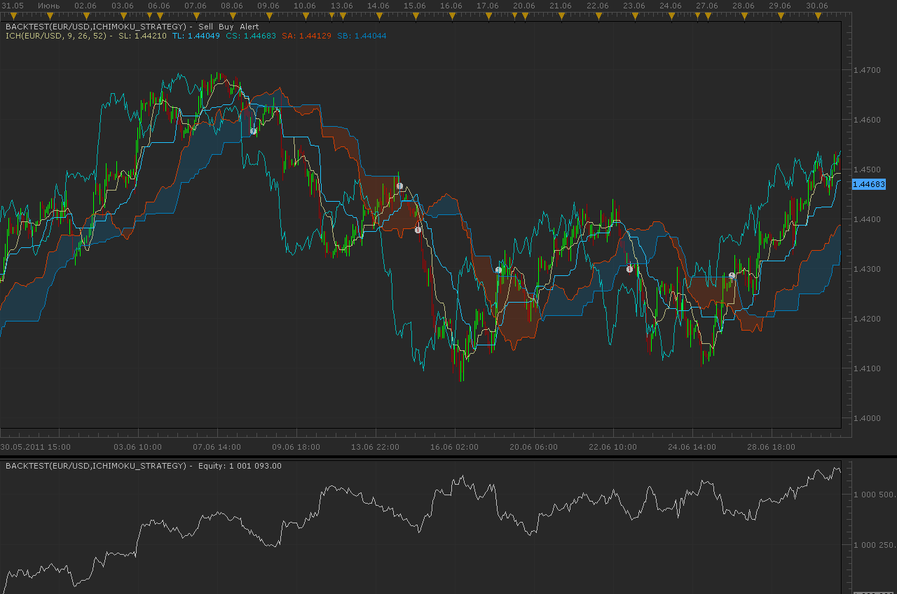

# Ichimoku strategy

> Source: https://fxcodebase.com/code/viewtopic.php?f=31&t=5437  
> Forum: 31 · Topic 5437 · 26 post(s)

---

## Ichimoku strategy

**Alexander.Gettinger** · Mon Jul 25, 2011 11:21 pm

Strategy based on Ichimoku indicator.

BUY conditions:
Tenkan Sen above Kijun Sen.
Chikou Span above the Price Line.
Current Price above the Cloud.

SELL conditions:
Tenkan Sen below Kijun Sen.
Chikou Span below the Price Line.
Current Price below the Cloud.

 

Download:

 [Ichimoku_Strategy.lua](files/13116/Ichimoku_Strategy.lua)

The Strategy was revised and updated on December 10, 2018.

---

## Re: Ichimoku strategy

**t1982t** · Sun Jul 31, 2011 10:47 pm

Thank you very much

---

## Re: Ichimoku strategy

**germano** · Fri Oct 21, 2011 8:15 am

Sirs,
I ask a favor. Someone can program varying of the “Ichimoku Strategy”?

Like this

BUY conditions:
Tenkan Sen above Kijun Sen.
Chikou Span above the Price Line.
**Tenkan Sen above Kijun Sen wen Kumo is positive.**

SELL conditions:
Tenkan Sen below Kijun Sen.
Chikou Span below the Price Line
**Tenkan Sen below Kijun Sen wen Kumo is negative.**

Thanks in advance
germano

---

## Re: Ichimoku strategy

**germano** · Fri Oct 21, 2011 8:58 am

Sirs,

sorry, I made a error.
The change is as follows:

BUY conditions:
Tenkan Sen above Kijun Sen.
Chikou Span above the Price Line.
**(Tenkan Sen above Kijun Sen) above Kumo.**

SELL conditions:
Tenkan Sen below Kijun Sen.
Chikou Span below the Price Line
**(Tenkan Sen below Kijun Sen) below Kumo.**

Thanks in advance.
germano

---

## Re: Ichimoku strategy

**Apprentice** · Sat Oct 22, 2011 4:40 pm

Your request is added to the developmental cue.

---

## Re: Ichimoku strategy

**Apprentice** · Tue Oct 25, 2011 3:39 am

 [Ichimoku strategy.lua](files/16814/Ichimoku%20strategy.lua)

---

## Re: Ichimoku strategy

**germano** · Thu Oct 27, 2011 5:35 pm

Hello Apprentice,

thanks for the help.
I do still corrections. However, I want to try to make them alone.
There is always to learn.

germano

---

## Re: Ichimoku strategy

**turkuaz** · Thu Nov 17, 2011 3:19 am

Dear Forum followers
 and
 Dear Programmers

 This is a very good strategy. Horizontal strategy, but the trend is in error.

 Buy and sell a variety of giving orders. But the trend is in a horizontal position for the usually closes with a loss.

 To avoid this, I suggest using Bollinger bands.

 Bollinger bands strategy in a horizontal position while the obscure pop-up. Instead, a limit of 50 pips, add to those positions that are open. This limit can also adjust can the trader needs to know the parameters.

 Bollinger band range opened a new position created by the new strategy that positions remain open. Opposite positions should be closed.
 However, some rules embroidered closed position.
 The strategy works only when the period started in the position of the closure strategy. Traders are logged in obscure positions. In addition, the strategy started in the position not be covered in the other time Periods.

 So the strategy process for positions that have opened their own time period and do their own.

 Strategy must act according to the direction of the Bollinger Bands.

 Thank you for your help and assistance.

---

## Re: Ichimoku strategy

**TheEdge** · Tue Jan 31, 2012 8:44 pm

Hello,

This is in regard to the strategy posted by Apprentice.

I have included a screen shot to show the issue based on the rules as I understand them as posted by germano.

The issue is that although in much of the back testing I've done the system is profitable there are many times it does not close or open a position when it should and this is leading to losses and probably Profits as well.

Could you tell me exactly what the trading rules are supposed to be for this strategy?

I am including 2 screen shots the first one shows how by not following the trading rules as posted by germano, there was excellent profit made.

The second shows that by not following the rules we lost about half the equity we made from before.

So I am just trying to make sure I understand the rules of this strategy and that this strategy is trading within those rules.

Thanks for All you guys do!

---

## Re: Ichimoku strategy

**Apprentice** · Wed Feb 01, 2012 3:14 am

Originally, this was not my strategy.
I only made ​​minor changes.

All three rules must be satisfied, to make a trade.
Try to use stop orders to limit risk.

---

## Re: Ichimoku strategy

**TheEdge** · Wed Feb 01, 2012 4:02 pm

Thanks for the reply,

I did realize it was not yours originally, however if you look at the second pic I posted the very first short that was opened should have been closed at the point where I indicated that a Long should have been open.

In the first pic there is maybe 1 or 2 places where it should have closed the short and went long.

My concern is that even when all 3 rules are meet it's not opening and closing properly. Does the indicator trade based on Server Time or the time I set in the trading platform? I saw something about time and signals somewhere else on the forum.

Thanks

---

## Re: Ichimoku strategy

**phivar** · Thu Feb 02, 2012 12:09 pm

Hi,
Are tthese conditions "AND" conditions or "OR" conditions. It seems to be "OR" but the best condition to buy would be (Tenkan Sen above Kijun Sen) AND (Chikou Span above the Price Line) AND (Current Price above the Cloud).

It would be the same for the SELL conditions
Thanks

> **Alexander.Gettinger wrote:**
> Strategy based on Ichimoku indicator.
>
> BUY conditions:
> Tenkan Sen above Kijun Sen.
> Chikou Span above the Price Line.
> Current Price above the Cloud.
>
> SELL conditions:
> Tenkan Sen below Kijun Sen.
> Chikou Span below the Price Line.
> Current Price below the Cloud.
>
>
>
> Ichimoku_Strategy.png
>
>
>
> Download:
>
>
> Ichimoku_Strategy.lua

---

## Re: Ichimoku strategy

**Apprentice** · Fri Feb 03, 2012 3:46 am

Alex is using AND condition in this example.
All three conditions must be met.

---

## Re: Ichimoku strategy

**TheEdge** · Tue Feb 07, 2012 1:27 pm

Wondering if I could get a mod of the indicator as posted by Apprentice with the following conditions:

BUY conditions:
Tenkan Sen above Kijun Sen.
**Close of Current Price above Cloud.
Chikou Span above the Cloud.**
Tenkan Sen above Kijun Sen wen Kumo is positive.

SELL conditions:
Tenkan Sen below Kijun Sen.
**Close of Current Price above Cloud.
Chikou Span below the Cloud.**
Tenkan Sen below Kijun Sen wen Kumo is negative.

I updated this a bit after going back over the charts and rereading the Ichimoku Signals, a book on Ichimoku states that if Price Closes above/below the Cloud AND the Chikou span is above/below the Cloud those trades had a win ratio of 80% when all those conditions where met.

I have also noticed that when back testing I get no results for any back test if the Start Time is greater than the Stop Time, for example when trading Gold the market closes at 22:00 GMT (17:00 New York) and reopens at 23:00 GMT (18:00 New York) But if I set the Start Time to 18:00 and end time to 17:00 than there are no back test results.

Also, if I set the Start and Stop time to both 00:00:00 (which I assume means to always trade) I am not getting results on the higher time frames. I am on the lower time frames...does this have to be set to at least have a closing time of some kind to work on the higher time frames?

For anyone interested, I back tested this with a variety of settings on all the currency pairs offered by FXCM...interesting note that the settings 5-21-55 (Fibo Numbers) out preformed the standard settings on a range of about 10 pairs by almost 2X. As a matter of fact the standard 9-26-52 was almost the worst performing settings used in the back test, the back test was from March 02 2009 to January 09 2012 on the 15 minute chart.

---

## Re: Ichimoku strategy

**Apprentice** · Wed Feb 08, 2012 5:55 am

Your request is added to the development list.

---

## Re: Ichimoku strategy

**TheEdge** · Wed Feb 08, 2012 6:17 am

Thanks.

I also wanted to clarify the comment about the time settings and back test results.

First, I had both the start and stop time set to 00:00:00 in my back testing and thus the strategy was only opening/closing trades during that time...very interesting that with no stop loss or take profit settings these settings produced some interesting results on a select few pairs. (Past performance does not guarantee future results)

This is way on my post ( [viewtopic.php?f=31&t=5437#p24762](https://fxcodebase.com/code/viewtopic.php?f=31&t=5437#p24762) ) the strategy was not closing some trades.

As for the time issue there seems to be no way to start trading at 17:00 and stop trading at say 05:00.

Is there a way to allow the start time be in the evenings and end time to be in the morning?

Also, is there a way to have to start and stop times so it would run between say 00:00 to 01:00 and again at 07:00 to 08:00?

---

## Re: Ichimoku strategy

**GideonHanekom** · Wed Jun 27, 2012 4:10 am

Hi Codebase moderator

I apologise if the post you declined came accross as advertising. That was not my intention. There is an error with the Ichimoku trading strategy and I would appreciate it if the programmers can have a look at the coding. I my opinion the strategy should not have been opende a buy order when the tenkan sen crossed the kijun sen going down. At best a short but only when price action was below the cloud.

Attached again the marketscope chart.

Kind regards

Gideon

---

## Re: Ichimoku strategy

**trader-muc** · Tue Sep 25, 2012 11:06 am

may i request a ichimoku signal as follows:

buy: tenkan crosses above kijun
sell: tenkan crosses below kijun

(i.e. the other ichimoku parameters are ignored).

If this signal already is available please post a link.

Thank you all !

---

## Re: Ichimoku strategy

**Apprentice** · Wed Sep 26, 2012 4:24 am

Added to list of development.

---

## Re: Ichimoku strategy

**Apprentice** · Wed Sep 26, 2012 11:04 am

Requested can be found here.
[viewtopic.php?f=31&t=23833&p=40976#p40976](https://fxcodebase.com/code/viewtopic.php?f=31&t=23833&p=40976#p40976)

---

## Re: Ichimoku strategy

**benben99** · Tue Dec 25, 2012 3:51 pm

> **Apprentice wrote:**
>
>
> Ichimoku strategy.png
>
>
>
>
> Ichimoku strategy.lua

hello sir,
can u please make a very simple strategy that buys and sells only on a kejun cross of the price?
it is the 26 moving avg/// i want to use it on 4 hours
can u please use the following parameters?

1.how many lots to open
2. how much is every lot
3.option to add limits and stops to each lot seperatly
4.open trade only if the price has close above or below the kejun,close trade obv if it crosses back and close the other way.......
5.open longs and shorts? yes/no

please reply to me in person if u can
thanks alot benben

---

## Re: Ichimoku strategy

**Apprentice** · Wed Dec 26, 2012 4:55 am

Your request is added to the development list.

---

## Re: Ichimoku strategy

**benben99** · Wed Dec 26, 2012 5:58 pm

> **Apprentice wrote:**
> Your request is added to the development list.

cant wait for that!!!!! thanks alot bud

---

## Re: Ichimoku strategy

**benben99** · Sat Jan 12, 2013 3:42 pm

> **benben99 wrote:**
>
>
> > **Apprentice wrote:**
> > Your request is added to the development list.
>
>
>
>
> cant wait for that!!!!! thanks alot bud

can y please make that strategy?
im always waiting forever and nothing is moving here
please!!!!!!!!!!!!!!!
thanks

---

## Re: Ichimoku strategy

**Apprentice** · Sun Jan 13, 2013 8:07 am

Try This (End of Period) version.
[viewtopic.php?f=31&t=30025](https://fxcodebase.com/code/viewtopic.php?f=31&t=30025)

---

## Re: Ichimoku strategy

**Apprentice** · Fri Dec 09, 2016 4:45 am

Strategy has been revised and updated.
