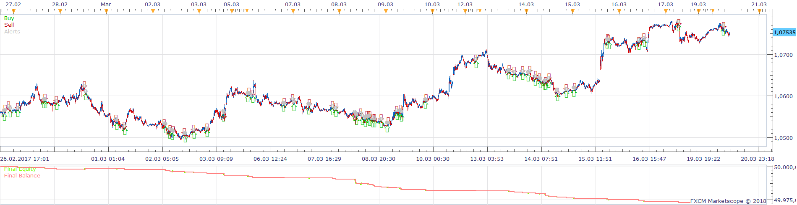

# Ichimoku with Alligator and oscillators Strategy

> Source: https://fxcodebase.com/code/viewtopic.php?f=31&t=65675  
> Forum: 31 · Topic 65675 · 4 post(s)

---

## Ichimoku with Alligator and oscillators Strategy

**Apprentice** · Thu Jan 25, 2018 3:12 pm

Based on the request.
[viewtopic.php?f=27&t=65674&p=117266#p117266](https://fxcodebase.com/code/viewtopic.php?f=27&t=65674&p=117266#p117266)

Open Long
AO> 0
AC> 0
1. Alligator Lips cross and is above 2. Alligator Lips
Tenkan-sen curve cross and is above Kijun-sen

Exit Long
Stop when ONE of these conditions appears
AO <0
1. Alligator Lips cross and is below 2. Alligator Lips
Tenkan-sen curve is below Kijun-sen

Vice versa for Short

 [Ichimoku with Alligator and oscillators Strategy.lua](files/117267/Ichimoku%20with%20Alligator%20and%20oscillators%20Strategy.lua)

---

## Re: Ichimoku with Alligator and oscillators Strategy

**Utawafr** · Fri Jan 26, 2018 12:21 pm

Hello,
Thank you for this code, but doing the backtest I realize that it does not respect all the orders that I would like it to apply.
Indeed, as you can see in the screenshot attached, there is for example a situation where all conditions were met to make a sell order. I may have misrepresented previously, but the order does not have to be done only when all the conditions arrive at the same time, but rather that the order is done when all the conditions are met, that is a small nuance I think that has its importance suddenly ...
With this baktest I could see that there are many opportunities that have not been seized ...
Can you update this code please?
thank you in advance
cordially

---

## Re: Ichimoku with Alligator and oscillators Strategy

**Apprentice** · Fri Jan 26, 2018 1:35 pm

Can you review entry order code?

Code: [Select all](https://fxcodebase.com/code/)
`if   Alligator1.Lips[period+LipsS1] > Alligator2.Lips[period+LipsS2]
   and Alligator1.Lips[period+LipsS1-1] <= Alligator2.Lips[period+LipsS2-1]
   and  AC.DATA[period]>0
   and  AO.DATA[period]>0
   and  ICH.SL[period]> ICH.TL[period]
   and  ICH.SL[period-1]<= ICH.TL[period-1]
   then   
          --Open Long
    elseif Alligator1.Lips[period+LipsS1] < Alligator2.Lips[period+LipsS2]
   and Alligator1.Lips[period+LipsS1-1] >= Alligator2.Lips[period+LipsS2-1]
   and  AC.DATA[period]<0
   and  AO.DATA[period]<0
   and    ICH.SL[period]< ICH.TL[period]
   and  ICH.SL[period-1]>= ICH.TL[period-1]
      then
       --Open Short   
    end`

---

## Re: Ichimoku with Alligator and oscillators Strategy

**Utawafr** · Mon Jan 29, 2018 11:21 am

Hello,
Yes it's the good traduction of my demand, and it's why i don't understand why sometimes we haven't order of buy or sell with the backtest like you can see on the screenshot before ! I don't know what to do think about this and what we must improve for respect my strategy ! Help me please
