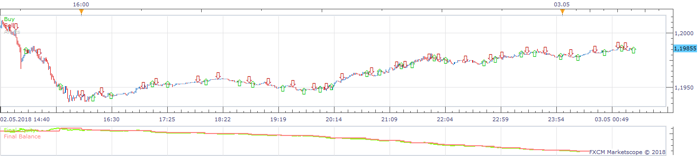
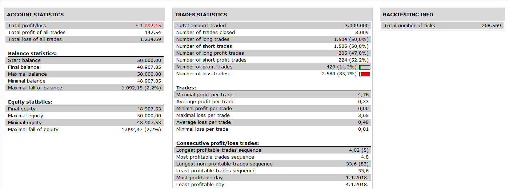

# Indicator Based Sar Strategy

> Source: https://fxcodebase.com/code/viewtopic.php?f=31&t=4725  
> Forum: 31 · Topic 4725 · 3 post(s)

---

## Indicator Based Sar Strategy

**Apprentice** · Mon Jun 13, 2011 11:18 am

 

 

The two main functionalities.
You can choose indicator on which SAR calculation is based on.
You can choose single Indicator data stream for SAR calculation.

Signals are generated by changes in SAR indications

 [Indicator Based Sar.lua](files/11696/Indicator%20Based%20Sar.lua)

To work, please install Tick_sar Indicator
[viewtopic.php?f=17&t=2450&p=5320&hilit=tick_sar#p5320](https://fxcodebase.com/code/viewtopic.php?f=17&t=2450&p=5320&hilit=tick_sar#p5320)

---

## Re: Indicator Based Sar Strategy

**Apprentice** · Wed Nov 30, 2016 8:19 am

Bump up.

---

## Re: Indicator Based Sar Strategy

**Apprentice** · Sun Nov 18, 2018 9:42 am

The Strategy was revised and updated on November 18. 2018.
