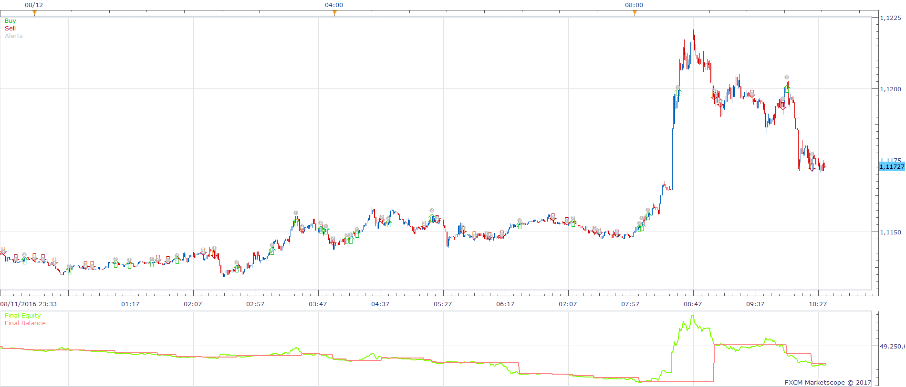
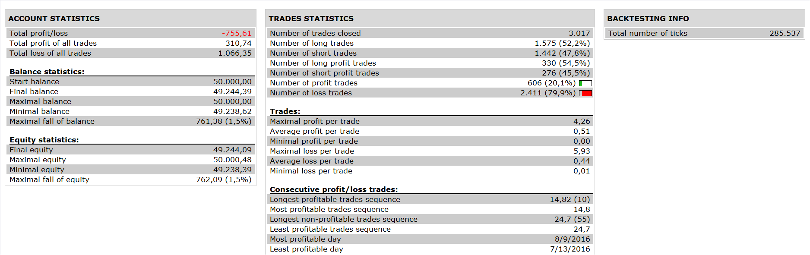
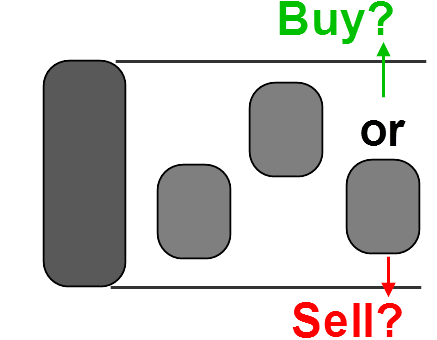

# Inside Bar Pattern Price Action Strategy

> Source: https://fxcodebase.com/code/viewtopic.php?f=31&t=64301  
> Forum: 31 · Topic 64301 · 1 post(s)

---

## Inside Bar Pattern Price Action Strategy

**Apprentice** · Sun Jan 15, 2017 6:09 am

 

Based on request.
[viewtopic.php?f=27&t=64299](https://fxcodebase.com/code/viewtopic.php?f=27&t=64299)

Long
Price > MA

 

Price / mother’s candle highs crossover.
Stop 1x mother’s candle range
Limit 2x mother’s candle range

Vice versa for Short.

 [Inside Bar Pattern Price Action Strategy.lua](files/110530/Inside%20Bar%20Pattern%20Price%20Action%20Strategy.lua)

The Strategy was revised and updated on January 19, 2019.
