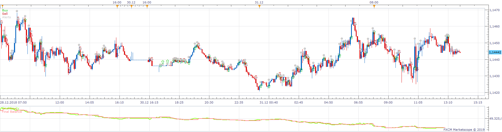
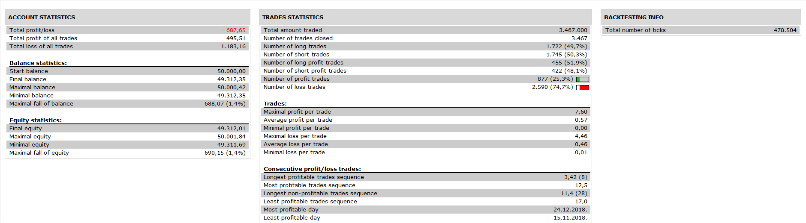

# InvestorsVsSpeculators_Strategy

> Source: https://fxcodebase.com/code/viewtopic.php?f=31&t=69270  
> Forum: 31 · Topic 69270 · 10 post(s)

---

## InvestorsVsSpeculators_Strategy

**Apprentice** · Tue Dec 24, 2019 7:14 am

 

Buy: upward movement of InvestorsVsSpeculators
Sell: downward movement of InvestorsVsSpeculators

InvestorsVsSpeculators with Change Alert.lua
[viewtopic.php?f=17&t=69124](https://fxcodebase.com/code/viewtopic.php?f=17&t=69124)

 [InvestorsVsSpeculators_Strategy.lua](files/130434/InvestorsVsSpeculators_Strategy.lua)

---

## Re: InvestorsVsSpeculators_Strategy

**enotikos** · Tue Dec 24, 2019 8:46 am

Hi apprentice,

If is selected the "use HA as source" the strategy don’t work and appears the message : InvestorsVsSpeculatorsStrategy.lua:147: specified index is out of range

---

## Re: InvestorsVsSpeculators_Strategy

**Apprentice** · Wed Dec 25, 2019 5:06 am

Your request is added to the development list.
Development reference 482.

---

## Re: InvestorsVsSpeculators_Strategy

**Apprentice** · Thu Dec 26, 2019 4:24 pm

This indicator does not support HA as a source.
I have disabled this option.
You will have to re-download.

---

## Re: InvestorsVsSpeculators_Strategy

**enotikos** · Fri Dec 27, 2019 8:56 am

Hi apprentice,
Would you add as a filter a Bigger timeframe of InvestorsVsSpeculators?
 eg there will open only buy trades on trading timeframe when at the same time and on the largest timeframe we have upward movement of InvestorsVsSpeculators

---

## Re: InvestorsVsSpeculators_Strategy

**Apprentice** · Tue Jan 07, 2020 8:38 am

Your request is added to the development list.
Development reference 530.

---

## Re: InvestorsVsSpeculators_Strategy

**enotikos** · Wed Jan 08, 2020 9:52 am

Hi apprentice,

the strategy don’t work and appears the message :
C:/Program Files (x86)/Candleworks/FXTS2/Strategies/Custom/
InvestorsVsSpeculatorsStrategy.lua:184: attempt to index field ‘Speculators’ (a nil value)

---

## Re: InvestorsVsSpeculators_Strategy

**Apprentice** · Wed Jan 08, 2020 11:24 am

DO you have InvestorsVsSpeculators with Change Alert.lua installed?

---

## Re: InvestorsVsSpeculators_Strategy

**enotikos** · Wed Jan 08, 2020 3:45 pm

of course

---

## Re: InvestorsVsSpeculators_Strategy

**Apprentice** · Wed Jan 22, 2020 5:02 pm

[InvestorsVsSpeculators_with__Change_Alert.lua](files/130852/InvestorsVsSpeculators_with__Change_Alert.lua)

 [InvestorsVsSpeculators_Strategy.lua](files/130852/InvestorsVsSpeculators_Strategy.lua)

Fixed.
