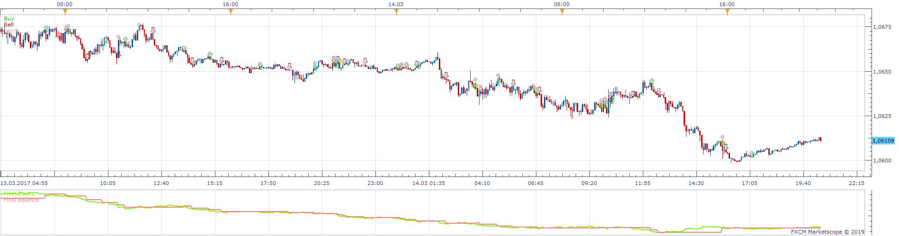
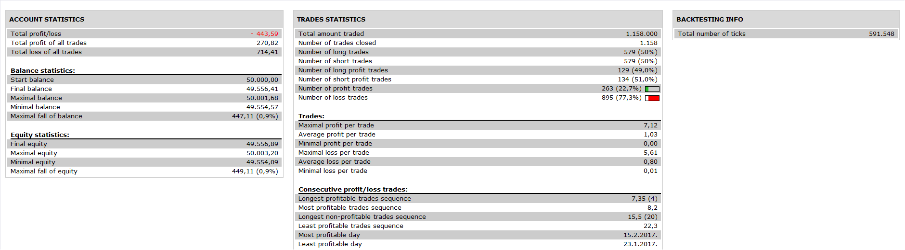

# IVFT Strategy

> Source: https://fxcodebase.com/code/viewtopic.php?f=31&t=68420  
> Forum: 31 · Topic 68420 · 7 post(s)

---

## IVFT Strategy

**Apprentice** · Tue May 07, 2019 6:59 am

 

Based on IVFT.lua
[viewtopic.php?f=17&t=67756](https://fxcodebase.com/code/viewtopic.php?f=17&t=67756)

 [IVFT Strategy.lua](files/126175/IVFT%20Strategy.lua)

---

## Re: IVFT Strategy

**yolerap** · Fri Jan 10, 2020 2:20 pm

Hi,

Could you please add the option : Timeframe of IVFT please ?

At the same time, could you add the option :
If TSI is > 0 ( and the different conditions of IVFT ) so open a long position
If TSI is < 0 ( and different conditions of IVFT ) so open a short position
Choose the Timeframe of TSI
Allow or not the TSI

Thank you,

---

## Re: IVFT Strategy

**Apprentice** · Sun Jan 19, 2020 5:19 am

Your request is added to the development list.
Development reference 567.

---

## Re: IVFT Strategy

**Apprentice** · Mon Jan 20, 2020 9:55 am

[IVFT_Strategy.lua](files/130816/IVFT_Strategy.lua)

Try this version.

---

## Re: IVFT Strategy

**yolerap** · Mon Jan 20, 2020 6:21 pm

Many thanks Apprentice !

You just forgot the timeframe of IVFT Could you add it please ?
Thanks again

---

## Re: IVFT Strategy

**Apprentice** · Wed Jan 22, 2020 4:58 pm

Your request is added to the development list.
Development reference 579.

---

## Re: IVFT Strategy

**Apprentice** · Fri Jan 24, 2020 7:58 am

[IVFT_Strategy.lua](files/130897/IVFT_Strategy.lua)

Try this version.
