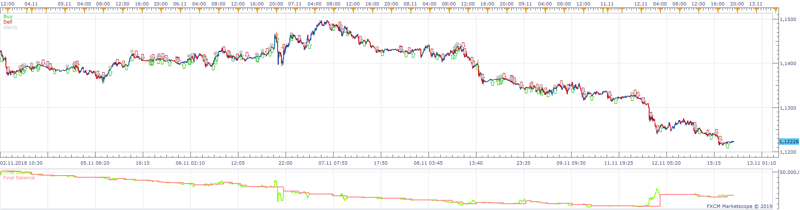
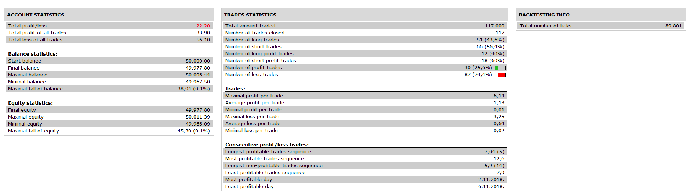

# IVFTBL Strategy

> Source: https://fxcodebase.com/code/viewtopic.php?f=31&t=67757  
> Forum: 31 · Topic 67757 · 6 post(s)

---

## IVFTBL Strategy

**Apprentice** · Wed Mar 20, 2019 1:37 pm

 

Based on the Indicator.
[viewtopic.php?f=17&t=67756](https://fxcodebase.com/code/viewtopic.php?f=17&t=67756)

 [IVFTBL Strategy.lua](files/124820/IVFTBL%20Strategy.lua)

---

## Re: IVFTBL Strategy

**cfbaua** · Wed Mar 20, 2019 4:07 pm

The strategy contains errors. It must open one trade at the time. See the attached screenshot, please correct this error.

---

## Please correct this error in the IVFTBL strategy.

**cfbaua** · Mon Mar 25, 2019 7:43 pm

The IVFTBL strategy opens more than one trade in the same direction. This should not happen.

It should open only one trade,then close it, before continuing to open another trade in the same direction.

Please correct this. (see attached screenshot).

---

## Re: IVFTBL Strategy

**Apprentice** · Mon Apr 01, 2019 10:10 am

Your request is added to the development list under Id Number 4578

---

## Re: IVFTBL Strategy

**Apprentice** · Tue Apr 09, 2019 6:07 am

It works well when the Position Cap is used, set to yes.

---

## Re: IVFTBL Strategy

**cfbaua** · Tue Apr 09, 2019 10:05 am

can you give an example of the settings where it works well?
