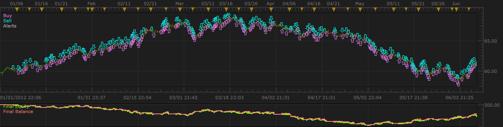
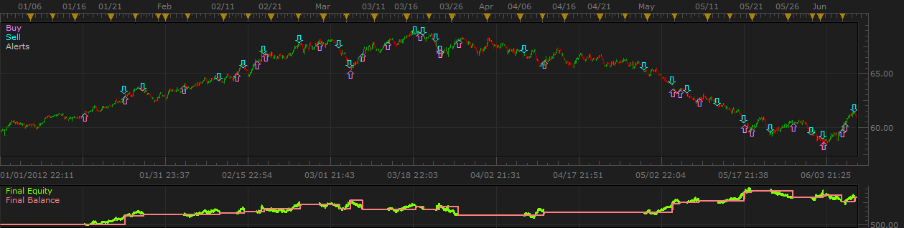

# James Stanley's Finger Trap (or Finger Cuffs) - My Take

> Source: https://fxcodebase.com/code/viewtopic.php?f=31&t=20399  
> Forum: 31 · Topic 20399 · 10 post(s)

---

## James Stanley's Finger Trap (or Finger Cuffs) - My Take

**Alokasi** · Tue Jun 19, 2012 5:43 pm

This is my interpretation and implementation of a strategy outlined by James Stanley of dailyfx.com. The article it's based off of is found here:
[http://www.dailyfx.com/forex/education/ ... Forex.html](http://www.dailyfx.com/forex/education/trading_tips/daily_trading_lesson/2012/03/26/Short_Term_Momentum_Scalping_in_Forex.html)

First and foremost, you need two indicators that I created as well. These must be installed for the strategy to function.

The first is simply an average of the open, high, low and close.

 [OHLC4.lua](files/35770/OHLC4.lua)

The second is a high/low channel that looks back a specific number of periods and is delayed a number of periods. It takes either the high and low off the bodies or the wicks of the candles.

 [HL_Range.lua](files/35770/HL_Range.lua)

Now, here is the strategy.

 [FingerCuffs_v03.lua](files/35770/FingerCuffs_v03.lua)

 [FingerCuffs_v04.lua](files/35770/FingerCuffs_v04.lua)

This strategy was designed to take advantage of strongly trending pairs and during this phase of development I was tuning it to NZD/JPY so that is the example that is given. There are a lot of options in here and I will endeavor to explain them all soon.

Here is performance Jan. 1, 2012 - Jun 7, 2012 using the defaults.

 

Here is the performance over the same time frame with some options tweaked (will elaborate later).

 

I will continue to modify this code as I see fit. New versions may not necessarily be better or behave in the same manner as the older versions. They will likely contain more options though, knowing how I tend to work on things.

If anyone would feel so inclined to donate: PayPal [[email protected]](https://fxcodebase.com/cdn-cgi/l/email-protection#9ef5fff2f2fbf0deebb0e9ffedf6f7f0f9eaf1f0b0fbfaeb)

The Strategy was revised and updated on December 11, 2018.

---

## Re: James Stanley's Finger Trap (or Finger Cuffs) - My Take

**Alokasi** · Tue Jun 19, 2012 6:01 pm

HL_Range and OHLC4

 

---

## Re: James Stanley's Finger Trap (or Finger Cuffs) - My Take

**mitenp** · Thu Jul 05, 2012 6:16 pm

HI Alokasi,

Was wondering if you are still working on this strategy. Many thanks for the one you have attached. I've modified certain bits to capture some ideas I've got on the strategy and its potentially looking good. Interesting to see what criteria changes were made in the NZDJPY example you provided previously.

Regards

---

## Re: James Stanley's Finger Trap (or Finger Cuffs) - My Take

**Alokasi** · Tue Jul 10, 2012 4:07 pm

I haven't given up on this yet. Just took a little vacation with my family and being a stay at home dad with four kids, time gets a little tight to work on this sort of stuff. Also, it being summer I have more work outside as well.

I would love to see your modifications.

Alokasi

---

## Re: James Stanley's Finger Trap (or Finger Cuffs) - My Take

**elacforex** · Tue Jan 07, 2014 4:32 am

Hi Alokasi,

Thanks for your time writing this strategy, it's very interesting. I'm familiar with the original strategy and I use it quite often, however, I have a few questions about your addon...

I like to trade using this strategy on the 4HR chart. So for example, I set my 8 EMA to 1D, 34 EMA to 1 D, and a 8 EMA to 4HR, then I begin.

In your addon, can you explain the following things:
-Trend time frame
-Trend entry time frame
-Trade management time frame
-Time frame for confirmation trend

So if I wanted to trade on the 4HR chart like I explained I like doing, what would I set those settings to?

Thanks, I look forward to more updates

---

## Re: James Stanley's Finger Trap (or Finger Cuffs) - My Take

**Alokasi** · Tue Jan 07, 2014 5:06 pm

The "Trend time frame" is the data series used to determine the trend direction. If the fast ema is above the slow ema for this time frame the trend direction is up, if its below then trend direction is down. The strategy will only trade in the direction determined by this trend. So in your case, this would be the 1D time frame ( = 1D chart) I believe.

The "Trend entry time frame" is used to pick the entries. In your case this would be the 4HR data (e.g. 4HR chart). If the trend determined by paragraph 1 is up, the strategy watches for a cross (in this time frame) of the OHLC line above the fast EMA OR checks whether the OHLC is above the look back channel (Set in the channel section). If either of these conditions is met, an entry is triggered. If the trend is down, it looks for a cross of the OHLC below the fast ema OR checks whether the OHLC is below the look back channel.

The "Trade management time frame" is used if the flag "Use automatic trade management" is set to "yes". This is the time frame that is used to move the stop. I set it to one minute (1minute chart). Then, at the close of every 1 minute bar it looks to see if the trade is (Min Profit) + (Lead Gap) pips profitable from the entry. If it is, it will move the stop to entry +/- (Min Profit), depending on long/short entry. Kind of a step-like trailing stop. After that it looks to see if the profitability of the trade is (Min Profit) + (Lead Gap) pips above the stop. It moves the stop in steps of (Min Profit) pips. If the flag is set to "No" it doesn't do anything.

"Time frame for confirmation of the trend" is only used if the flag "Confirm trend in a second time frame" is set to "YES". It also needs to be longer than the "Trend time frame". If this is turned on using the flag, then the strategy uses this time frame and the the "Trend time frame" to determine the trend direction. In this case, the fast ema has to be above the slow ema in BOTH these time frames for the trend to be up and vice versa for a down trend. It essentially adds a second filter on trend strength. I added this to help cut down on whipsaw trades when the strategy is used on lower time frames. If the flag is set to "No" it doesn't do anything.

---

## Re: James Stanley's Finger Trap (or Finger Cuffs) - My Take

**moomoofx** · Sun Jan 12, 2014 11:05 pm

Hi Alokasi,

Just wondering, did you ever get any confidence in this strategy? I implemented it myself recently and while it can be profitable with some tweaking for particular periods, it essentially becomes over-optimized and I couldn't find a set of parameters that worked well enough, at least for me, to consider running this live.

Cheers,
MooMooFX

---

## Re: James Stanley's Finger Trap (or Finger Cuffs) - My Take

**Jacqueline.anna** · Mon Jan 05, 2015 11:38 pm

this strategy is exellent, thanks and good work!!
but i think, is incomplete, can you add option for trailing stop fixed or dynamic??
with the option of how many pips in fixed option?

---

## Re: James Stanley's Finger Trap (or Finger Cuffs) - My Take

**Apprentice** · Tue Jan 06, 2015 2:52 am

Your request is added to the development list.

---

## Re: James Stanley's Finger Trap (or Finger Cuffs) - My Take

**Apprentice** · Sun Dec 11, 2016 12:45 pm

Strategy was revised and updated.
