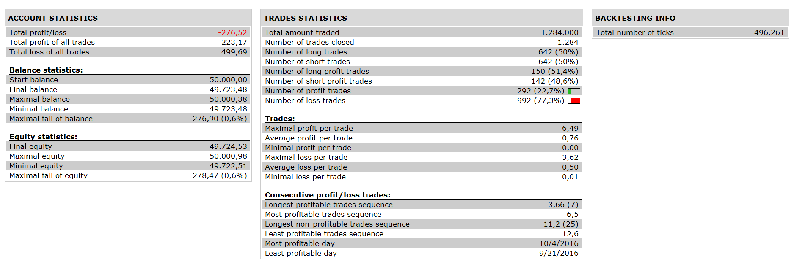

# Jubilee Bar Strategy

> Source: https://fxcodebase.com/code/viewtopic.php?f=31&t=64488  
> Forum: 31 · Topic 64488 · 1 post(s)

---

## Jubilee Bar Strategy

**Apprentice** · Mon Feb 27, 2017 5:19 am

 

Based on the request.
[viewtopic.php?f=27&t=64485](https://fxcodebase.com/code/viewtopic.php?f=27&t=64485)
Open Long
CCI>100
DX>40 (adx without averaging)
Bollinger % >100

Vice versa for Short.

 [Jubilee Bar Strategy.lua](files/111220/Jubilee%20Bar%20Strategy.lua)

BB-Percentages.lua is available here.
[viewtopic.php?f=17&t=226&hilit=BB+Percentage](https://fxcodebase.com/code/viewtopic.php?f=17&t=226&hilit=BB+Percentage)

The Strategy was revised and updated on January 19, 2019.
