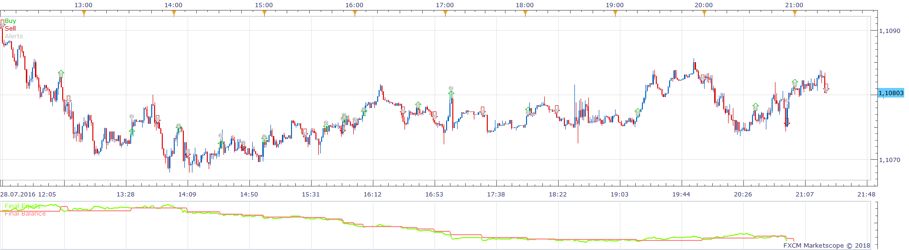
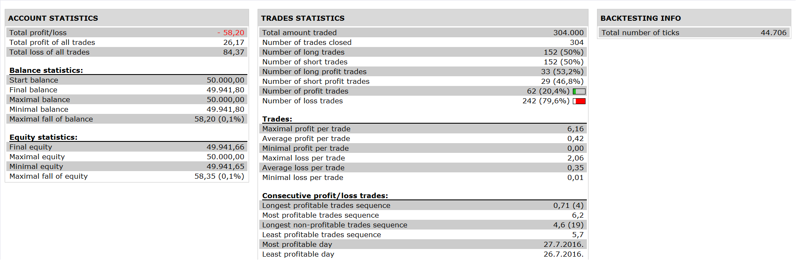

# Kfayol Strategy

> Source: https://fxcodebase.com/code/viewtopic.php?f=31&t=66676  
> Forum: 31 · Topic 66676 · 2 post(s)

---

## Kfayol Strategy

**Apprentice** · Fri Sep 28, 2018 6:41 am

 

Based on request.
[viewtopic.php?f=27&t=66674](https://fxcodebase.com/code/viewtopic.php?f=27&t=66674)

Buy Signal
EMA 5 > EMA 10
Price Close > PSAR
MACD Line > MACD Signal
RSI Line > 50

Sell Signal
Opposite of Buy Signal

 [Kfayol Strategy.lua](files/121282/Kfayol%20Strategy.lua)

---

## Re: Kfayol Strategy

**kfayol** · Fri Sep 28, 2018 7:11 am

Thanks Admin,

Well appreciated am looking at it
