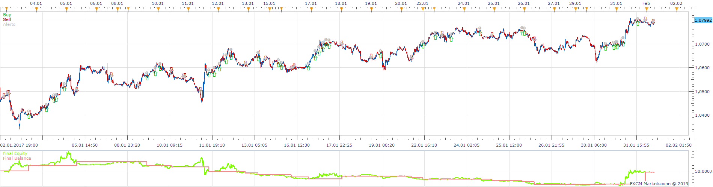
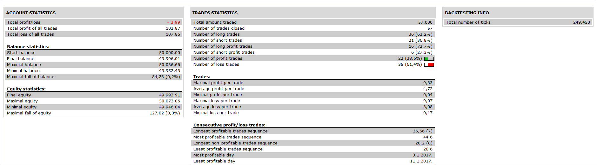
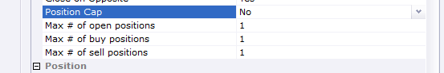

# kinjun strategy

> Source: https://fxcodebase.com/code/viewtopic.php?f=31&t=68444  
> Forum: 31 · Topic 68444 · 5 post(s)

---

## kinjun strategy

**Apprentice** · Thu May 09, 2019 1:15 pm

 

Based on request.
[viewtopic.php?f=27&t=68425](https://fxcodebase.com/code/viewtopic.php?f=27&t=68425)

 [kinjun strategy.lua](files/126257/kinjun%20strategy.lua)

---

## Re: kinjun strategy

**Apprentice** · Fri Feb 21, 2020 6:12 am

This strategy has a position cap feature.

---

## Re: kinjun strategy

**ASTONIX91** · Thu Mar 26, 2020 5:40 am

Thank you... Would it be possible to add a dynamic stop please

---

## Re: kinjun strategy

**Apprentice** · Thu Mar 26, 2020 6:29 am

Your request is added to the development list.
Development reference 947.

---

## Re: kinjun strategy

**Apprentice** · Fri Mar 27, 2020 8:13 am

It already supports that. Use 1 for dynamic and 10 or greater for the fixed trailing
