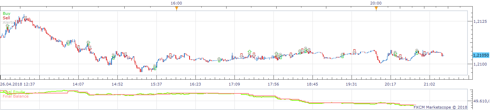
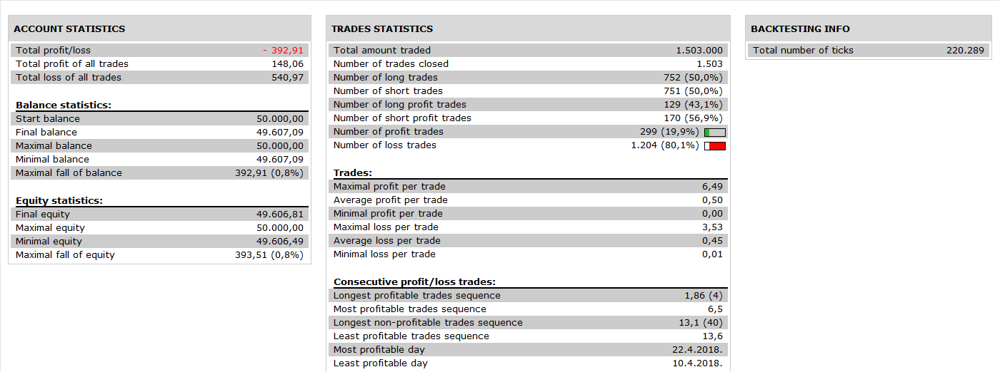

# KST Bollinger Strategy

> Source: https://fxcodebase.com/code/viewtopic.php?f=31&t=3708  
> Forum: 31 · Topic 3708 · 7 post(s)

---

## KST Bollinger Strategy

**Apprentice** · Wed Mar 23, 2011 5:58 am

 

 

Signals are generated.

Long
KST make Cross over Upper Bollinger Bands of KST

Short
KST make cross under Lower Bollinger Bands of KST

 [KST Bollinger Strategy.lua](files/8986/KST%20Bollinger%20Strategy.lua)

I you do not have KST Indicator, please install it.
[viewtopic.php?f=17&t=64518](https://fxcodebase.com/code/viewtopic.php?f=17&t=64518)

---

## Re: KST Bollinger Strategy

**JimmyAshey** · Wed Mar 30, 2011 5:04 pm

Hi Apprentice
Sorry mate, but it seems, when I add this strategy to the marketscope, there is neither a single signal generated like those shown in your screen-shot, nor the KST is overlaid with a bollinger band... could you be so kind to check it for me?

---

## Re: KST Bollinger Strategy

**Apprentice** · Thu Mar 31, 2011 2:23 am

First.
You have to manually add K.S.T. and Bollinger, indicators.

As for the strategy/signal.
After retesting everything seems working as expected.
Have you set , Allow strategy to Trade to Yes
also, Have you set, Show Alert to Yes.

---

## Re: KST Bollinger Strategy

**Apprentice** · Wed Nov 30, 2016 5:53 am

Bump up.

---

## Re: KST Bollinger Strategy

**Apprentice** · Sat Nov 17, 2018 9:57 am

The Strategy was revised and updated on November 17. 2018.

---

## Re: KST Bollinger Strategy

**mulligan** · Fri Nov 23, 2018 1:29 pm

This is a very nice oscillator combo. The strategy is only giving signals based on the KST oscillator line crossing over or under the upper Bollinger band line, not the lower. Besides this small fix, I would like to request an optional exit to the strategy. The strongest signals are when the KST oscillator line is above or below the Bollinger band. The following would be the logic.

KST oscillator line crosses above the upper Bollinger band - Buy
KST oscillator line crosses below the upper Bollinger band - Close buy trade
KST oscillator line crosses below the lower Bollinger band - Sell
KST oscillator line crosses above the lower Bollinger band - Close sell trade

Many thanks for your consideration.

---

## Re: KST Bollinger Strategy

**Apprentice** · Sun Nov 25, 2018 5:44 am

Fixed.
