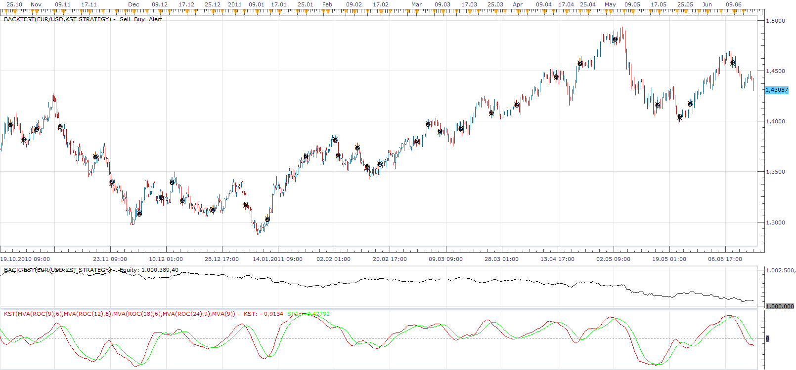

# KST Strategy

> Source: https://fxcodebase.com/code/viewtopic.php?f=31&t=4741  
> Forum: 31 · Topic 4741 · 5 post(s)

---

## KST Strategy

**Apprentice** · Wed Jun 15, 2011 5:11 am

Trades are generated by simple KST Line / KST Signal Line Crossover.

Please install the KST indicator.
[viewtopic.php?f=17&t=64518](https://fxcodebase.com/code/viewtopic.php?f=17&t=64518)

 [KST Strategy.lua](files/11748/KST%20Strategy.lua)

The Strategy was revised and updated on December 10, 2018.

---

## Re: KST Strategy

**psaros** · Thu Jun 16, 2011 5:11 am

thank you very much

---

## Re: KST Strategy

**mulligan** · Thu Nov 29, 2012 2:36 pm

I have loaded the KST indicator and strategy. Both are working, but the strategy alert is giving the reverse signal. That is it signals up trend when the indicator correctly shows down trend and vice versa. Thanks for your help.

---

## Re: KST Strategy

**Apprentice** · Fri Nov 30, 2012 2:47 am

Thank you for reporting.
I have Fixed the Bug.

---

## Re: KST Strategy

**Apprentice** · Thu Dec 08, 2016 3:54 pm

Strategy has been revised and updated.
