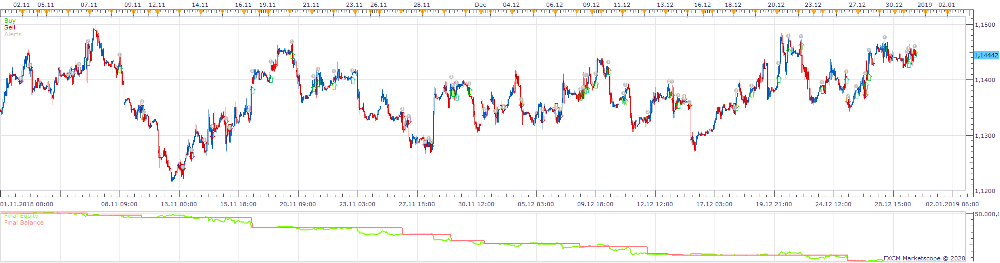
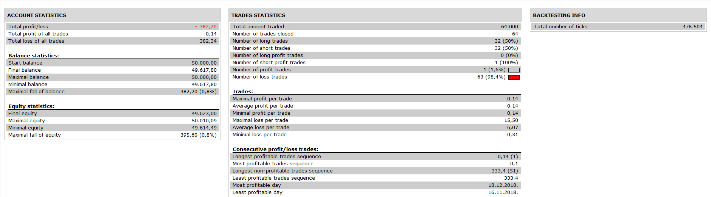

# Larry Williams Strategy

> Source: https://fxcodebase.com/code/viewtopic.php?f=31&t=69665  
> Forum: 31 · Topic 69665 · 4 post(s)

---

## Larry Williams Strategy

**Apprentice** · Mon Apr 13, 2020 5:56 am

 

Based on request.
[viewtopic.php?f=27&t=69649](https://fxcodebase.com/code/viewtopic.php?f=27&t=69649)

 [Larry Williams Strategy.lua](files/132817/Larry%20Williams%20Strategy.lua)

---

## Re: Larry Williams Strategy

**Matelosa** · Thu Apr 30, 2020 5:44 am

It also happens that in live mode it does not give an error, but it does not open any operation

---

## Re: Larry Williams Strategy

**Apprentice** · Thu Apr 30, 2020 8:00 am

Your request is added to the development list.
Development reference 1183.

---

## Re: Larry Williams Strategy

**Apprentice** · Fri May 01, 2020 9:26 am

[Larry Williams Strategy.lua](files/133431/Larry%20Williams%20Strategy.lua)

Try this version.
