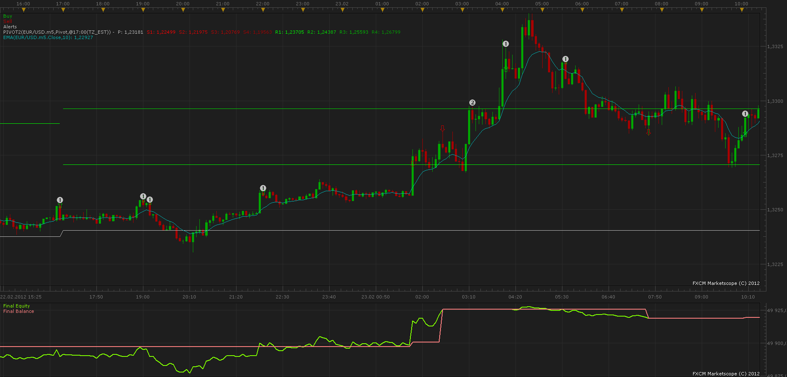

# Level Trading (Pivot and EMA)

> Source: https://fxcodebase.com/code/viewtopic.php?f=31&t=22422  
> Forum: 31 · Topic 22422 · 5 post(s)

---

## Level Trading (Pivot and EMA)

**sunshine** · Tue Aug 14, 2012 11:11 pm

Description:

Indicators: EMA and Classic Pivot levels
Rasionale: EMA provides momentum and directional bias
Pivot points provide historic support and resistance level to assist in entry, stop and limit levels

Buy condition:
1. Price trades above EMA
2. Price breaks and closes above Pivot point P or R1 or R2 by a specified (variable) number of pips
3. Enter Long at market at beginning of new candle
4. Place STOP order a specified number of pips below P, R1 or R2 (depending on which one was just breached and lead to the initiation of the trade)
5. Place Limit order a specified number of pips below R1 or R2 (depending on which one was breached and lead to the initiation on the trade)

Explanation of stop and limit placement eg. if price breached and closed above R1 the stop will be place below R1 by a specified number of pips and the limit below R2 by specified number of pips.

Sell condition:
1. Price trades below EMA
2. Price breaks and closes below Pivot point P or S1 or S2 by a specified (variable) number of pips
3. Enter Short at market at beginning of new candle
4. Place STOP order a specified number of pips above P, S1 or S2 (depending on which one was just breached and lead to the initiation of the trade)
5. Place Limit order a specified number of pips above S1 or S2 (depending on which one was breached and lead to the initiation on the trade)

Explanation of stop and limit placement eg. if price breached and closed below P the stop will be place above P by a specified number of pips and the limit above S1 by specified number of pips.

This strategy may be used also as a signal.
It's possible to specify custom beginning of trading day.

**NOTE: Due to limitations of the production version of FXTS, trading using this strategy is possible only using non-FIFO accounts.
Trading using FIFO accounts will be supported in the next beta version (and in the next production version) of FXTS.**

 

The Strategy was revised and updated on December 17, 2018.

---

## Re: Level Trading (Pivot and EMA)

**coldplay70** · Fri Apr 05, 2013 2:10 pm

Hello Sunshine,

I have Backtested your Strategy and it looks very nice! But I have a Question: Do you think it is possible, to change the Entry Trading Logic in this:

Buying Logic: If the EMA (and NOT the Price) crosses the Pivot Point or R1 and the next candle opens above the EMA and the Pivot Point / R1.
Selling Logic: If the EMA (and not the Price) crosses the Pivot Point or S1 and the next Candle opens under the EMA and the Pivot Point / S1.

The advantage of this logic:
1. It produced less signals.
2. The volatility of the price is eliminated since these frequently touches the pivot point, but then drops back below the daily pivot point.

I hope, this is possible and the strategy works with this changes a little bit more succesfully!

Thanks a lot for your Feedback.

Best Regards from Munich, Germany,
Coldplay70

---

## Re: Level Trading (Pivot and EMA)

**Apprentice** · Sat Apr 06, 2013 4:45 am

Your request is added to the development list.

---

## Re: Level Trading (Pivot and EMA)

**Stance** · Thu Aug 20, 2015 7:31 am

Could this be modified to support weekly pivot points?

---

## Re: Level Trading (Pivot and EMA)

**Apprentice** · Tue Dec 13, 2016 4:32 am

Strategy was revised and updated.
