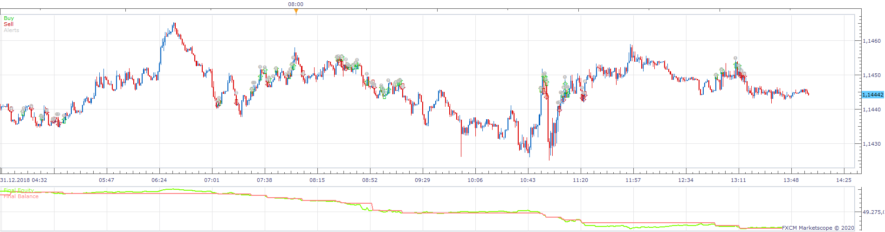
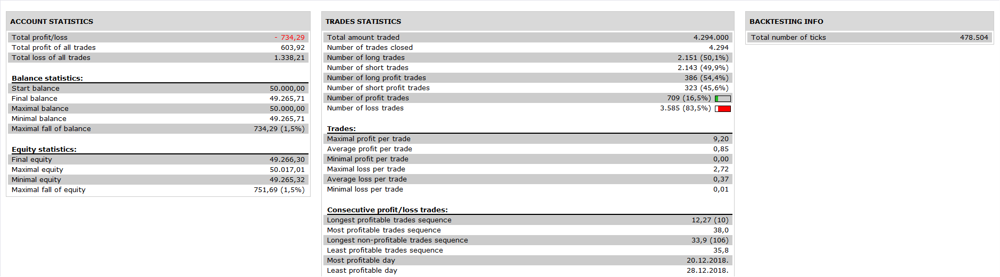

# Longer Shorter Strategy

> Source: https://fxcodebase.com/code/viewtopic.php?f=31&t=69698  
> Forum: 31 · Topic 69698 · 17 post(s)

---

## Longer Shorter Strategy

**Apprentice** · Mon Apr 20, 2020 7:55 am

 

Based on request.
[viewtopic.php?f=27&t=69687](https://fxcodebase.com/code/viewtopic.php?f=27&t=69687)

 [Longer Shorter Strategy.lua](files/132984/Longer%20Shorter%20Strategy.lua)

Longer Shorter Indicator.lua
[viewtopic.php?f=17&t=69697](https://fxcodebase.com/code/viewtopic.php?f=17&t=69697)

---

## Re: Longer Shorter Strategy

**MC. Trend Trader** · Tue Apr 28, 2020 9:06 am

Hello, please insert PositionCount and Breakeven in this strategy so that we can open several options with different limits and stops.

---

## Re: Longer Shorter Strategy

**MC. Trend Trader** · Tue Apr 28, 2020 9:09 am

Hello, please insert Positions Cap and PositionCount in this strategy so that we can open several options with different limits and stops.

---

## Re: Longer Shorter Strategy

**Apprentice** · Tue Apr 28, 2020 9:56 am

Your request is added to the development list.
Development reference 1163.

---

## Re: Longer Shorter Strategy

**Apprentice** · Thu Apr 30, 2020 4:35 am

[Longer Shorter Strategy.lua](files/133344/Longer%20Shorter%20Strategy.lua)

Try this version.

---

## Re: Longer Shorter Strategy

**SerifKocdemir** · Thu Apr 30, 2020 7:00 am

> **Apprentice wrote:**
>
>
> Longer Shorter Strategy.lua
>
>
> Try this version.

Thank you so much.

---

## Re: Longer Shorter Strategy

**SerifKocdemir** · Sun May 03, 2020 9:20 pm

Sorry
I use for The first time Strategy in FXCM Trading Station
What does mean ''Custom ID'' inside of Strategy.
What Will I write for ''Custom ID''?

---

## Re: Longer Shorter Strategy

**Apprentice** · Mon May 04, 2020 4:21 am

This is completely arbitrary.
Make sure you don't use the same id on different strategies.
Otherwise, one strategy may close other strategy positions.

---

## Re: Longer Shorter Strategy

**SerifKocdemir** · Mon May 04, 2020 4:22 pm

thank you.
It is possible that you add inside of Staretgy Ticket Number to get into continious position/positions before we have started but we didnt start by Strategy and we want to close this position/positions whenever/whichprice strategy close?

---

## Re: Longer Shorter Strategy

**Apprentice** · Tue May 05, 2020 4:47 am

You want to ability for this strategy to close other positions?

---

## Re: Longer Shorter Strategy

**SerifKocdemir** · Tue May 05, 2020 5:15 am

> **Apprentice wrote:**
> You want to ability for this strategy to close other positions?

YES

---

## Re: Longer Shorter Strategy

**Apprentice** · Tue May 05, 2020 7:34 pm

Your request is added to the development list.
Development reference 1233.

---

## Re: Longer Shorter Strategy

**Apprentice** · Wed May 06, 2020 5:56 am

[Longer Shorter Strategy.lua](files/133626/Longer%20Shorter%20Strategy.lua)

Try this version.

---

## Re: Longer Shorter Strategy

**SerifKocdemir** · Wed May 06, 2020 10:20 am

> **Apprentice wrote:**
>
>
> Longer Shorter Strategy.lua
>
>
> Try this version.

Thank you so much.
I use happly.

---

## Re: Longer Shorter Strategy

**MC. Trend Trader** · Wed May 20, 2020 4:53 am

> **Apprentice wrote:**
>
>
> Longer Shorter Strategy.lua
>
>
> Try this version.

Hello Appprentice ,

This strategy was somehow changed. It does not work anymore. Can you please undo the change so that the strategy works again like the first version from Mon Apr 20, 2020 7:55 am.

Long Price source and short Price source have been added under Parameters.

please insert PositionCount and Breakeven in this strategy so that we can open several options with different limits and stops.

---

## Re: Longer Shorter Strategy

**Apprentice** · Thu May 21, 2020 6:23 am

Your request is added to the development list.
Development reference 1327.

---

## Re: Longer Shorter Strategy

**Apprentice** · Fri May 22, 2020 7:36 am

Unclear what needs to be done. There are a lot of version of this strategy. Complain is about "Apr 20 (file 28378)" was broken (wrong price type). 28512 is a fixed version of Apr 20 and the latest version (28671) is based on 28512

Can you post he provide link to the file?
