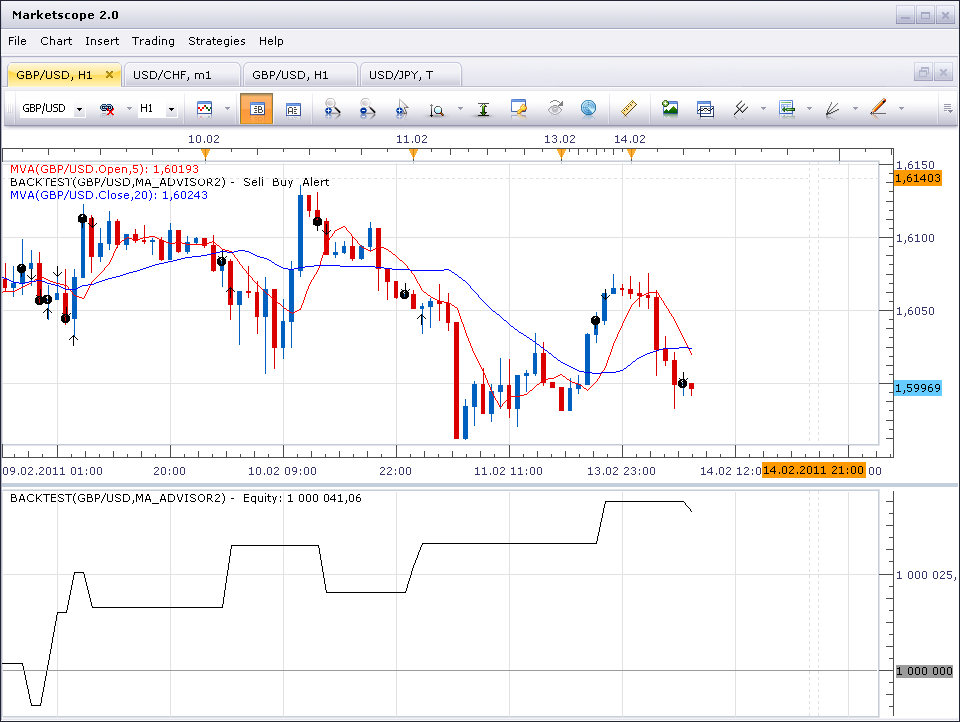

# MA Advisor (corrected version)

> Source: https://fxcodebase.com/code/viewtopic.php?f=31&t=3401  
> Forum: 31 · Topic 3401 · 27 post(s)

---

## MA Advisor (corrected version)

**sunshine** · Mon Feb 14, 2011 7:05 am

MA Advisor strategy is included in the standard set of Marketscope strategies. But with the current version of strategy it's not possible to set stop and limit oprders for US-based accounts.
I've uploaded the corrected version. This version uses Entry Limit Stop orders (ELS) as alternative of Stop and Limit orders for US-based accounts.
This version of the strategy will be included in the next update of FX Trading Station.

---

## Re: MA Advisor (corrected version)

**noel5378** · Tue Feb 22, 2011 8:46 pm

Is there anyway to modify this so that the stops are not trailing, but operate as normal stoploss orders

---

## Re: MA Advisor (corrected version)

**noel5378** · Wed Feb 23, 2011 4:22 pm

Also is it possible to incorporate the ADX as a filter to prevent traing in range bound markets...(i.e. those with adx < 25

---

## Re: MA Advisor (corrected version)

**sunshine** · Thu Feb 24, 2011 8:22 am

Hi,
I agree, it's strange restriction on creating simple stop orders in this strategy. I'll upload the fixed version a bit later.
As for ADX filter, do I correctly understand that a signal shouldn't appear in case ADX < specified level (e.g. 25)?

---

## Re: MA Advisor (corrected version)

**noel5378** · Thu Feb 24, 2011 2:01 pm

Yeah the trade should not be inacted unless the ADX is greater than X # 25, 30, 40 etc for the purpose of entry, while still retaining the ability to close a position if the markets change. My hope is that this will reduce the number of false entries into a range bound market and hopefully increase the amount of profiatable trades.

---

## Re: MA Advisor (corrected version)

**sunshine** · Fri Feb 25, 2011 9:03 am

I've uploaded the version with regular stop orders in the first post in this topic and put the request for adding ADX filter:
[viewtopic.php?f=27&t=3529](https://fxcodebase.com/code/viewtopic.php?f=27&t=3529)

---

## Re: MA Advisor (corrected version)

**basicstrategy** · Fri Feb 25, 2011 11:50 pm

Hi Sunshine,

please, could you add either one (or both) of following already existing indicators to your corrected version of your MA Advisor :

1) "20 in 1 Moving Average Indicator a.k.a. Averages" (viewtopic.php?f=17&t=2430) indicator (I need ZeroLagEMA from it)

2) NonLagMA2 (viewtopic.php?f=17&t=2231&p=5930#p5930)

Thank you very much in advance

basicstrategy

---

## Re: MA Advisor (corrected version)

**Apprentice** · Sat Feb 26, 2011 5:58 am

Added into the development cue.

---

## Re: MA Advisor (corrected version)

**josh2011** · Thu Apr 21, 2011 5:16 pm

Hello Apprentice,

Thanks for all the great work you have been doing in this forum. Please i will like you to re-visit the MA ADVISOR strategy. Please can you add the ADX filter to it so that it doesn't take trades in ranging markets? Someone else has requested for this over 4 months now without any reply. I understand you have a very tight schedule but thanks a great deal all the same. cheers

---

## Re: MA Advisor (corrected version)

**Apprentice** · Fri Apr 22, 2011 12:24 am

Your request is in a development cue.

---

## Re: MA Advisor (corrected version)

**Apprentice** · Wed Apr 27, 2011 4:18 am

[ma_advisor_with_ADX_Filter.lua](files/10101/ma_advisor_with_ADX_Filter.lua)

 [ma_advisor_with_ADX_Filter.lua.rc](files/10101/ma_advisor_with_ADX_Filter.lua.rc)

This version has an ADX filter.
Get in position if ADX suggests the existence of a strong trend.

There is an additional option.
Close position if the trend is weak.
(This option can be used separately.)

---

## Re: MA Advisor (corrected version)

**josh2011** · Wed Apr 27, 2011 3:40 pm

Hello Apprentice,

Thanks for the great work! I'm so happy for the ADX filter you added to the MA ADVISOR, it was simply magnificient!..I have tested it already and seems to be working fine. But for it to be very profitable, trade entry trigger has to be confirmed by RSI MID-LINE CROSS. I have tested this manually several times and it is profitable. Please can you add this additional filter to it? I know this will be asking for too much. I appreciate.

Joshua

---

## Re: MA Advisor (corrected version)

**Apprentice** · Thu Apr 28, 2011 5:46 am

Sure.
I will add this filter.
When I find time.

---

## Re: MA Advisor (corrected version)

**josh2011** · Thu Apr 28, 2011 5:50 am

Thanks Apprentice for your genuine help.

Cheers from Abu Dhabi.

---

## Re: MA Advisor (corrected version)

**nookie** · Fri Jul 08, 2011 6:18 am

Hi Apprentice,

I cant find where the strategy closes the initial position and what are the rules for it - DMI lines crosses or this is a strategy with always an open position ? What are the rules in this strategy for a position to be closed ?
Is it possible this to be tweaked so when DMI lines cross position is closed and also this to be shown when a "test strategy" is used for this?
What I mean is shown on the screenshot I attach - strategy opened position just fine and to close it on this DMI cross on the arrow.. to have something like "CLOSE position" or something similar

Thanks a lot

nookie

---

## Re: MA Advisor (corrected version)

**josh2011** · Fri Jul 08, 2011 3:37 pm

Hi Apprentice,

How are you and how is work? Thanks for last time when you acceded to my request of adding the ADX filter to the MA_ADVISOR strategy. It was great. However, I want to make a very humble request.
1. Can you include open/close BUY and SELL order function to trigger when both MAs cross each other? and this should be optionally selected in the strategy parameters. Currently, the MA ADVISOR only opens a position when the MAs have crossed WITH PRICE CLOSING. I would like to see open positions when MAs have crossed whether price closes or not. In the same vein, I would also like an open position to close when the two MAs cross back in the opposite direction which will trigger an open order in the new direction of the MA cross.
2. Can you include the "number of pips" after the MA cross before an order is open or closed? This should be optionally selected by the person using it.
3. Like I requested before (months back actually), can you include the RSI (level 50 cross)filter to this already great strategy?

If you can do this for me, I will gladly post the parameters that I used to obtain the result that yielded 66.6% returns after 240days of trading(back-tested). And this will benefit the forum. See attached. Thanks

---

## Re: MA Advisor (corrected version)

**Apprentice** · Sat Jul 09, 2011 3:21 am

I am on vacation until August 15.
Therefore, the best thing I can do for you is to put your request in developmental cue.

---

## Re: MA Advisor (corrected version)

**sergesp** · Tue Apr 24, 2012 9:27 pm

Hi - I have been trying to add a modification to this strategy without much luck.

Would it be possible to add a SAR indicator so that one can check if SAR up or down is present and then compare the last SAR value with price and the two MA value to decide if one wants to open a position. ie how to add a SAR indicator and access the direction and values and also the price and EMA values.

Thanks

---

## Re: MA Advisor (corrected version)

**Apprentice** · Wed Apr 25, 2012 3:01 am

It is possible, someone will prepare something.
Until then, look at an example of a similar solution.
[viewtopic.php?f=31&t=13376&hilit=sar](https://fxcodebase.com/code/viewtopic.php?f=31&t=13376&hilit=sar)

---

## Re: MA Advisor (corrected version)

**sergesp** · Wed Apr 25, 2012 8:05 am

> **Apprentice wrote:**
> It is possible, someone will prepare something.
> Until then, look at an example of a similar solution.
> [viewtopic.php?f=31&t=13376&hilit=sar](https://fxcodebase.com/code/viewtopic.php?f=31&t=13376&hilit=sar)

Thank you very much - looking at other example but eagerly awaiting the modified version. Thanks again.

---

## Re: MA Advisor

**rjm354** · Mon Dec 03, 2012 7:29 pm

When trading the trend using MA Advisor , In an uptrend I want to only buy , and in a downtrend I want the strategy to just sell.
The problem I have is I want the strategy to simply close for example the open buy position at the next cross down. Just close the open buy. Don't open a sell.
Is it possible to add this feature to the MA Advisor ?

If I want to run this strategy in an up trend I want to ...

Allowed direction---- BUY
Close open position at next cross ----- Yes

If I run BUY ONLY Or SELL ONLY the only way to close the position is with a stop or limit.
I also want the option of closing the position at the next cross . BUT NOT OPENING ANOTHER POSITION IN THE OPPOSITE DIRECTION. Like I chose "ALLOWED DIRECTION ..... BOTH " I dont want that.

And is it possible to add NonLag Confirmation from a different time frame?

If NonLag is Blue and turns Red on the daily chart for example, I want my sell strategy to begin selling only with the added feature of closing the open sell at the next cross

If Nonlag is Red and turns Blue on the daily chart I want my Buy only strategy to start buying only with the added feature of closing the open buy at the next cross.

Thanks .

---

## Re: MA Advisor (corrected version)

**Apprentice** · Tue Dec 04, 2012 6:31 pm

Your request is added to the development list.

---

## Re: MA Advisor (corrected version)

**rjm354** · Tue Dec 04, 2012 11:08 pm

Thank You Apprentice,

I thought of something today maybe it is possible and maybe easier.

When using the MA Advisor in the "ALLOWED SIDE" section and a trader chooses "BOTH"
It would be great if we can set different stops and limits for each side " buy stops and limits" and
"sell stops and limits"
So when using the strategy to trade an up trend for example. I may want larger limits then the selling side of the strategy. Or I can just use the sell side to close the buy side. Or vise versa in a down trend.
Separating the limits and stops for someone who chooses "BOTH" would be awesome.

Thanks

---

## Re: MA Advisor (corrected version)

**Apprentice** · Thu Dec 08, 2016 3:03 pm

Strategy has been revised and updated.

---

## Re: MA Advisor (corrected version)

**tmccravy** · Sun Apr 29, 2018 7:01 am

OK, I am a trading newbie, so please forgive any ignorant questions. I have been backtesting the MA Advisor (and MA Advisor 2) strategies, using only buy (no sell), 5 and 10 MVA speeds. Testing the period Jan 1 2015 to Mar 13 2018. For both strategies the profit seems unusually high, but can't figure out the logic for entry and close of trades. When the MVA5 crosses the MVA10 upward, the strategy buys. But the strategy also randomly open trades where there has been no crossover of the MVA. Trades seemed to be closed in groups with no rationale that I can see. Maybe I am missing something here - or just don't understand the strategy at all?

Can someone help me figure out the trading rules for this strategy? I've attached screenshots of sample trades + an excel worksheet of all trades for ease of reference...

Many thanks

 

*This is an example of some buy trades executed*

 

*This is an example of some close trades executed (about 15 together)*

 

*These are the parameters for MA Advisor backtest*

 

*This is the big picture of the backtest*

---

## Re: MA Advisor (corrected version)

**tmccravy** · Mon Apr 30, 2018 1:35 am

Hello all,

Process is the best teacher. I think in explaining my problem to the forum and going through it again, i have identified my own errors. In terms of the strategy buys not lining up with the moving averages, I was using MVA in the strategy and EMA 10,5 as my indicator. So that explains the slightly off phenomenon I was experiencing. When I re-calibrated to EMA, the buys seem to be on target every time.

2nd mystery - in terms of the 'odd closes' - I think it has to do with my account margin. I started with 50k account opening, and 3,200 margin minimum. Trading min-lots of 10k each. I think this means that after about 15 trades, my used margin reaches 0, and then all trades are closed. Problem is the strategy backtesterdoesn't show this as an event, but I can see it in the declining margin balance.

Question: Am I correct?

Thanks for any support

---

## Re: MA Advisor (corrected version)

**Apprentice** · Fri May 18, 2018 5:49 am

Affirmative.
One more thing.
Special notice about price simulation.
[viewtopic.php?f=31&t=3036](https://fxcodebase.com/code/viewtopic.php?f=31&t=3036)
