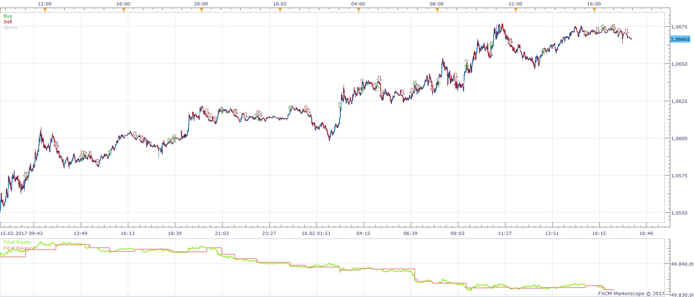
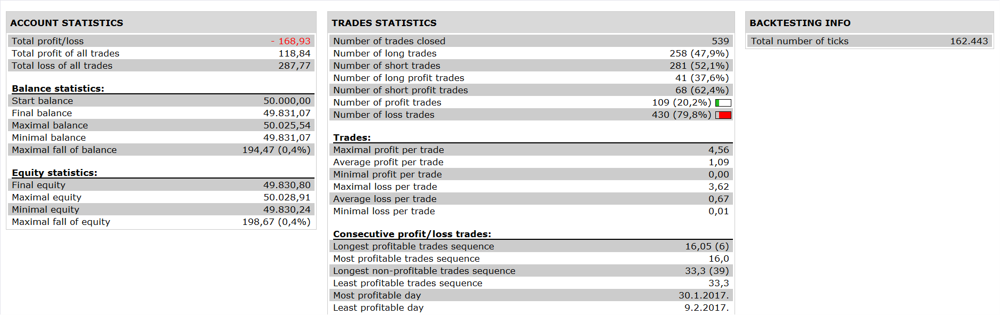

# MA Angle Strategy

> Source: https://fxcodebase.com/code/viewtopic.php?f=31&t=64964  
> Forum: 31 · Topic 64964 · 1 post(s)

---

## MA Angle Strategy

**Apprentice** · Sat Aug 05, 2017 5:57 am

 

Long: Positiv Color
Short: Negative Color
Exit: Neutral Color (optional)

 [MA Angle Strategy.lua](files/113999/MA%20Angle%20Strategy.lua)

 MAAngle.lua is available here.
[viewtopic.php?f=17&t=1294](https://fxcodebase.com/code/viewtopic.php?f=17&t=1294)

The Strategy was revised and updated on January 21, 2019.
