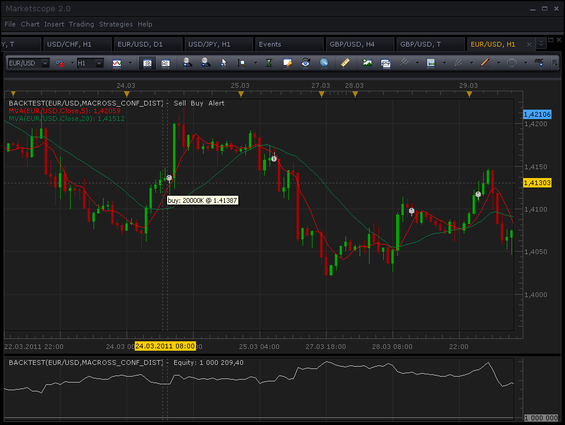

# MA Cross Strategy with confirmation by distance b/w lines

> Source: https://fxcodebase.com/code/viewtopic.php?f=31&t=3795  
> Forum: 31 · Topic 3795 · 44 post(s)

---

## MA Cross Strategy with confirmation by distance b/w lines

**sunshine** · Thu Mar 31, 2011 6:08 am

The strategy checks for the cross between two moving average lines and trade long or short (see below) if the distance between lines become bigger that the specified during the next N bars. If lines do not diverge, the strategy will not trade. If you specify 0 as the distance and 0 as a number of bars, the strategy will work exactly as the standard MA cross signal.

BUY:
Fast MA crosses over the slow MA, and the distance between lines become bigger that the specified during the next N bars.

SELL:
Fast MA crosses under the slow MA, and the distance between lines become bigger that the specified during the next N bars.

The strategy can also trade on the Tick time frame.

 

 [macross_conf_dist_strategy.lua](files/9238/macross_conf_dist_strategy.lua)

The Strategy was revised and updated on December 18, 2018.

---

## Re: MA Cross Strategy with confirmation by distance b/w lines

**NID007** · Mon Apr 04, 2011 4:30 am

thanks for your post ,
I have installed the this version

I would like to set the Limit order in pips , to less than one pip in the parameters

i.e. 0.1 , 0.2. 0.3 , 0.5 etc upto 0.9 max for my personal trading. this version does not permit it ,can we add it please thankyou in advance

Nid007

---

## Re: MA Cross Strategy with confirmation by distance b/w lines

**sunshine** · Tue Apr 05, 2011 3:37 am

Hi,
I've updated the top post. Please re-install the strategy.

---

## Re: MA Cross Strategy with confirmation by distance b/w lines

**NID007** · Wed Apr 06, 2011 12:59 pm

> **sunshine wrote:**
> Hi,
> I've updated the top post. Please re-install the strategy.

Thanks so much Sunshine I will test it thanks again great work
Nid007

---

## Re: MA Cross Strategy with confirmation by distance b/w lines

**Damian** · Tue Sep 27, 2011 8:19 am

Hi. I have question. Can You add time parameters for this strategy?
 Start Time for trading
Stop Time for trading
Use Mandatory closing
Mandatory closing time?

Thanks

---

## Re: MA Cross Strategy with confirmation by distance b/w lines

**Apprentice** · Tue Sep 27, 2011 10:49 am

Your request is added to the developmental cue.

---

## Re: MA Cross Strategy with confirmation by distance b/w lines

**ancient-school** · Fri Sep 30, 2011 12:36 pm

Would be useful to have Parameter "Maximum Allowed Trades": Enter Value: "1","2","10" etc ...

---

## Re: MA Cross Strategy with confirmation by distance b/w lines

**Apprentice** · Fri Sep 30, 2011 2:42 pm

Your request is added to the developmental cue.

---

## Re: MA Cross Strategy with confirmation by distance b/w lines

**ancient-school** · Fri Sep 30, 2011 3:15 pm

> **Apprentice wrote:**
> Your request, "Maximum Allowed Trades": Enter Value: "1","2","10" etc ..., is added to the developmental cue.

Parameter Price to Start Trading at, would also be interesting, i.e. once price is above or below a Price Value it trades as per settings...

Parameter, Price Value to Start Trading: "Above:, "x.xxxx" or "Below", "x.xxxx" ...

---

## Re: MA Cross Strategy with confirmation by distance b/w lines

**Journeyman** · Wed Nov 02, 2011 2:05 am

Great strategy!

Is there any way to add a stop order on a third moving average? It tends to give up a lot of profit if it waits for the next signal to open before closing the last positions.

I would like to encourage users to post their settings. This is a really good strategy, if set up correctly.

I use the following for a five minute chart on the AUDUSD:

3 min fast MA
50 min slow MA
10 distance
5 number of bars
50 pip fixed stop

---

## Re: MA Cross Strategy with confirmation by distance b/w lines

**Apprentice** · Wed Nov 02, 2011 11:41 am

Your request is added to the development queue.

---

## Re: MA Cross Strategy with confirmation by distance b/w lines

**Journeyman** · Wed Nov 02, 2011 5:04 pm

Great, thanks.

I forgot to request an option to disable the pop-up windows when a trade is opened. They're really annoying.

For some reason I'm not able to test the strategy on the tick chart. Is this my fault? I've tried everything.

---

## Re: MA Cross Strategy with confirmation by distance b/w lines

**Damian** · Wed Nov 09, 2011 10:01 am

Guys I have a question, how long must we wait until our requests are done?

Sorry for my English

---

## Re: MA Cross Strategy with confirmation by distance b/w lines

**Apprentice** · Wed Nov 09, 2011 6:12 pm

It all depends.
From several days to several months.
The workload is greater than we can finish.

Use a premium service if you want to get some work completed in a shorter time.
Or supports, this forum so that we can give customers better service.
By donations or promoting SDK / Lua.

---

## Re: MA Cross Strategy with confirmation by distance b/w lines

**Journeyman** · Thu Nov 10, 2011 6:24 pm

Here's a screen grab to illustrate what I'm on about.

The profits would have been larger and the losses almost negligible had these trades closed when the 20 min MA crossed the 50 min MA line.

---

## Re: MA Cross Strategy with confirmation by distance b/w lines

**Journeyman** · Wed Nov 16, 2011 7:48 pm

Here's another screen grab with some different settings. Check out the difference in profits!

---

## Re: MA Cross Strategy with confirmation by distance b/w lines

**luigipg** · Wed Dec 14, 2011 2:30 am

Hi apprentice, why in this strategy we can insert a TP of 300 pips maximum? is very restrictive and does not allow me to use it. I'd be really grateful if you can remove this limitation. Thanks a lot. Regards. Luigi!!!

---

## Re: MA Cross Strategy with confirmation by distance b/w lines

**Apprentice** · Wed Dec 14, 2011 3:19 am

Two zeros added.

---

## Re: MA Cross Strategy with confirmation by distance b/w lines

**luigifx** · Thu Apr 19, 2012 4:08 pm

Hi !!

Is it possible to apply a RSI filter ?

thanx

---

## Re: MA Cross Strategy with confirmation by distance b/w lines

**Apprentice** · Fri Apr 20, 2012 2:06 am

Yes

Your request is added to the development list.

---

## Re: MA Cross Strategy with confirmation by distance b/w lines

**wmaster** · Thu Jun 21, 2012 3:10 am

RSI Filter has been added.

Condition:
RSI > 50 buy and RSI < 50 Sell

---

## Re: MA Cross Strategy with confirmation by distance b/w lines

**guangho** · Thu Oct 04, 2012 12:18 am

HI! sunshine,wmaster：
can you help me?I want to add " RSI " interval parameters and Level：70、50、30.

In these intervals I can freely set the various transactions："No Action"/"Buy"/"SELL"/"both"/"Close Position"

Thank you for your help.

---

## Re: MA Cross Strategy with confirmation by distance b/w lines

**Apprentice** · Thu Oct 04, 2012 5:42 am

You talk about macross_conf_dist_strategy or standalone RSI strategy.
You want to be able to choose, OB, OS, Cental Line Values
And select the desired trade.
If this relates to macross_conf_dist_strategy, can you give me a more detailed conditions.
Especially in relation to RSI / MA interaction.

---

## Re: MA Cross Strategy with confirmation by distance b/w lines

**guangho** · Thu Oct 04, 2012 8:05 am

HI,Apprentice:

My idea:
1、RSI>80:"Fast MA crosses under the slow MA" is sell.
 "Fast MA crosses over the slow MA" is only close sell (no buy).

2、80>Rsi>60:both。

3、60>Rsi>40: NO ANY Action.

4、40>Rsi>20:both。

5、RSI<20: "Fast MA crosses over the slow MA" is buy.
 "Fast MA crosses under the slow MA" is only close buy (no sell).

Have you got that?thank you！

---

## Re: MA Cross Strategy with confirmation by distance b/w lines

**guangho** · Thu Oct 04, 2012 10:47 am

HI,Apprentice:

The above strategy RSI did not produce the effect, whether the parameter is the number of backtracking, the result will be the same.

---

## Re: MA Cross Strategy with confirmation by distance b/w lines

**guangho** · Fri Oct 05, 2012 11:47 am

HI,Apprentice:

The strategy of " RSI " parameters cannot be used, you have to check now?

thank you！

---

## Re: MA Cross Strategy with confirmation by distance b/w lines

**Apprentice** · Sat Oct 06, 2012 8:08 am

Your request is added to the development list.
As for strategy from wmaster, I have not found deviations from defined.

---

## Re: MA Cross Strategy with confirmation by distance b/w lines

**luigipg** · Tue Nov 13, 2012 12:15 pm

Hi, please I very need two additions to this strategy: 1) "magic number" so that it can run multiple times simultaneously on the same pair; 2) which can works on "alive bar" without waiting for the current candle go to closes. I would be very grateful. Thanks a lot to all. Luigi!!!

---

## Re: MA Cross Strategy with confirmation by distance b/w lines

**Apprentice** · Wed Nov 14, 2012 7:08 am

Your request is added to the development list.

---

## Re: MA Cross Strategy with confirmation by distance b/w line

**BERNYFINCH** · Wed Jun 12, 2013 3:29 pm

HELLO,

I GOT INTERESTING RESULTS WITH THIS STRATEGY. I'D LIKE TO KNOW IF IT IS POSSIBLE TO ADD FOLLOWING THINGS:
1/ AN EXIT TRADE POSSIBILITY BY "PRICE CROSSING THE FIRST OR SECOND MOVING AVERAGE THAT WE CAN CHOOSE"

2/ THE POSSIBILITY TO ACCEPT OR NOT MULTIPLE TRADES

I WOULD BE GRATEFUL IF POSSIBLE , I THANK YOU IN ADVANCE
BEST REGARDS

---

## Re: MA Cross Strategy with confirmation by distance b/w line

**fxcyberman** · Sun Jul 07, 2013 4:15 pm

Can You add time parameters for this strategy?
Start Time for trading
Stop Time for trading
Use Mandatory closing
Mandatory closing time?

Thanks in advance

---

## Re: MA Cross Strategy with confirmation by distance b/w line

**Apprentice** · Tue Jul 09, 2013 4:14 am

Your request is added to the development list.

---

## Re: MA Cross Strategy with confirmation by distance b/w line

**Scott2trade** · Thu Oct 17, 2013 8:37 am

Hello can you PLEASE add H,L_Band indicator support for this strategy as well as the option to open only one trade.. ie.(...Choose open multiple trades {Yes or NO}) that would be GReat! As well as the ability to set trade times/w mandatory ALL close options? PLEASE If you DO NOT have the time to write this can you direct me to where/and_or/whom i may pay to write in these additional features. Thank You.

---

## Re: MA Cross Strategy with confirmation by distance b/w line

**Apprentice** · Tue Oct 22, 2013 5:01 am

Your request is added to the development list.

---

## Re: MA Cross Strategy with confirmation by distance b/w line

**dannyh5** · Tue Feb 11, 2014 3:34 pm

All all

I have a few settings forthis stategy I wouldlike to share. I am currently trying them out on live trading using micro lots. Great results on back test

EUR/AUD 1 Hour chart
Fast 7 TMA
Slow 82 SMMA
Confirm 29
N-Bar 7

USD/CHF 1 Hour Chart
Fast 7 TMA
90 SMMA
Distance 20
N-Bar 3

The pic of of EUR/AUD from 01/03/2012 - 1/12/2013. no stops were used

---

## Re: MA Cross Strategy with confirmation by distance b/w line

**Rudolf** · Fri Aug 28, 2015 12:28 pm

Hi,

Can you add Averages 20 in 1 to this strategy ?

[viewtopic.php?f=17&t=2430&hilit=averages](https://fxcodebase.com/code/viewtopic.php?f=17&t=2430&hilit=averages)

---

## Re: MA Cross Strategy with confirmation by distance b/w line

**Paulo C** · Wed Feb 24, 2016 3:26 pm

hello Apprentice
I would like to test this strategy in reverse mode, it is possible to add it?
Best regards,
Paulo Campota

---

## Re: MA Cross Strategy with confirmation by distance b/w line

**Apprentice** · Thu Feb 25, 2016 2:10 pm

Reverse mode Added.
Rudolf, Your request is added to the development list.

---

## Re: MA Cross Strategy with confirmation by distance b/w line

**dandee** · Fri Feb 26, 2016 5:13 am

Absolutely brilliant, I can sleep at night now, Thanks man

---

## Re: MA Cross Strategy with confirmation by distance b/w line

**Paulo C** · Tue Mar 01, 2016 4:29 pm

> **Apprentice wrote:**
> Reverse mode Added.
> Rudolf, Your request is added to the development list.

Thank Apprentice

---

## Re: MA Cross Strategy with confirmation by distance b/w line

**Atmotrader** · Thu Mar 03, 2016 4:56 pm

Hi,

I have tradet your strategy very sucessfully in the last days. I would like to say thank you for the great work.

Now I have a little wish. Could you add a feature where I can set the maximum number of trades that are made during a day or while the strategy is active.

Would be so great if you could do this.

Thanks in advance!
Masoud

---

## Re: MA Cross Strategy with confirmation by distance b/w line

**Apprentice** · Fri Mar 04, 2016 2:56 am

"Max Number Of Open Position In Any Direction" or "Max Number Of Open Position In One Direction"
 are NOT sufficient?
You need a count of open positions during the last day?

---

## Re: MA Cross Strategy with confirmation by distance b/w line

**Atmotrader** · Fri Mar 04, 2016 3:19 am

I want the strategy to only make one trade even it is running the whole day. Let's say I run it on the 5 min TF and I start it at the london open. You can bet there are many signals during the day but I want the strategy to only trade the first signal. You know?

---

## Re: MA Cross Strategy with confirmation by distance b/w line

**Apprentice** · Wed Dec 14, 2016 6:09 am

Strategy was revised and updated.
