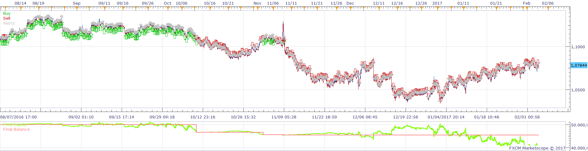
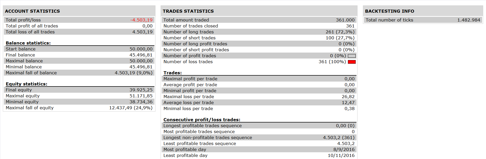

# MA Cross Strategy with Daily Open Line Filter

> Source: https://fxcodebase.com/code/viewtopic.php?f=31&t=64481  
> Forum: 31 · Topic 64481 · 5 post(s)

---

## MA Cross Strategy with Daily Open Line Filter

**Apprentice** · Sat Feb 25, 2017 3:37 pm

 

Open Long
Short / Long MA Cross Over
Price > Day Open
Open Short
Short / Long MA Cross Under
Price < Day Open

 [MA Cross Strategy with Daily Open Line Filter.lua](files/111194/MA%20Cross%20Strategy%20with%20Daily%20Open%20Line%20Filter.lua)

Daily open line is available here.
[viewtopic.php?f=17&t=20169](https://fxcodebase.com/code/viewtopic.php?f=17&t=20169)
Averages is available here.
[viewtopic.php?f=17&t=2430](https://fxcodebase.com/code/viewtopic.php?f=17&t=2430)

The Strategy was revised and updated on January 21, 2019.

---

## Re: MA Cross Strategy with Daily Open Line Filter

**Kilgharrah** · Tue Feb 28, 2017 3:49 am

I would really appreciate the implementation of different time frame for Daily Open Line, since I think it is not properly using the opening price as the indicator. One TF for strategy and other for the indicator or the correction that use always the daily price by hour and not change with the strategy TF. Thank you so much.

---

## Re: MA Cross Strategy with Daily Open Line Filter

**Apprentice** · Tue Feb 28, 2017 3:51 am

Your request is added to the development list, Under Id Number 3753
 If someone is interested to do this task, please contact me.

---

## Re: MA Cross Strategy with Daily Open Line Filter

**MC. Trend Trader** · Sun Mar 12, 2017 6:17 pm

Hello,

I would like to be able to specify open hours also with minutes and only candle cross over or under
daily open daily line without Ma Cross

---

## Re: MA Cross Strategy with Daily Open Line Filter

**Alexander.Gettinger** · Tue Oct 17, 2017 2:49 pm

> **Kilgharrah wrote:**
> I would really appreciate the implementation of different time frame for Daily Open Line, since I think it is not properly using the opening price as the indicator. One TF for strategy and other for the indicator or the correction that use always the daily price by hour and not change with the strategy TF. Thank you so much.

Please, try this version of the strategy.

 [MA Cross Strategy with Daily Open Line Filter Other TF.lua](files/115464/MA%20Cross%20Strategy%20with%20Daily%20Open%20Line%20Filter%20Other%20TF.lua)
