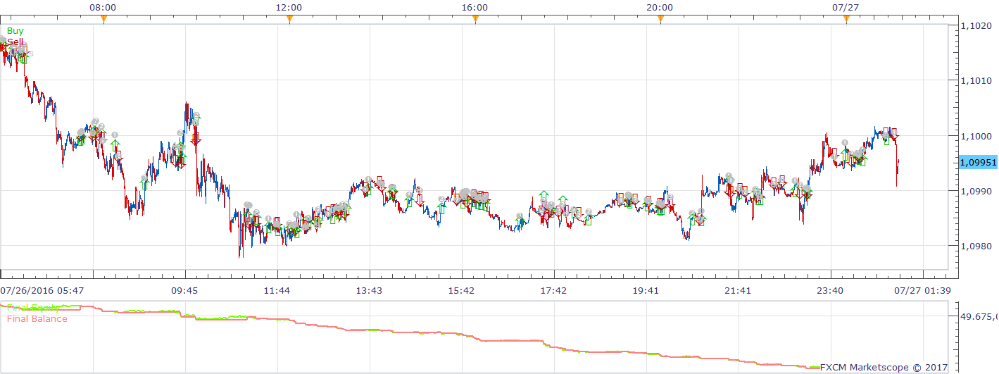
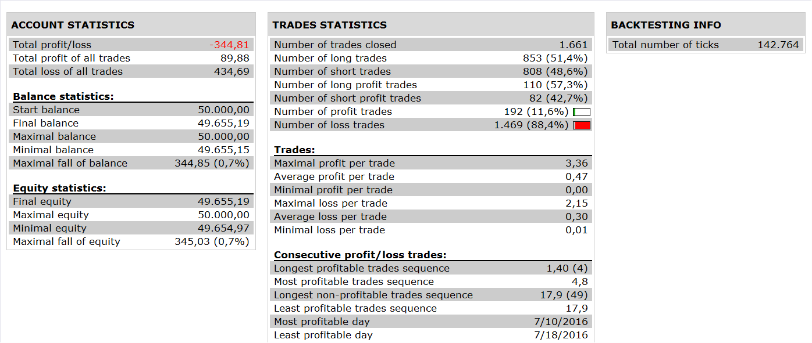

# MA CROSS Strategy with TREND Filter

> Source: https://fxcodebase.com/code/viewtopic.php?f=31&t=64296  
> Forum: 31 · Topic 64296 · 8 post(s)

---

## MA CROSS Strategy with TREND Filter

**Apprentice** · Fri Jan 13, 2017 8:27 am

 

Open Long
Prise rises above 50 EMA and then 5 EMA Crosses above 20 EMA.
When 5 EMA Crosses below 20 EMA trade is closed.
Open Short
Price falls below Trend 50 EMA and then 5 EMA crosses below 20 EMA.
When 5 EMA crosses above 20 EMA trade is Closed.

 [MA CROSS Strategy with TREND Filter.lua](files/110509/MA%20CROSS%20Strategy%20with%20TREND%20Filter.lua)

The Strategy was revised and updated on January 19, 2019.

---

## Re: MA CROSS Strategy with TREND Filter

**DAVIDR** · Fri Jan 13, 2017 12:19 pm

Thank you for this.

---

## Re: MA CROSS Strategy with TREND Filter

**Armando92** · Sat Jan 14, 2017 5:45 am

Hi Apprentice
I am new here , congratulations for your great work.
This strategy is perfect for my way of trading, but would it be possible to add a MACD indicator?
Thanks

---

## Re: MA CROSS Strategy with TREND Filter

**Apprentice** · Sun Jan 15, 2017 5:14 am

> but would it be possible to add a MACD indicator

Can you define Entry / Exit conditions.

---

## Re: MA CROSS Strategy with TREND Filter

**Armando92** · Sun Jan 15, 2017 7:39 am

Hello Apprentice
Thanks you for your reply.
I trade the GER30 in m1 and I use a MACD with settings corresponding to a higher time frame.
- long entry : MA1 crosses MA2 and prices are above MA3, and the MACD is green
- Long exit: MACD turns to red or TP reached
- Short entry : MA1 crosses MA2 and prices are under MA3, and the MACD is red
- Short exit: MACD turns to green or TP reached
Thanks

---

## Re: MA CROSS Strategy with TREND Filter

**Armando92** · Tue Jan 31, 2017 7:43 am

Hi Apprentice,
Please can you explain me why, even max number of open positions in any direction is 1 and max number of positions in one direction is also one, this strategy opens many trades in few seconds.
Are there some settings that I don't understand?
Regards

---

## Re: MA CROSS Strategy with TREND Filter

**Apprentice** · Thu Feb 02, 2017 3:30 pm

Set "Use Position Cap" to yes.

---

## Re: MA CROSS Strategy with TREND Filter

**Armando92** · Fri Feb 03, 2017 2:54 am

Thanks
