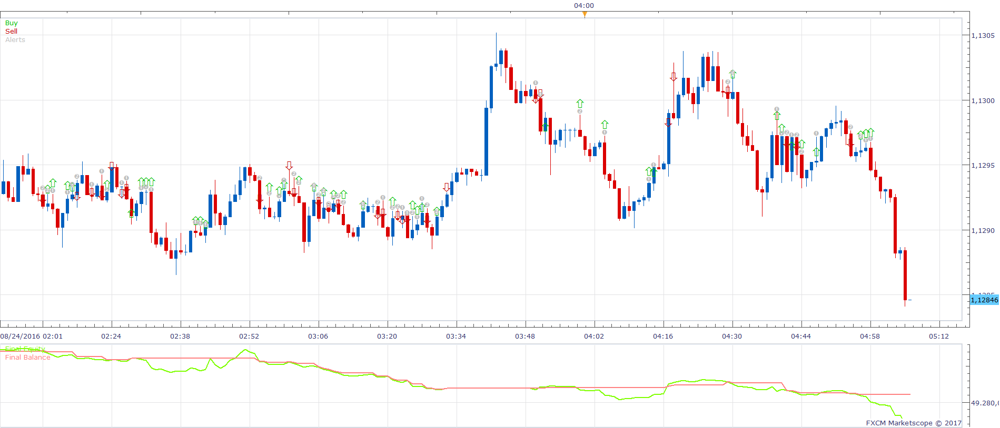
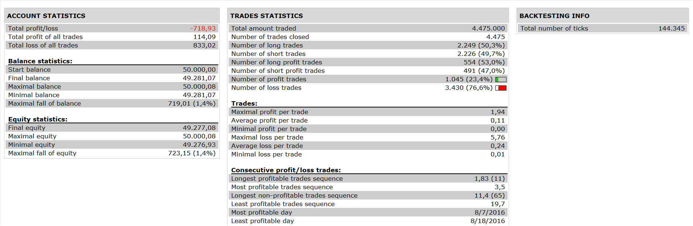

# MA Cross Strategy

> Source: https://fxcodebase.com/code/viewtopic.php?f=31&t=64535  
> Forum: 31 · Topic 64535 · 14 post(s)

---

## MA Cross Strategy

**Apprentice** · Wed Mar 22, 2017 6:59 am

 

Long Trade
Price / MA CrossOver
Stop loss - low of candle
Limit/Stop would be equal to stop loss (1:1 risk to reward)

Vice versa for short.

 [MA Cross Strategy.lua](files/111620/MA%20Cross%20Strategy.lua)

---

## Re: MA Cross Strategy

**aladin** · Sun Jun 24, 2018 10:57 am

Hi, is possible add a Limit and Stop pips value ?
There are only True / False options and don't close position.

Thanks

---

## Re: MA Cross Strategy

**Apprentice** · Sat Aug 04, 2018 7:20 am

Your request is added to the development list under Id Number 4215

---

## Re: MA Cross Strategy

**Apprentice** · Mon Aug 06, 2018 9:09 am

Try it now.

---

## Re: MA Cross Strategy

**terminator2410** · Wed Jul 01, 2020 12:23 pm

Dear Sir

Tested this strategy, opened positions according to conditions (both long and short), however, it placed no stop loss at the bottom of the signaling candlestick for long position, nor at the top of the signaling candlestick for short position. I had set Stop Order Type to "Auto" and Limit Order Type to "Do not set". Also, can you include to this strategy the coding for calculating the lots used as a percentage of the equity?

thank you

---

## Re: MA Cross Strategy

**Apprentice** · Thu Jul 02, 2020 3:14 am

Have you try "pips" stop option?

---

## Re: MA Cross Strategy

**terminator2410** · Fri Jul 03, 2020 9:43 am

I just did, this works fine, however this is what I am after. I want strategy to be placing stop losses at the low/high of the signaling candlestick automatically as per initial request instead of me having to do so manually.

Also, can you include the breakeven coding for this strategy? Both lots calculation & breakeven coding can be found in this strategy :

[viewtopic.php?f=31&t=69284](https://fxcodebase.com/code/viewtopic.php?f=31&t=69284)

Thank you

---

## Re: MA Cross Strategy

**Apprentice** · Sat Jul 04, 2020 4:39 am

Your request is added to the development list.
Development reference 1628.

---

## Re: MA Cross Strategy

**Apprentice** · Mon Jul 06, 2020 2:04 pm

[MA Cross Strategy v3.lua](files/135683/MA%20Cross%20Strategy%20v3.lua)

Try this version.

---

## Re: MA Cross Strategy

**terminator2410** · Tue Jul 07, 2020 7:55 am

Hello

I tried high/low as stop loss, strategy did place some stop loss, however, I could not figure out the logic behind it (no high/low on my chart confirmed the stop loss logic). ATR stop loss placed no stop loss at all. Breakeven and partial close works fine. Again, stop loss placed at the bottom/high of the signaling candlestick when going long/short respectively not found.

Thank you

---

## Re: MA Cross Strategy

**ttta.4x** · Tue Aug 25, 2020 5:33 pm

> **terminator2410 wrote:**
> Hello
>
> I tried high/low as stop loss, strategy did place some stop loss, however, I could not figure out the logic behind it (no high/low on my chart confirmed the stop loss logic). ATR stop loss placed no stop loss at all. Breakeven and partial close works fine. Again, stop loss placed at the bottom/high of the signaling candlestick when going long/short respectively not found.
>
> Thank you

I think the stop loss doesn't apply since it's suppose to close when it reverses. Maybe an "XOR' condition can be implemented wherein, which ever comes first, the cross OR whatever stop loss.

---

## Re: MA Cross Strategy

**ttta.4x** · Tue Aug 25, 2020 5:49 pm

Simple but effective strategy. Can we convert this to cross ma(2 MAs). trigger will be at the cross over/under? thanks!

---

## Re: MA Cross Strategy

**ttta.4x** · Tue Aug 25, 2020 5:59 pm

Simple but effective strategy. Can we convert this to cross ma(2 MAs). trigger will be at the cross over/under? thanks!

---

## Re: MA Cross Strategy

**Apprentice** · Wed Aug 26, 2020 5:35 am

Something like this?
[viewtopic.php?f=31&t=60657](https://fxcodebase.com/code/viewtopic.php?f=31&t=60657)
