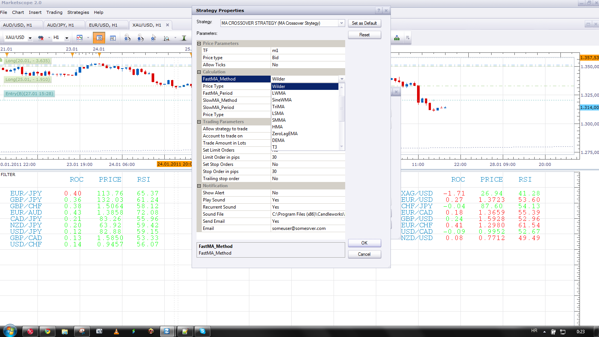
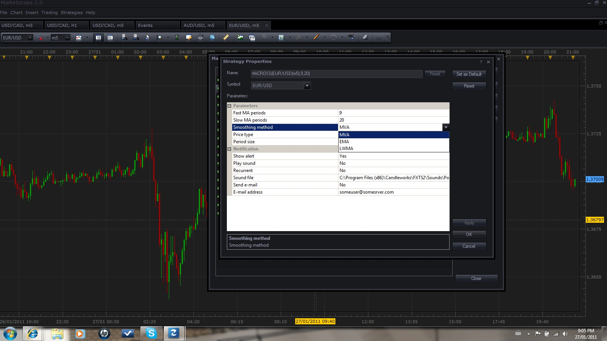

# MA Crossover Strategy

> Source: https://fxcodebase.com/code/viewtopic.php?f=31&t=2763  
> Forum: 31 · Topic 2763 · 55 post(s)

---

## MA Crossover Strategy

**Apprentice** · Mon Nov 22, 2010 7:23 am

This strategy give, signals when the short moving average falls / rises above the long moving average.

 [MA crossover Strategy.lua](files/6289/MA%20crossover%20Strategy.lua)

This Strategy use Averages (20 in 1) Indicator
[viewtopic.php?f=17&t=2430](https://fxcodebase.com/code/viewtopic.php?f=17&t=2430)

The Strategy was revised and updated on December 18, 2018.

---

## Re: MA Crossover Strytegy

**Representative** · Wed Dec 15, 2010 1:34 pm

Hello everyone.

I am using this strategy successfully, but now I wanted it to trade for me when I am away (as I just missed out on 30 pips, which is not nice after several losses to miss out on a profit ) but as I put that in, gave all its variables it started giving me a log after a random candle opened (not a cross at all).
And it didnt open a trade, but it is giving me logs... and as I am typing this the logs went up from 30 to 145 at the moment.
The log says: [string "MA crossover Strategy.lua"] Cannot recognize the host command.

Up to 180 logs now.

Anyone any ideas on whats going on here? and how to fix it?

---

## Re: MA Crossover Strytegy

**Nikolay.Gekht** · Wed Dec 15, 2010 4:10 pm

What Trade Station version do you use?

AFAIK this stategy requires 01.09.101210 version installed or autotrading patch installed over older versions. I strongly recommend to update up to the latest version.

---

## Re: MA Crossover Strytegy

**Representative** · Wed Dec 15, 2010 5:02 pm

I am using marketscope 2.0.
and when I click check for updates it says that there are no updates available (I installed it late august 2010).

---

## Re: MA Crossover Strytegy

**Representative** · Wed Dec 15, 2010 5:05 pm

I just checked and it is version 01.09.082610 I am downloading the patch as I am writing this message.

Fingers crossed

---

## Re: MA Crossover Strytegy

**shinobi_brian** · Fri Dec 17, 2010 6:41 am

This doesn't seem to be entering trades, not sure what's wrong?

---

## Re: MA Crossover Strytegy

**Representative** · Fri Dec 17, 2010 11:28 am

Have you downloaded the patch and added the strategy to your cutsom strategies?

And congrats on winning one of the FXCM micro questions

---

## Re: MA Crossover Strytegy

**snakewob** · Thu Jan 20, 2011 10:31 am

I have testet
and the backtest makes not stop losses or trailing stops.
it is not be got for the backtest performace.

can anyone slove the problem?

---

## Re: MA Crossover Strytegy

**luciana** · Tue Jan 25, 2011 1:59 pm

Hi, is it possible to add to the strategies/signals based on MA more options for MA methods? Specifically, at the moment, I'm looking for WMA/ MA crossover strategy. Thanks.

---

## Re: MA Crossover Strytegy

**luciana** · Thu Jan 27, 2011 9:38 am

Can be the WMA added to the MA based startegy/signals to be able to include it into my own strategy ? Yes, No, Maybe...Thanks in advance.

---

## Re: MA Crossover Strytegy

**Apprentice** · Thu Jan 27, 2011 12:43 pm

Yes you can use it.
Wilders Smoothing (Wilders Moving Average) is added in this strategy.

---

## Re: MA Crossover Strytegy

**luciana** · Thu Jan 27, 2011 2:20 pm

Hi, thank you for your replay. Under smoothing method (MA crossover strategy proprieties), the WMA is not listed; only MVA, EMA and LWMA are. Thanks.

---

## Re: MA Crossover Strytegy

**Apprentice** · Thu Jan 27, 2011 6:26 pm

Wilder or WMA is available.
Or Do you think about weight moving average.
Sometimes the confusion arises

---

## Re: MA Crossover Strytegy

**luciana** · Thu Jan 27, 2011 9:17 pm

It is about Wilder - I used the Macross that was already set up a while ago on my computer, although I had loaded the MA crossover strategy. The Macross has no Wilder as I mentioned as per the screenshot:

 

---

## Re: MA Crossover Strytegy

**Apprentice** · Fri Jan 28, 2011 3:44 am

You have to be exact.
This is the first time you mention Macros.
Until now, you mentioned MA crossover Strategy or you not mentioned anything

---

## Re: MA Crossover Strategy

**luciana** · Fri Jan 28, 2011 9:04 am

Very true, because I use them for alerts, and for this purpose are both the same, less the MA smoothing methods.
Thank you for yours tremendous work to help us. All my best.

---

## Re: MA Crossover Strategy

**station0524** · Sat May 21, 2011 4:34 pm

I have the same problem with both this strategy and the Three MA Strategy. When I apply them to my charts, nothing happens, no signals, nothing happens. Same with trying to back test. Sub chart appears but again no signals or testing. Is there something that I have to enable or do to make them function?

---

## Re: MA Crossover Strategy

**MoonValley** · Sat May 28, 2011 1:45 am

Hi apprentice,

Thanks for this strategy! I've just been testing it and it seems useful so far.

Can you make a little adjustment to this strategy that makes it respect the default 200 SMA in Marketscope 2.0, which means it will not signal or take any trade against the 200 SMA. E.g. if it is set to trade a m5 chart and the currency pair is trading below the 200 SMA, it takes only short positions and ignors any long signal. Similarly when the price goes above the 200 SMA, it goes on taking only long possitions and ignoring any short signal.

I'm not a programmer, but I think it only takes a couple of lines of coding

Thanks again,

MoonValley

---

## Re: MA Crossover Strategy

**Apprentice** · Mon May 30, 2011 11:57 am

MVA Filter added to the developmental cue.

---

## Re: MA Crossover Strategy

**station0524** · Sat Jun 11, 2011 11:00 pm

Should probably post this in the posting about the 20 in 1 indicator but have done that with no reply. Is it possible to add KAMA to the averages ? Also the strategy won't let one use stop and limit orders. Why is that?

---

## Re: MA Crossover Strategy

**Apprentice** · Sun Jun 12, 2011 5:48 am

First.
Answered within the original topic.
Second.
According to information I have,
Limit and Stop orders are No No (forbidden) for U.S. residents, accounts.

---

## Re: MA Crossover Strategy

**station0524** · Mon Jun 13, 2011 10:00 pm

Of course one can place stop and limit orders in the US. "FIFO" only means first in first out, meaning if you have more than one position when the limit or stop order is triggered that order will affect the first position entered.

---

## Re: MA Crossover Strategy

**Apprentice** · Tue Jun 14, 2011 11:43 am

station0524
Can you test the new version.
It seems that the problem in the template that I used.

---

## Re: MA Crossover Strategy

**station0524** · Thu Jun 16, 2011 1:24 pm

It works if you set it to a Non hedging account and not a US account. The system then enters stop and limit orders no matter if your trading in the US. I have another request though, hope you can help. I added the strategy twice on the same chart with different settings, meaning different stop and limit orders for the two strategies. However, when trades are entered, even though two trades are entered it will only use the stop and limit orders from the one strategy on both trades and ignore the stop and limit settings of the second strategy. I have tried to fix this but don't know why it does that. I was even thinking of renaming the strategy so I have the same strategy with different names. Would that help? Any advice would be appreciated.

---

## Re: MA Crossover Strategy

**station0524** · Tue Jun 28, 2011 12:13 am

Apprentice,
Two questions/requests if you don't mind and have the time. First one really pertains to the 20 in 1 AVERAGES but as we use it with this strategy thought I'd ask here, Already asked before for "KAMA" to be added and was wondering if you have any idea how long it would be?

Second. I use a very successful trading system with this strategy by using the strategy on a 15min and 60min chart and only entering trades on the 15min chart if the strategy already is in the same direction on the 60min chart. I do this by monitoring the signals and entering manually. Do you think it is possible to write a program that can do this for example if the strategy shows to be short on the 60min chart then ignore long signals and only take short trades on the 15min chart? It would be great to be able to do this with all time frames.

---

## Re: MA Crossover Strategy

**Apprentice** · Tue Jun 28, 2011 4:24 am

1st Alex is committed to KAMA Averages expansion.
2nd This is possible.
Post your request with detailed descriptions, within the appropriate topic.

---

## Re: MA Crossover Strategy

**abreumr** · Wed Jun 29, 2011 7:22 am

I would like to know if it is possible to add an OSMA filter in this strategy. I mean if the OSMA is positive than it should open long trades only and if OSMA is negative should look for short positions.

Thanks

---

## Re: MA Crossover Strategy

**Apprentice** · Wed Jun 29, 2011 8:44 am

It is possible.

---

## Re: MA Crossover Strategy

**abreumr** · Wed Jun 29, 2011 11:28 am

> **Apprentice wrote:**
> It is possible.

Is it possible to have a noise when the signal is ready?

---

## Re: MA Crossover Strategy

**station0524** · Mon Sep 05, 2011 7:28 pm

Even though KAMA was added to the Averages indicator, when one tries to use the MA crossover Strategy, KAMA does not appear as one of the choices for fast or slow MA. Why not?

---

## Re: MA Crossover Strategy

**sunshine** · Tue Sep 06, 2011 12:23 am

Please find the strategy with support of the KAMA method in the attachment.

---

## Re: MA Crossover Strategy

**mgammal** · Thu Sep 15, 2011 1:36 pm

Hello Apprentice/Sunshine ... i hope you are well as you read my post. Can you please help me in modifying this strategy by 2 things:

1) adding a reverse possibility: so instead of buying when it signals a buy, it sells, and vice versa.
2) i would like the strategy NOT to close the trade when a counter signal happens, so if MA crossover again i dont want my trade to close. I would like my trade to close only on my set TP and SL ..

Thanks alot for your help guys.. i really appreciate it

Gammal

---

## Re: MA Crossover Strategy

**Apprentice** · Fri Sep 16, 2011 9:32 am

Your request is added to the developmental cue

---

## Re: MA Crossover Strategy

**mgammal** · Tue Sep 20, 2011 12:06 pm

Dear Apperentice.. Any idea when will my code be ready?

thanks a million

---

## Re: MA Crossover Strategy

**Journeyman** · Fri Oct 28, 2011 12:05 am

What a brilliant strategy!

Just one warning, though. If you change the settings after the initial signal has been generated, ie when the lines cross, the next trade will not activate until they cross back over again. This is probably the same for all strategies, but only this one has so far been worth any input.

Also, is there any way to stop the "trade open" dialogue box? It's really annoying.

Might I suggest that users post their settings. It took me a week of fine tuning before I got them right.

---

## Re: MA Crossover Strategy

**sunshine** · Fri Oct 28, 2011 1:58 am

> **Journeyman wrote:**
> Also, is there any way to stop the "trade open" dialogue box? It's really annoying.

Just select the "Don't show..." check box in the pop-up box:

 [4908](files/17007/Alert.png)

---

## Re: MA Crossover Strategy

**virgilio** · Wed Jan 25, 2012 11:53 am

This is one of the best strategies available in this entire program, if used correctly. Furthermore, I would like to request the addition of the JRX (Jurik Ultralinear Smoothing) as a choice amongst the moving averages. I hope it can be done.
Thanks in advance.

---

## Re: MA Crossover Strategy

**Apprentice** · Wed Jan 25, 2012 6:36 pm

Your request is added to the developmental cue.

---

## Re: MA Crossover Strategy

**virgilio** · Fri Feb 03, 2012 9:52 am

Hi Apprentice,
Any ideas when the request from Jan 23 can be implemented? "... addition of the JRX (Jurik Ultralinear Smoothing) as a choice amongst the moving averages..."
Thank you.

---

## Re: MA Crossover Strategy

**Melchizedek** · Thu Nov 29, 2012 3:04 am

Question on what this strategy does: I'm still new to some of the lingo. Does this basically alert you when one MA crosses another? Or does it implement trades too?

I'm simply looking for an alert when an EMA crosses an MA. I may not want the trade based on other conditions, but I want an email alert.

Please let me know if this is that type of strategy/alert. If it's not, and there isn't one, let me know and I'll make the official request in a new thread.

THANKS!

---

## Re: MA Crossover Strategy

**Apprentice** · Thu Nov 29, 2012 3:59 am

This strategy can do both.
If you want Alerts only, set Allow strategy to trade to NO.

---

## Re: MA Crossover Strategy

**rose4uj** · Mon Mar 04, 2013 7:50 am

hi

im attempting to download the file but am unable to, any ideas what im doing wrong?

cheers

---

## Re: MA Crossover Strategy

**Apprentice** · Sat Mar 09, 2013 6:03 am

Can you describe the problem you encounter with.

I hope that this explanation will help.
[viewtopic.php?f=31&t=2310](https://fxcodebase.com/code/viewtopic.php?f=31&t=2310)

---

## Re: MA Crossover Strategy

**sjkafeero** · Sun Mar 24, 2013 8:09 am

Hi Apprentice,

 I love this strategy so much. Is there a way I can execute a buy order when the second bar close is higher than the high of the crossover bar(.i.e. the bar when the MA crossover)? The reverse being true for the sell order. Thanks and await your prompt response.

---

## Re: MA Crossover Strategy

**Apprentice** · Mon Mar 25, 2013 5:22 pm

You mean As an additional filter. Yes

---

## Re: MA Crossover Strategy

**sjkafeero** · Tue Mar 26, 2013 8:30 am

Hi Apprentice

 Thanks for the reply. May I ask how I apply that strategy? Thanks once again.

---

## Re: MA Crossover Strategy

**Apprentice** · Wed Mar 27, 2013 6:12 am

Unfortunately you can not, someone needs to rewrite this strategy.

---

## Re: MA Crossover Strategy

**rittorno** · Wed May 15, 2013 8:29 am

Apprentice,
I really like your MA Strategy but I want to add an additional condition for exiting a position that would be triggered based on price crossing one of the averages (ie, EMA, T3, SMA)

I'm sure you are extremely busy but if you could point me in the right direction or post sample code for checking a price crossing and average it would be greatly appropriated.

Thanks

rich

---

## Re: MA Crossover Strategy

**xpertizetrading** · Fri May 22, 2015 5:35 am

Is it possible to code this strategy:

Ma (20 in 1) - Price Level (User Defined, eg. 1.0040 etc) crossover

Buy: Cross Over
Sell: Cross Under.

Thanks
Xpertizetrading

---

## Re: MA Crossover Strategy

**Apprentice** · Tue May 26, 2015 3:37 am

So you're not interested in the Price / MA cross
as in this example.
[viewtopic.php?f=31&t=3859&hilit=averages](https://fxcodebase.com/code/viewtopic.php?f=31&t=3859&hilit=averages)
You're interested in MA / Level Cross.

---

## Re: MA Crossover Strategy

**Apprentice** · Tue May 26, 2015 3:50 am

Requested can be found here.
[viewtopic.php?f=31&t=62265](https://fxcodebase.com/code/viewtopic.php?f=31&t=62265)

---

## Re: MA Crossover Strategy

**Rudolf** · Fri Aug 28, 2015 12:11 pm

Can you add directional confirmation for this strategy ? ( RSI or something else )

---

## Re: MA Crossover Strategy

**lendoo** · Tue Dec 08, 2015 6:44 am

Hi!
The MA Crossover Strategy close automatically the position when the MA cross back. But I would like to close by SL level only. Can you update this strategy please?

Many thanks.

---

## Re: MA Crossover Strategy

**Apprentice** · Wed Dec 16, 2015 5:40 am

Your request is added to the development list.

---

## Re: MA Crossover Strategy

**Apprentice** · Wed Dec 14, 2016 5:36 am

Strategy was revised and updated.
