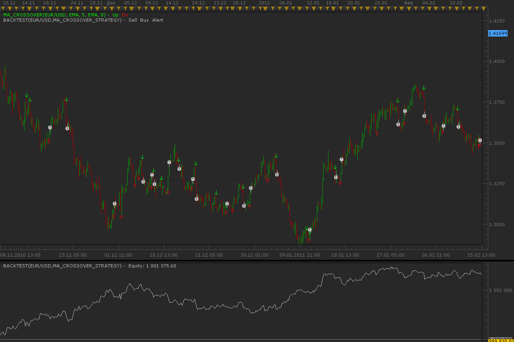

# MA crossover strategy

> Source: https://fxcodebase.com/code/viewtopic.php?f=31&t=3684  
> Forum: 31 · Topic 3684 · 16 post(s)

---

## MA crossover strategy

**Alexander.Gettinger** · Mon Mar 21, 2011 3:08 am

Strategy based on MA crossover indicator ([viewtopic.php?f=17&t=2621](https://fxcodebase.com/code/viewtopic.php?f=17&t=2621)).

 

Download:

 [MA_Crossover_Strategy.lua](files/8914/MA_Crossover_Strategy.lua)

For this strategy must be installed AVERAGES indicator ([viewtopic.php?f=17&t=2430](https://fxcodebase.com/code/viewtopic.php?f=17&t=2430)).

---

## Re: MA crossover strategy

**alepan72** · Mon May 02, 2011 5:20 am

Goodmorning everyone!
I use strategies with an MA as stop. When I add the option, strategy confirm the enter/exit point in to the close of candle. I wonder if you can tell me how to write the code, when I have a strategy that work with candles (RSI, crossover, Stochastic etc.), my MA stop close the trade on tick and not on close of candle.
Thanx in advance and best regards for your services!!!

---

## Re: MA crossover strategy

**rebeljedi** · Thu Feb 16, 2012 2:05 am

hi Alexander,

could you kindly create a combination of this strategy MA Crossover with this ADX DMI strategy?

The strategy:

1. FasterMA crosses above SlowerMA (confirmed cross) and
ADX>=[specified value] and DMIplus>=[specified value] on the candle where crossing happens
=> buy on open of next candle

2. 1. FasterMA crosses below SlowerMA (confirmed cross) and
ADX>=[specified value] and DMIminus>=[specified value] on the candle where crossing happens
=> sell on open of next candle

thank you!

---

## Re: MA crossover strategy

**Apprentice** · Thu Feb 16, 2012 2:50 am

Your request is added to the development list.

---

## Re: MA crossover strategy

**rebeljedi** · Thu Feb 16, 2012 3:06 am

Thank you very much, Alexander!

---

## Re: MA crossover strategy

**amazon1a** · Wed Feb 22, 2012 9:24 pm

I am also very interested in this strategy. Thanks

---

## Re: MA crossover strategy

**rebeljedi** · Mon Jul 02, 2012 7:22 am

> **rebeljedi wrote:**
> hi Alexander,
>
> could you kindly create a combination of this strategy MA Crossover with this ADX DMI strategy?
>
> The strategy:
>
> 1. FasterMA crosses above SlowerMA (confirmed cross) and
> ADX>=[specified value] and DMIplus>=[specified value] on the candle where crossing happens
> => buy on open of next candle
>
> 2. 1. FasterMA crosses below SlowerMA (confirmed cross) and
> ADX>=[specified value] and DMIminus>=[specified value] on the candle where crossing happens
> => sell on open of next candle
>
> thank you!

Hi, I would like to check if there is any update on this request as you have indicated it will be in the developmental queue. Thank you.

---

## Re: MA crossover strategy

**rebeljedi** · Tue Aug 14, 2012 3:08 am

Hi,

I am checking in again to restate my interest in the MAcrossover-ADX DMI request.
Please kindly advise if there is a new link.

Thank you.

---

## Re: MA crossover strategy

**guangho** · Thu Oct 25, 2012 1:34 pm

Friends, hello!

The strategy, it will generate signals when the " opening " and " closing " of the operation.

I would like to ask: can modify it to generate a signal only when the " opening " and " closing "? Because I just want to through the " limit " and " stop" for unwinding operation. My account is allowed to lock.

Thank you very much.

---

## Re: MA crossover strategy

**Apprentice** · Fri Oct 26, 2012 2:57 am

If I understood well.
Set "Allow strategy to trade" to no.
And you will have a trade signal only.

---

## Re: MA crossover strategy

**guangho** · Fri Oct 26, 2012 5:27 am

> **Apprentice wrote:**
> If I understood well.
> Set "Allow strategy to trade" to no.
> And you will have a trade signal only.

I am not as long as the trading signals. My idea is that the condition is established after the... Constantly. The establishment of the position, and then through the other strategies to the termination of execution of these open positions.

---

## Re: MA crossover strategy

**Apprentice** · Sat Oct 27, 2012 2:57 am

So you want a strategy that only opens new positions, and use other strategys to close them.

---

## Re: MA crossover strategy

**guangho** · Sat Oct 27, 2012 11:50 am

> **Apprentice wrote:**
> So you want a strategy that only opens new positions, and use other strategys to close them.

I think you're absolutely right.

Is in the condition established by the time of opening new buying and selling positions ( my account allows for "lose " operation ), let the other strategies to close. However, for safety's sake, stop and stop profit function must remain in force.

Thank you, looking forward to your new strategy.

---

## Re: MA crossover strategy

**guangho** · Mon Oct 29, 2012 10:08 am

> **Apprentice wrote:**
> So you want a strategy that only opens new positions, and use other strategys to close them.

hello，Apprentice：
I passed the test, find the target is not practical, unless it is with great capital amount of possible. So thank you for your attention to this matter, you don't have to change the strategy.

I am in another strategy put forward some modification request, hope you can take a look at it.
Can you help me?Thank you!
[viewtopic.php?f=31&t=14741](https://fxcodebase.com/code/viewtopic.php?f=31&t=14741)

---

## Re: MA crossover strategy

**Apprentice** · Wed Dec 07, 2016 3:25 pm

Strategy has been revised and updated.

---

## Re: MA crossover strategy

**Sospool** · Mon Jun 04, 2018 5:16 am

Hello, I have the message below when I start the strategy:

C:/Program Files (x86)/Candleworks/FXTS2/Strategies/Custom/MA_Crossover_Strategy.lua:-1: nil

Thank you
