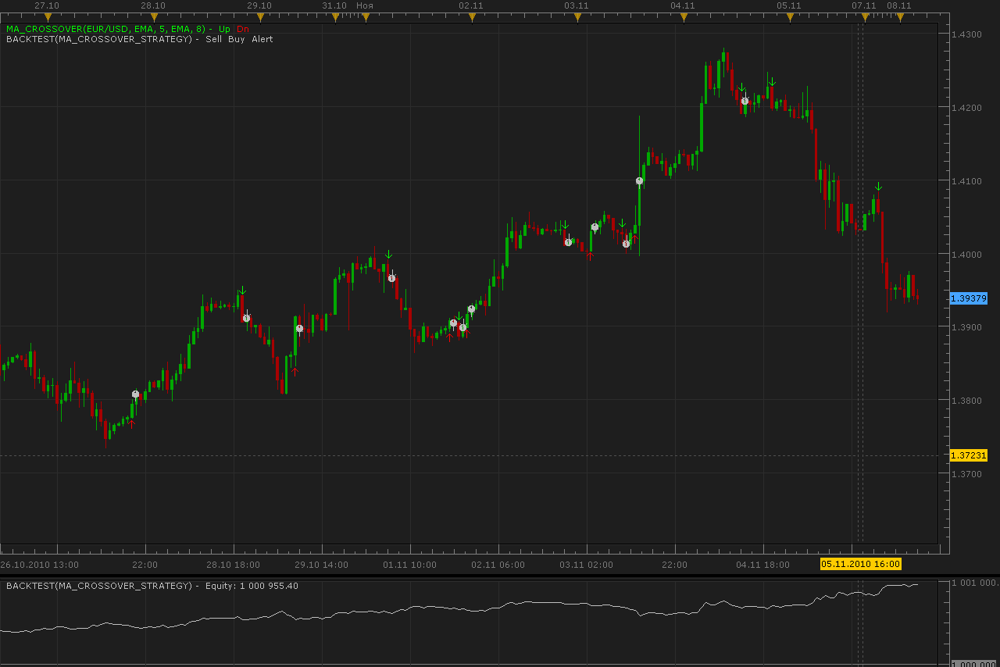

# MA crossover strategy

> Source: https://fxcodebase.com/code/viewtopic.php?f=31&t=2622  
> Forum: 31 · Topic 2622 · 9 post(s)

---

## MA crossover strategy

**Alexander.Gettinger** · Mon Nov 08, 2010 4:26 am

Strategy on MA Crossover indicator ([viewtopic.php?f=17&t=2621](https://fxcodebase.com/code/viewtopic.php?f=17&t=2621))

 

For this strategy must be installed Averages indicator: [viewtopic.php?f=17&t=2430](https://fxcodebase.com/code/viewtopic.php?f=17&t=2430)

The Strategy was revised and updated on December 10, 2018.

---

## Re: MA crossover strategy

**mcarr005** · Mon Nov 08, 2010 4:35 pm

It is possible for this strategy generate an entry order instead of market order?

For SELL signal, the entry price could be 10 pips greater than the price at which the moving average has been crossed.
For BUY signal, the entry price could be 10 pips lower than the price at which the moving average has been crossed.

Thanks

---

## Re: MA crossover strategy

**cmpblsmith** · Wed Jul 31, 2013 8:59 pm

Is it possible to have 3rd ma for confirmation as an option? And/Or option for oscillator confirmation such as RSI, ATR, ADR etc.?
Thank you!!!

---

## Re: MA crossover strategy

**Apprentice** · Thu Aug 01, 2013 2:15 am

Your request is added to the development list.

---

## Re: MA crossover strategy

**cmpblsmith** · Thu Aug 01, 2013 9:54 pm

Thanks Apprentice!
Can we also include an option for this Mva stop?
[viewtopic.php?f=31&t=2339](https://fxcodebase.com/code/viewtopic.php?f=31&t=2339)
This is a great strategy for entry, however it is a little late to exit

---

## Re: MA crossover strategy

**Apprentice** · Mon Aug 05, 2013 2:30 am

Your request is added to the development list.

---

## Re: MA crossover strategy

**Coondawg71** · Wed Aug 14, 2013 7:28 am

I don't believe any of the Moving Average Crossover Strategies support the following 1.) Volume Adjusted Moving Average (Vama). or 2.) Volume Moving Average (Volma).

Can we please request these methods of moving average to be supported within one of the crossover systems.

Thanks,

sjc

---

## Re: MA crossover strategy

**Apprentice** · Thu Aug 15, 2013 12:43 am

Your request is added to the development list.

---

## Re: MA crossover strategy

**Apprentice** · Fri Dec 09, 2016 6:35 am

Strategy was revised and updated.
