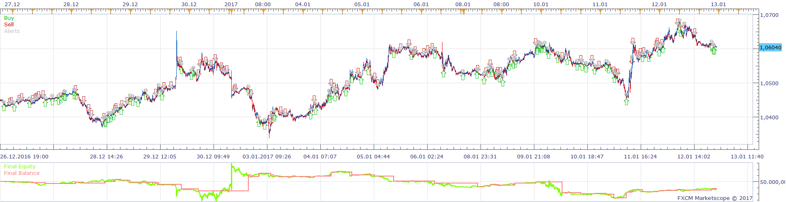
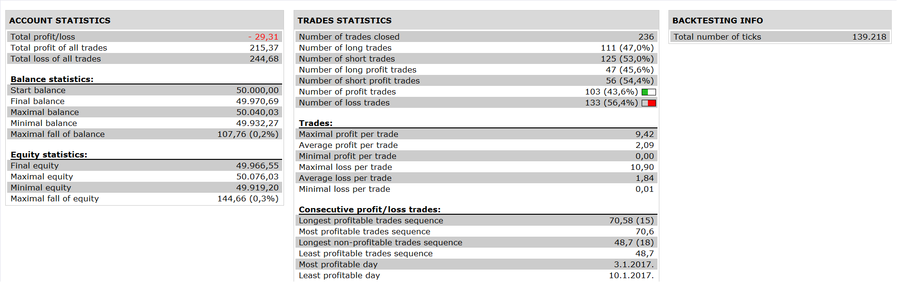

# MA difference Strategy

> Source: https://fxcodebase.com/code/viewtopic.php?f=31&t=64906  
> Forum: 31 · Topic 64906 · 1 post(s)

---

## MA difference Strategy

**Apprentice** · Thu Jul 06, 2017 3:36 pm

 

MA difference is available here.
[viewtopic.php?f=17&t=64888&p=113434#p113434](https://fxcodebase.com/code/viewtopic.php?f=17&t=64888&p=113434#p113434)

Open Long
signal 2> signal 1 and differece 1< difference 2 and differnce 2 cross over signal 2
Open Short
signal 2< signal 1 and difference 1> difference 2 and difference2 cross under signal 2

 [MA difference Strategy.lua](files/113435/MA%20difference%20Strategy.lua)

The Strategy was revised and updated on January 21, 2019.
