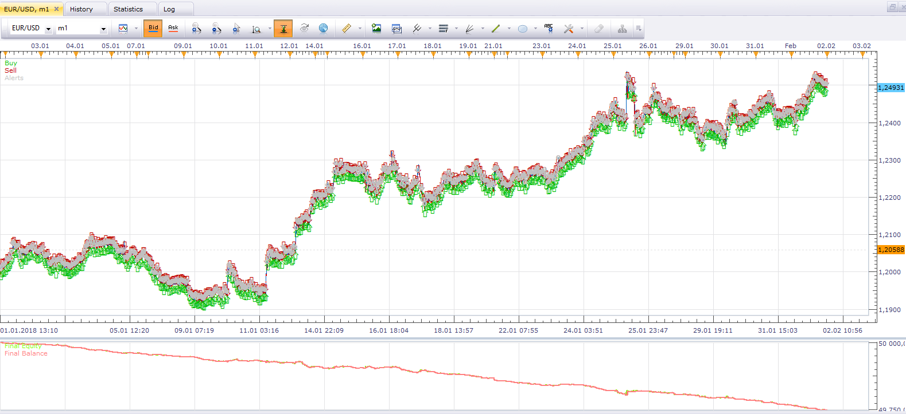
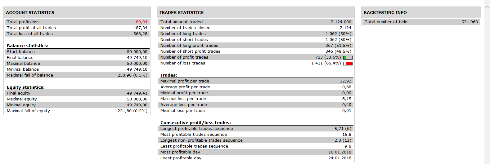

# MA (Fast, Medium, Slow) Strategy

> Source: https://fxcodebase.com/code/viewtopic.php?f=31&t=3834  
> Forum: 31 · Topic 3834 · 2 post(s)

---

## MA (Fast, Medium, Slow) Strategy

**sunshine** · Tue Apr 05, 2011 5:25 am

The strategy is based on three MAs indicators: Fast, Medium and Slow.

The strategy trades by the following conditions:

**Signals to open:**

- When the fast MA crosses over the slow MA, the strategy goes long;
- When the fast MA crosses under the slow MA, the strategy goes short.
**Signals to close:**
- When the fast MA crosses over the medium or slow MA, the strategy closes existing sell positions;
- When the fast MA crosses under the medium or slow MA, the strategy closes existing buy positions.

Download both files:

 [ma_strategy.lua](files/9373/ma_strategy.lua)

 [ma_strategy.lua.rc](files/9373/ma_strategy.lua.rc)

 

 

The Strategy was revised and updated on November 19, 2018.

---

## Re: MA (Fast, Medium, Slow) Strategy

**Apprentice** · Wed Nov 30, 2016 5:51 am

Bump up.
