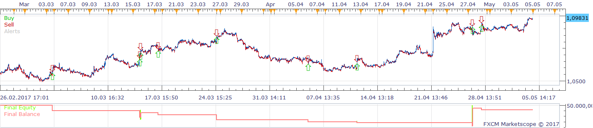
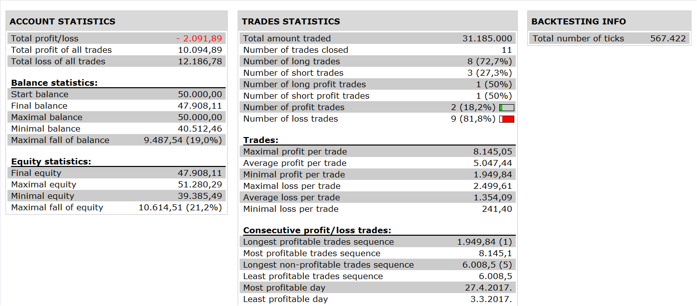
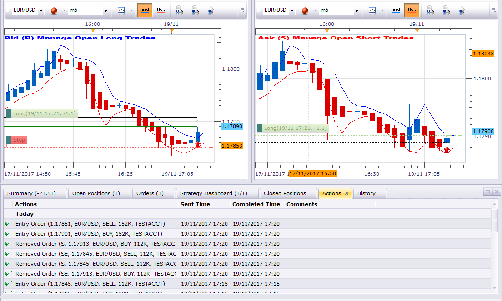
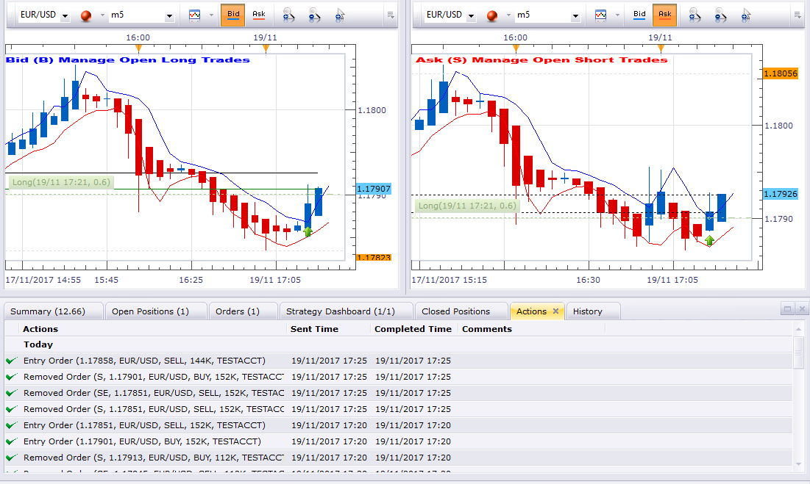
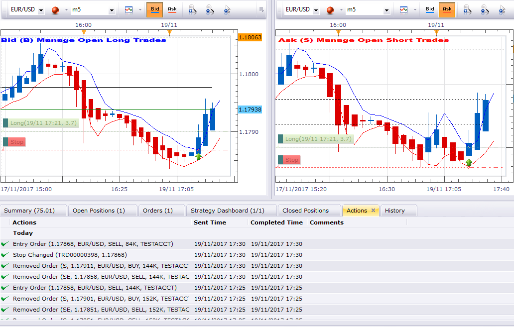

# MA HA Strategy

> Source: https://fxcodebase.com/code/viewtopic.php?f=31&t=65476  
> Forum: 31 · Topic 65476 · 20 post(s)

---

## MA HA Strategy

**Apprentice** · Sat Dec 23, 2017 8:22 am

 

Based on the request.
[viewtopic.php?f=27&t=65472&p=116601#p116601](https://fxcodebase.com/code/viewtopic.php?f=27&t=65472&p=116601#p116601)

 [MA HA Strategy.lua](files/116610/MA%20HA%20Strategy.lua)

SHIFT_MA.lua is available here.
[viewtopic.php?f=17&t=1044&p=106775#p106775](https://fxcodebase.com/code/viewtopic.php?f=17&t=1044&p=106775#p106775)

---

## Re: MA HA Strategy

**Silverthorn** · Tue Jan 02, 2018 12:38 am

Hi Apprentice,

Thank you for your help.

At first the Strategy behaved very strangely. I eventually figured out that the shift on the MA was 2 periods not 1.

I found the lines

 upper_band = core.indicators:create("SHIFT_MA", ha_ask.high, instance.parameters.N, instance.parameters.MA, 1, instance.parameters.SY);
 lower_band = core.indicators:create("SHIFT_MA", ha_bid.low, instance.parameters.N, instance.parameters.MA, 1, -instance.parameters.SY);
 centre_band_bid = core.indicators:create("SHIFT_MA", ha_bid.open, instance.parameters.N, instance.parameters.MA, 1, 0);
 centre_band_ask = core.indicators:create("SHIFT_MA", ha_ask.open, instance.parameters.N, instance.parameters.MA, 1, 0);

and changed to

 upper_band = core.indicators:create("SHIFT_MA", ha_ask.high, instance.parameters.N, instance.parameters.MA, 0, instance.parameters.SY);
 lower_band = core.indicators:create("SHIFT_MA", ha_bid.low, instance.parameters.N, instance.parameters.MA, 0, -instance.parameters.SY);
 centre_band_bid = core.indicators:create("SHIFT_MA", ha_bid.open, instance.parameters.N, instance.parameters.MA, 0, 0);
 centre_band_ask = core.indicators:create("SHIFT_MA", ha_ask.open, instance.parameters.N, instance.parameters.MA, 0, 0);

That gives an offset of one candle as required but I'm sure that is not the correct way to fix the problem. It did allow me to run the strategy in simulator to test.

I then saw that the pending stop losses are placed at the centre band instead on the opposite band. I had originally requested that the stop be placed on the opposing band and moved to the centre band on the next candle but now realise that that is way too soon and causes a lot of stop outs. This is a manual trading system that I have used successfully for some time now. However the timing of when I move from the outer band to the centre band is something I use my own judgement on so it may need some tweaking.

Can I please have the pending stop loss placed on the opposite outer band on creation and then move up with the opposing outer band until the stop loss is above the trade entry/ break even point. At that time the stop loss should follow the centre band.

Lastly this is not a strategy that is set and forget. The timing is based on top down and bottom up analysis. I originally thought that being able to set trading to long or short only would suffice. I now realise that it would be a big advantage to be able to force a trade open and then let the strategy manage it from there. Is it possible to have a pair of buttons on the screen that would allow me to open trades manually and then allow the strategy to manage the trades from there?

Thanks again for your awesome work.

Cheers.

---

## Re: MA HA Strategy

**Apprentice** · Tue Jan 02, 2018 8:31 am

Your request is added to the development list under Id Number 3927

---

## Re: MA HA Strategy

**Apprentice** · Wed Jan 03, 2018 5:19 am

Try this version.

 [MA HA Strategy.lua](files/116725/MA%20HA%20Strategy.lua)

---

## Re: MA HA Strategy

**Silverthorn** · Sun Mar 04, 2018 11:56 pm

Hi Apprentice,

I've been using this for some time now and would like to request some changes if I may.

1- Can I please have an option to turn the use of the centre band off and on.

Use Center Band ON = Stop is placed at the opposite band and moves up or down with the opposite band until the stop loss is above the break even point and then is moved with the center band.

Use Center Band OFF = Stop is placed at the opposite band and moves up or down with the opposite band.

2- I have also noticed that to move the stop loss is first deleted and then a new stop order is placed. Sometimes the new stop order is too close to the market price and the order fails. When this happens the trade is left open with no stop loss. Is it possible to place either the stop as close as possible to the desired position or track the position some other way and close if the stop loss is hit.

---

## Re: MA HA Strategy

**Apprentice** · Mon Mar 05, 2018 11:17 am

Your request is added to the development list under Id Number 4061

---

## Re: MA HA Strategy

**Apprentice** · Tue Mar 06, 2018 3:46 pm

Try this version.

 [MA HA Strategy.lua](files/118064/MA%20HA%20Strategy.lua)

---

## Re: MA HA Strategy

**Silverthorn** · Mon Mar 19, 2018 7:10 pm

Hi Apprentice.

Works GREAT!! Thanks so much. Is it possible to get it to work on custom time frames like can be set with Custom Time Frame Candle View?

---

## Re: MA HA Strategy

**Silverthorn** · Tue Mar 20, 2018 11:48 pm

Hi Apprentice,

I hope you can help.

I'm getting the following error popup and then the Strategy stops.

C:/Program Files (x86)/Candleworks/FXTS2/Strategies/Custom/MA HA Strategy.lua:110: attempt to index local 'source' (a nil value)

---

## Re: MA HA Strategy

**Silverthorn** · Sun Mar 25, 2018 9:08 pm

Hi Apprentice,

Any word on this? Are you able to replicate the error?

---

## Re: MA HA Strategy

**Apprentice** · Mon Mar 26, 2018 10:10 am

> by Apprentice » Tue Mar 06, 2018 10:46 pm

Try it now.

---

## Re: MA HA Strategy

**Silverthorn** · Wed Apr 11, 2018 7:33 pm

Thanks so much Apprentice!!!,

The error is all sorted out but it still drops the stop loss during trades.

Can you make the strategy run on one time frame but trade on another?

Time frame 1- hard coded to m1 to force the Strategy run every one min so it checks for a stop or new user created entry request every min.

Time Frame 2- User Selected time frame that it trades on and uses to calculate the bands etc.

Really appreciate your great work. This is becoming very useful!!!

---

## Re: MA HA Strategy

**Silverthorn** · Mon Apr 23, 2018 1:56 am

Hi Apprentice,

Just wondering.. Is there any update on this strategy yet?

---

## Re: MA HA Strategy

**Apprentice** · Mon Apr 23, 2018 5:12 am

Your request is added to the development list under Id Number 4116

---

## Re: MA HA Strategy

**Apprentice** · Thu Apr 26, 2018 6:12 am

[MA HA Strategy.lua](files/118829/MA%20HA%20Strategy.lua)

Try this version.

 I didn't manage to figure out what you means by " still drops the stop loss during trades"

---

## Re: MA HA Strategy

**Silverthorn** · Tue May 01, 2018 7:09 pm

Thanks for the update Apprentice. I'll test it over the coming week.

By " still drops the stop loss during trades" I mean that when managing an open trade it sometimes deletes the stop loss on the creation of a new candle but fails to recreate the new stop loss leaving the trade unprotected by a stop loss.

Regarding the time custom frames. I read in the Help Files for Marketscope here.

[http://www.fxcorporate.com/help/MS/NOTF ... eriod.html](http://www.fxcorporate.com/help/MS/NOTFIFO/web-content.html?key=index.html#Change_Period.html)

" Type the period of your choice in the following way:

Type the first letter of the time unit you want to use (m for minutes, h/H for hours, d/D for days, w/W for weeks, and M for months).

Type the number of time units of your choice (for m – 1, 2, 3, 4, 5, 6, 10, 12, 15, 20 or 30; for h/H – 1, 2, 3, 4, 6, 8 or 12; for d/D, w/W, and M - 1). For example, to set a two-minutes period, a three-hours period, a one-day period, or a one-month period, you should type m2, h/H3, d/D1, or M1 respectively.

Press ENTER. "

This gives us access to far more time frames than are available from the drop down menu and these are available by simply typing the time frame into the chart as a native part of the program. How can we set the strategy to trade to these other standard time frames?

---

## Re: MA HA Strategy

**Silverthorn** · Thu May 10, 2018 2:05 am

Hi Apprentice. Finally had a chance to test the updated version. The strategy does update every minute now but the shift in bars no longer works. The shift in points however does still work...

Any response on my previous post re. trading on the other time frames available in Marketscope?

---

## Re: MA HA Strategy

**Silverthorn** · Mon May 21, 2018 3:02 am

Any news??

---

## Re: MA HA Strategy

**Silverthorn** · Mon May 28, 2018 12:23 am

Hi Apprentice,

I've been able to answer my own question re. making the additional time periods available by changing

FLAG_PERIODS
to
FLAG_PERIODS_EDIT

I've had no luck at all however getting the latest version of the strategy to run successfully.

The previous version is the best one and is the closest to functional however it still removes the stop loss on an active trade on the second candle of the trade and does not recreate it until the third candle.

 

*Entries are set correctly and trade executes correctly*

 

*Stop Loss is deleted on second candle*

 

*Stop is created again on third and subsequent candles.*

---

## Re: MA HA Strategy

**Silverthorn** · Fri Jun 08, 2018 1:04 am

Hi Apprentice,

Would you have any idea when somebody is able to have a look at this?

It's totally unusable at the moment.

The previous version fails to create the stoploss on open positions and the latest version does very strange things and is totally unusable.

Thanks
