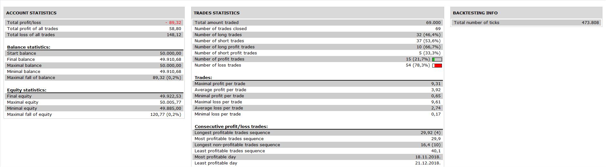

# MA_MA MACD_Signal Cross Strategy

> Source: https://fxcodebase.com/code/viewtopic.php?f=31&t=67341  
> Forum: 31 · Topic 67341 · 4 post(s)

---

## MA_MA MACD_Signal Cross Strategy

**Apprentice** · Tue Feb 12, 2019 5:08 am

 

Based on request.
[viewtopic.php?p=123759#p123759](https://fxcodebase.com/code/viewtopic.php?p=123759#p123759)

Open Long if 1. coincide with 2.
1. MA1/MA2 cross Over.
2. MACD/Signal Line cross

Both crosses must happen simultaneously to have a trade.

 [MA_MA MACD_Signal Cross Strategy.lua](files/123842/MA_MA%20MACD_Signal%20Cross%20Strategy.lua)

---

## Re: MA_MA MACD_Signal Cross Strategy

**OzzyTrader** · Sun Dec 13, 2020 10:43 pm

Could you please create another version of this strategy so I can ad another paramanter.

I would like the ability to set the Bottom Level and the Top Level of the MACD D indicator so for example.

It would only open a trade if the signal occours above 0.00183 in a sell or
It would only open a trade if the signal occours below 0.00142

Essentially creating a overbought for sell trades and oversold for buy trades.

many thanks

---

## Re: MA_MA MACD_Signal Cross Strategy

**Apprentice** · Mon Dec 14, 2020 6:46 am

Your request is added to the development list.
Development reference 2461.

---

## Re: MA_MA MACD_Signal Cross Strategy

**Apprentice** · Tue Dec 15, 2020 11:57 am

[MA_MA_MACD_Signal_Cross_Strategy.lua](files/139584/MA_MA_MACD_Signal_Cross_Strategy.lua)

Try this version.
