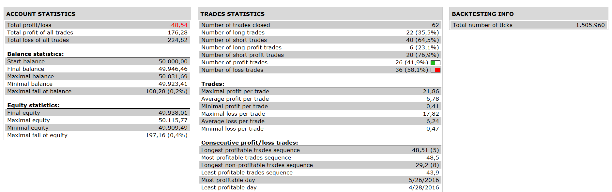

# MA MACD Stochastic Strategy

> Source: https://fxcodebase.com/code/viewtopic.php?f=31&t=63989  
> Forum: 31 · Topic 63989 · 2 post(s)

---

## MA MACD Stochastic Strategy

**Apprentice** · Tue Oct 18, 2016 6:10 am

 

Long
MA2 crosses above MA3.
MACD > 0.
stochastic >= 80

Short
MA1 crosses below MA3
MACD < 0
stochastic <= 20

 [MA MACD Stochastic Strategy.lua](files/108642/MA%20MACD%20Stochastic%20Strategy.lua)

The Strategy was revised and updated on January 18, 2019.

---

## Re: MA MACD Stochastic Strategy

**Apprentice** · Sun Dec 18, 2016 7:06 am

Strategy was revised and updated.
