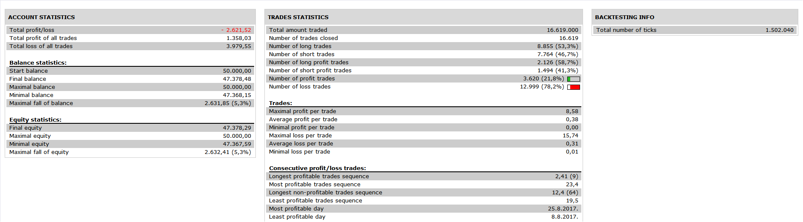

# MA MACD Zero Lag Strategy

> Source: https://fxcodebase.com/code/viewtopic.php?f=31&t=69936  
> Forum: 31 · Topic 69936 · 7 post(s)

---

## MA MACD Zero Lag Strategy

**Apprentice** · Thu May 28, 2020 7:00 am

 

Based on request.
[viewtopic.php?f=27&t=69922](https://fxcodebase.com/code/viewtopic.php?f=27&t=69922)

 [MA MACD Zero Lag Strategy.lua](files/134411/MA%20MACD%20Zero%20Lag%20Strategy.lua)

Averages.lua
[viewtopic.php?f=17&t=2430](https://fxcodebase.com/code/viewtopic.php?f=17&t=2430)

 [MACD_Zero_Lag.lua](files/134411/MACD_Zero_Lag.lua)

---

## Re: MA MACD Zero Lag Strategy

**PAULUC02** · Thu May 28, 2020 11:44 am

Hello apprentice
this strategy is not as i ask.
The condition for a purchase:
- prices must be above the moving average 50
-the macd crosses upwards under line 0.
condition for a sale:
- prices must be below the moving average 50
-macd crosses down above line 0.
thank you.

---

## Re: MA MACD Zero Lag Strategy

**Apprentice** · Tue Jun 02, 2020 6:22 am

Try it now.

---

## Re: MA MACD Zero Lag Strategy

**PAULUC02** · Wed Aug 19, 2020 10:56 am

hello apprentice
Would it be possible to create a dashboard for this strategy in muti time frame.
thank you

---

## Re: MA MACD Zero Lag Strategy

**Apprentice** · Thu Aug 20, 2020 6:16 am

Your request is added to the development list.
Development reference 1913.

---

## Re: MA MACD Zero Lag Strategy

**Apprentice** · Tue Sep 01, 2020 3:25 am

Try this version.
[viewtopic.php?f=17&t=70358&p=137208#p137208](https://fxcodebase.com/code/viewtopic.php?f=17&t=70358&p=137208#p137208)

---

## Re: MA MACD Zero Lag Strategy

**Exolon** · Wed Sep 09, 2020 4:58 pm

This seems like the strategy described for MACD on the "Tradingrush" YouTube channel. I tested it manually for a few days recently, but with 200 day EMA instead of 50 day. The results were not great
