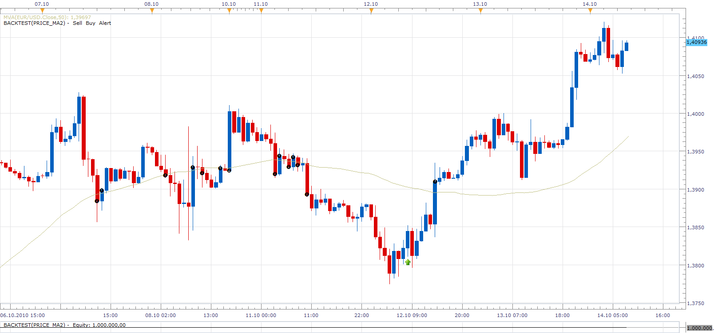

# MA / Price Cross Strategy

> Source: https://fxcodebase.com/code/viewtopic.php?f=31&t=2403  
> Forum: 31 · Topic 2403 · 47 post(s)

---

## MA / Price Cross Strategy

**Apprentice** · Thu Oct 14, 2010 7:21 am

This strategy generates orders based on two two types of signals.

Crossover
Cross over, closing price, below or above the moving average generates Short or Long orders.

Touch.
This is a counter strategy.
If prices during the period falls below the moving average but at the closing price is above average. Generates a Long position.

If prices during the period rises above the moving average but at the closing price is below average. Generates a Short position.

The strategy enables you to the define second moving average to confirm the trend.

 

 [price_ma.lua](files/5199/price_ma.lua)

---

## Re: MA / Price Cross Strategy

**sho-me-pips** · Thu Oct 14, 2010 8:57 am

I found this opens multiple orders in trend direction, maybe an option to close on non-confirmed signals.

Is it possible to incorporate the MVA Stop strategy ([viewtopic.php?f=31&t=2339](https://fxcodebase.com/code/viewtopic.php?f=31&t=2339)) as a stop option inside this strategy.

Example: Position is opened on the 100 MVA and the MVA Stop Strategy becomes the stop and trails at the MVA(userdefined input).

---

## Re: MA / Price Cross Strategy

**sho-me-pips** · Tue Oct 19, 2010 8:45 am

Is it possible to incorporate the MVA Stop strategy (viewtopic.php?f=31&t=2339) as a trailing stop option inside this strategy.

---

## Re: MA / Price Cross Strategy

**sho-me-pips** · Thu Oct 21, 2010 9:34 am

New version is still opening mulitple orders.

---

## Re: MA / Price Cross Strategy

**wizardpro** · Mon Oct 25, 2010 1:12 pm

Hi , Great product.
Excellent product with auto trade what more can I ask .
Just to explain some of the parameter setting such as
Allow Strategy to trade Yes ? = Does does mean it can be done automatically trading without Stragery Trader just using FXCM Trading statioon Sound Great.

Set Limitd Order ?? == Was that refering to number of trade or number of pip such as Take profit.
Limited Order in pips?? == No idea Take Profit Pip I assume
Set Stop Order?? = Stop loss no of trade.
Stop order in piprs? = setting stop loss in pip
Trailing stop order? = Can this be adjust such as 15pip trailing or etc? FXCM come with new technology dynamic instead of the old design trailing ?
Thank once again Great work once again.

---

## Re: MA / Price Cross Strategy

**wizardpro** · Tue Oct 26, 2010 8:25 am

HI ,
It would be good to add on email alert in the subject such as what prices to entry,stop loss and take profile and close with other emails alert.
Improve features such as
1) Emails notiications opening and closing
2) Enter Stop loss and Take Profit
30Enable Dynamic and Fixed Trailing

---

## Re: MA / Price Cross Strategy

**olgasgs** · Tue Oct 26, 2010 8:31 am

Thank you for using our products!

> **wizardpro wrote:**
> Allow Strategy to trade Yes ? = Does does mean it can be done automatically trading without Stragery Trader just using FXCM Trading statioon Sound Great.

Yes.

> **wizardpro wrote:**
> Set Limitd Order ?? == Was that refering to number of trade or number of pip such as Take profit.

This property defines whether the strategy will create Limit (Take Profit) orders for positions opened by this strategy. If the value of this property is "Yes", the strategy will create Limit orders at the price specified in the "Limit Order in pips" property.

> **wizardpro wrote:**
> Limited Order in pips?? == No idea Take Profit Pip I assume

The property defines the price of Limit (Take Profit) orders in pips.

> **wizardpro wrote:**
> Set Stop Order?? = Stop loss no of trade.

This property defines whether the strategy will create Stop (Stop Loss) orders for positions opened by this strategy. If the value of this property is "Yes", the strategy will create Stop orders at the
price specified in the "Stop Order in pips" property.

> **wizardpro wrote:**
> Stop order in piprs? = setting stop loss in pip

The property defines the price of Stop (Stop Loss) orders in pips.

> **wizardpro wrote:**
> Trailing stop order? = Can this be adjust such as 15pip trailing or etc?

In this version of the strategy, Stop orders can be created only in the dynamic trailing mode. But it's possible to modify the strategy code to provide the ability to set the trailing step of orders.
Do you need the modified strategy?

> **wizardpro wrote:**
> FXCM come with new technology dynamic instead of the old design trailing ?

Actually, now FXCM supports both dynamic and fixed modes of trailing stops. But in some systems only one of the trailing modes is available. It depends on the server settings.

---

## Re: MA / Price Cross Strategy

**wizardpro** · Tue Oct 26, 2010 8:43 am

Hi
Can somone explain how to use the parameter such as I can see 3 time frames in each MA.
I though just set my perfer MA in what time frames and the rest are default parameter MA time frames.
I do not understand your parameter how t o use it .
Thank

---

## Re: MA / Price Cross Strategy

**wizardpro** · Wed Oct 27, 2010 1:55 pm

Hi,
For example I pefer to trade in the MA base on H4 time frames.
Prices Parameter udner time frames 4 hours
MVA Parameter for trading Singal time fram 4 hours
MVA Parameter for trend 4 hours
I failes to understand why there are 3 time frames, please kindly explain on the parameter as usually what I did was open a H4 chart and insert 2 MA and trade when cross just as simple as that but i failes to understand your parameter is refering too ?

---

## Re: MA / Price Cross Strategy

**sho-me-pips** · Thu Nov 11, 2010 6:53 pm

Strategy (on AUD/JPY pair) seems to have a bug that occurs when using the 15 min price parameter and 2 hour MVA trade parameter.

If strategy needs to open or close position on the two hour mark, it doesn't. I haven't noticed any other pairs this happens to. I have not noticed or had any other problems.

---

## Re: MA / Price Cross Strategy

**durleo** · Mon Jan 10, 2011 12:09 pm

Hi There - i am getting an error 158 on the trade station with the latest update.

---

## Re: MA / Price Cross Strategy

**sunshine** · Tue Jan 11, 2011 5:44 am

> **durleo wrote:**
> Hi There - i am getting an error 158 on the trade station with the latest update.

Hi,
Could you please provide more details about this issue.
When does the error occur?
- During the update
- When starting the application
- During login
It would be great if you also attached a screenshot.

---

## Re: MA / Price Cross Strategy

**basicstrategy** · Mon Jan 24, 2011 1:52 am

Hi,
is it possible to remove the fact that this strategy opens a new order at each candle ?
My idea is that it opens one when the candle crosses the ma and closes and reverses the trade when it crosses in the other direction.
Thanks in advance for your answer.

---

## Re: MA / Price Cross Strategy

**luciana** · Fri Mar 04, 2011 1:12 pm

Hi, how the confirmation option works? I set it "yes" and does not enter the trade although the price cross the fast (set it up as the MA parameter for trading), and the slow MA (set it up as the MA parameter for trend); just it gives an alert to "enter the trade but without confirmation". When the cross is confirmed? Would you please explain the meaning of the confirmation for this strategy? Thanks.
BTW, would you also please add to the smoothing methods of MAs, the Wilders? Thanks again in advance.

---

## Re: MA / Price Cross Strategy

**Rainbowlighthousecp** · Mon Mar 21, 2011 3:13 am

Hi,

Can you add to this strategy the option of using a CCI with a period that we can select? The idea is to use another indicator like CCI as a filter. For example, when price cross over the MA to the upside, CCI should be above "0" then enter long.

Thanks! Look forward to this addition.

---

## Re: MA / Price Cross Strategy

**Apprentice** · Mon Mar 21, 2011 11:16 am

Your request has been added to developmental cue.

---

## Re: MA / Price Cross Strategy

**R3boot** · Thu Mar 31, 2011 3:07 am

that's awesome

well, i got this strategy that works on the one u posted,,,, it's just differs in the following points.
tools: zigzag and MA

*If ZIGZAG formed a top AND candle Closed below MA ..... open position SHORT

*Close position on the 3rd candle closing

opposite for LONG: IF zigzag formed bottom AND candle closed above MA >>>> open LONG

* close position on 4rd candle closing too

using confirmation of rsi would be useful too

---

## Re: MA / Price Cross Strategy

**STEIGO** · Thu May 12, 2011 5:21 am

Apprentice - I admire your work, although I do find it difficult to follow HOW you achieve your results – my deficiency, not yours (a few notes in the code, or some logic statements would really help).

I particularly like your “touches” option in this strategy. I guess this must work on tick data?
Is this similar to the TS2 trading from a line touches/crosses option?

Is it possible to modify/code this “touches” option as follows – open position when price crosses/touches (a LINE) and reverses, - when the LINE crossed/touched, could be either
1. a price,
2. a moving average,
3. a fib line,
4. a pivot line?

If it is possible – could further conditions be put on the cross/reverse – if price crosses by say 20pips do not action strategy.

If these ideas seem possible I'll specify in detail the requirements

My ideal preference would be along the lines – Define 6 ma's, 5ema, 10ema 21ema, 35sma, 50sma and 62sma. Open a position IF a ma is crossed and REVERSES, while using the next ma as a stop loss.
IE. If the tick price crosses the 21ema and then reverses – open a position and attach a stop at the 35ema price.
Only one position should be open at a time, to account for multiple reversals across different ma's. However, in the above case, a short term reversal at the 21ema position, followed by a continuation to say the 50ema then a reversal, would mean – the initial position opened at 21ema would be stopped out at the 35ema price (for a loss), but the later reversal at the 50 ema would still be opened with a stop at the 62 sma price.

If these ideas are possible, I believe it may satisfy previous coding requests made by JonathanG called “Price Brakes Level, Reversal Entry

---

## Re: MA / Price Cross Strategy

**Apprentice** · Thu May 12, 2011 6:46 am

It is possible, but it would be better done as a new strategy.
As regards the comments, I agree.
But this add time to development.

---

## Re: MA / Price Cross Strategy

**luigipg** · Fri Dec 02, 2011 10:24 am

Apprentice, hi and thanks for everything. Please may you (or somelse) edit this strategy by adding confirmation by distance in pips or percentage of ATR (n periods) b/w price and MA? With the stop loss always on the MA and/or the value that we choosen. For me you can also remove the trend confirmation. I would be very grateful because I'm crazy to do all this manually. I hope to soon find this update. I thank you heartily. Luigi!!!

---

## Re: MA / Price Cross Strategy

**Apprentice** · Fri Dec 02, 2011 6:11 pm

Your request is added to the developmental cue.

---

## Re: MA / Price Cross Strategy

**luigipg** · Sat Dec 03, 2011 3:18 am

Thank you very much apprentice, but I forgot one very important thing. The position is expected to open at the touch of the calculated level and not wait for the closing bar (see the option in "MA / Price Cross Signal") [viewtopic.php?f=29&t=2386](https://fxcodebase.com/code/viewtopic.php?f=29&t=2386). Sorry and thanks again. Luigi!!!

---

## Re: MA / Price Cross Strategy

**arstechnica** · Wed Oct 24, 2012 5:17 pm

Dear Mario,

I appreciate Your work and effort very much.

I'm setting some strategies and need some modifications to this one:

I need 4 EMA strategy (or MVA or different to be selected by user also to optimize with backtesting)

Short positions:
conditions: 1)first EMA is under second EMA
 2)price intersect first EMA (or touch and reverse)
open short: next candle without touching first EMA and price go lower than first candle low
Stop/Profit: third Ema intersect forth EMA (of course also trailing stop or pip stop and profit possibilities)

Long position the opposite

Of course for better backtesting I would select if price is applied to High, Low, etc..

Filter like ADX, RSi could be good for backtesting (with the possibility of no filters).

In addition, in my opinion any strategy should have a box to chek if You want to apply to any cross or which cross You want to apply to simplify use (if to apply to more thanone cross or index).

Please let me know if You can do it and how much time You think you need.

My best Regards
Salvatore

---

## Re: MA / Price Cross Strategy

**Apprentice** · Thu Oct 25, 2012 1:43 am

Your request is added to the development list.

---

## Re: MA / Price Cross Strategy

**osprandel** · Thu Nov 01, 2012 12:02 pm

Hello,

I was hoping that someone could help me code a very simple price/MA strat.

When price crosses and closes above the 100EMA of the high, go long. When price crosses and closes below the 100EMA of the low, go short. This is a stop and reverse method.

---

## Re: MA / Price Cross Strategy

**Apprentice** · Fri Nov 02, 2012 5:05 am

Your request is added to the development list.

---

## Re: MA / Price Cross Strategy

**osprandel** · Fri Nov 02, 2012 8:24 am

thank you, I will be here when it is finished or you have any questions, thank you very much

---

## Re: MA / Price Cross Strategy

**sagymmm** · Mon Nov 05, 2012 4:27 pm

Can we have a strategy for VIDYA and PPMA wither crossover or the average crossed by the candle?

---

## Re: MA / Price Cross Strategy

**Apprentice** · Tue Nov 06, 2012 7:18 am

In nutshell, you want Price / VIDYA and Price / PMMA Cross Strategy.

---

## Re: MA / Price Cross Strategy

**sagymmm** · Wed Nov 07, 2012 4:08 am

Price/average cross and crossover of slow and fast averages

---

## Re: MA / Price Cross Strategy

**Apprentice** · Thu Nov 08, 2012 10:19 am

PPMA, VIDYA and some other Methods Added to topmost Post.

Another similar strategy, with PPMA and VIDYA can be found here.
[viewtopic.php?f=31&t=23836&hilit=MA+Cross](https://fxcodebase.com/code/viewtopic.php?f=31&t=23836&hilit=MA+Cross)

---

## Re: MA / Price Cross Strategy

**arstechnica** · Sat Jan 05, 2013 11:22 am

Could you please add hte possibility to invert the signal :

example

Crossover
Cross over, closing price, below the moving average generates Long orders

Thanks and regards

---

## Re: MA / Price Cross Strategy

**Apprentice** · Sun Jan 06, 2013 5:43 am

Your request is added to the development list.

---

## Re: MA / Price Cross Strategy

**IQFX32** · Sun Jun 09, 2013 3:24 pm

Hello,

Can we chose more than 300 period MA, 800 for example?

Thank you

---

## Re: MA / Price Cross Strategy

**Apprentice** · Mon Jun 10, 2013 3:12 am

limit increased to 2000.

---

## Re: MA / Price Cross Strategy

**IQFX32** · Mon Jun 10, 2013 12:28 pm

It dosen't works.
Thank you

---

## Re: MA / Price Cross Strategy

**Apprentice** · Wed Jun 12, 2013 5:13 am

Attempting to refresh your browser or download it from another computer / browser.

---

## Re: MA / Price Cross Strategy

**Bob NZ** · Sun Jul 07, 2013 1:06 am

Hi,
 I tried loading price_ma.lua got an error. "price_ma.lua: 78: unexpected symbol near )"

I'm new just learning how to learn lua programming. But I suppose the 78 is the line number.

This is line 78:-

 strategy.parameters:addDouble("MvaLBSens", "Minimal change of MVA to detect trend (in %)", "", 1, 0.000001, 1000000);

I have no idea of what it means. There is a big gap between looking at Guppy's ma's etc,. And other project to learn from that I have found, and this program.

Can someone explain how I can fix this?

Also are there any tutorials with projects that go from beginner to more advanced in small steps? If so where can I find them?

Thanks.

Cheers

Image of T/S II error loading.

 

---

## Re: MA / Price Cross Strategy

**Epsilon** · Mon Jul 08, 2013 12:47 pm

Bob, it's actually the line above the one you're referring to. Change
strategy.parameters:addInteger("MvaLB1", "Periods to look back", "", 20, 1, 2000));
to
strategy.parameters:addInteger("MvaLB1", "Periods to look back", "", 20, 1, 2000);

---

## Re: MA / Price Cross Strategy

**Apprentice** · Tue Jul 09, 2013 4:11 am

Bug Fixed.

---

## Re: MA / Price Cross Strategy

**bushka57** · Tue Dec 22, 2015 9:44 pm

Hi Apprentice

Is it possible to modify this strategy slightly to add the following features in the trading parameters?

* Being able to set stop loss by price rather than pips as the stop loss price can vary depending on entry price
* Being able to set stop loss by percentage of trading account balance
* Being able to set profit target by price
* Being able to set profit target by percentage of trading account balance. I always risk 1% so if I can set my profit target by percent it makes it easy to enter 2:1 or 3:1 trades
* Being able to set the trading amount by percentage calculated between the stop loss price and the entry, example. If you set your stop 50 pips away, how many lots is that if you only wish to risk 1%
In my trading plan I risk 1% on each trade, no matter how far back my stop loss is placed.

Thanks

---

## Re: MA / Price Cross Strategy

**Apprentice** · Mon Dec 28, 2015 5:56 am

Your request is added to the development list.

---

## Re: MA / Price Cross Strategy

**bushka57** · Mon Jan 04, 2016 3:32 am

Thanks Apprentice, much appreciated

---

## Re: MA / Price Cross Strategy

**Apprentice** · Wed Dec 14, 2016 5:10 am

Strategy was revised and updated.

---

## Re: MA / Price Cross Strategy

**amazon1a** · Tue Jul 10, 2018 3:15 pm

Hi Apprentice,

Would it be possible to add an ADX filter to this Strategy? I would like to be able to chose the ADX Level and the Periods for the trading signal TF. Basically I only want to trade when ADX is above 32.

Thanks, AG

---

## Re: MA / Price Cross Strategy

**Apprentice** · Sat Aug 04, 2018 8:08 am

ADX filter added.

---

## Re: MA / Price Cross Strategy

**ttta.4x** · Sat Sep 05, 2020 12:29 pm

nice extension. maybe a little documentation atleast the logic would have been excellent. I just notice that it stops working at some point during simulation. Thanks
