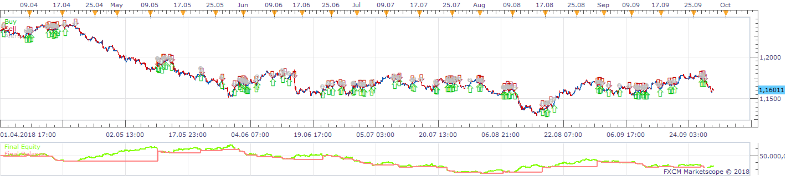
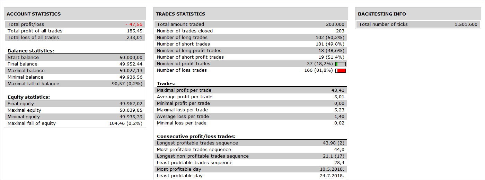

# MA Price Cross Touch Strategy.Avignon

> Source: https://fxcodebase.com/code/viewtopic.php?f=31&t=66893  
> Forum: 31 · Topic 66893 · 16 post(s)

---

## MA Price Cross Touch Strategy.Avignon

**Apprentice** · Tue Nov 06, 2018 7:11 am

 

Opening and close the trade when the price touches or crosses the shortest moving average
but only if the longest moving average confirms the trend.

 [MA Price Cross Touch Strategy.Avignon.lua](files/121979/MA%20Price%20Cross%20Touch%20Strategy.Avignon.lua)

---

## Re: MA Price Cross Touch Strategy.Avignon

**Avignon** · Tue Nov 06, 2018 12:21 pm

The closing of the trade was not done.

 

---

## Re: MA Price Cross Touch Strategy.Avignon

**Avignon** · Tue Nov 06, 2018 1:21 pm

Or it's a bug, or there must be something to optimize under the conditions in lines of code because it worked.

 

---

## Re: MA Price Cross Touch Strategy.Avignon

**Jyuken** · Wed Jan 23, 2019 8:52 am

Hey apprentice !

Thank you so much for this strategy, I love it and have some good result with it. However I though about a way to improve it and saw some flaws in the positions taken sometimes.

For example here :
the first position was good : buying when short MA > long MA and price cross from the bottom the short MA
the second position was good : selling when short MA < long MA and price cross from the top the short MA
However the third one bothers me : buying because price cross short MA from the bottom despite of the fact that long MA > short MA

So maybe I misunderstood but what do you mean by "if the longest moving average confirms the trend" ?

Moreover I thought about a filter that would improve this strategy : if there is less than n pips separating the two moving average then we do not open a trade. Would it be possible to add that to this strategy ?

Thank you so much for your work, have a wonderful day !

---

## Re: MA Price Cross Touch Strategy.Avignon

**faboris** · Mon Jul 26, 2021 4:25 am

Hi All,

When the cross strategy is sending a BUY/SELL signal, is it possible to code another condition as below :

- When it is a BUY, price is closed above the MA. Wait the next candle and the next candle closing price has to be above the MA as well. If the closing price of the next candle is below the MA, it is not a BUY

- Same strategy for a SELL Signal

Many thanks

Boris

---

## Re: MA Price Cross Touch Strategy.Avignon

**Apprentice** · Tue Jul 27, 2021 2:58 am

Your request is added to the development list.
Development reference 683.

---

## Re: MA Price Cross Touch Strategy.Avignon

**Apprentice** · Thu Jul 29, 2021 1:52 pm

[MA_Price_Cross_Touch_Strategy.Avignon.lua](files/143020/MA_Price_Cross_Touch_Strategy.Avignon.lua)

Try this version.

---

## Re: MA Price Cross Touch Strategy.Avignon

**faboris** · Fri Jul 30, 2021 9:06 am

That's great. Many Thanks

Can I ask you 1 last request ?

The signal is great but the price is not. Is it possible to code as the example below (in RED)

-When the buy signal is confirmed, the price entry should be at the low level of the Period-1
-Same logic for a SELL Signal

Thanks in advance

Boris

---

## Re: MA Price Cross Touch Strategy.Avignon

**Apprentice** · Fri Jul 30, 2021 2:14 pm

Your request is added to the development list.
Development reference 705.

---

## Re: MA Price Cross Touch Strategy.Avignon

**Apprentice** · Wed Aug 04, 2021 4:38 am

[MA_Price_Cross_Touch_Strategy.Avignon.lua](files/143076/MA_Price_Cross_Touch_Strategy.Avignon.lua)

Try this version.

---

## Re: MA Price Cross Touch Strategy.Avignon

**faboris** · Wed Aug 04, 2021 7:04 am

Brilliant. It works perfectly

Can I ask you a final adjustment ? Can you remove below signal ?

Signals should be above/below both MA.

When it is a BUY, closing price should be above both MA (which is not the case in this example). When it is a SELL, closing price should be below both MA (which is ok for this example)

Thanks

Boris

---

## Re: MA Price Cross Touch Strategy.Avignon

**Apprentice** · Thu Aug 05, 2021 5:58 am

Your request is added to the development list.
Development reference 721.

---

## Re: MA Price Cross Touch Strategy.Avignon

**Apprentice** · Thu Aug 05, 2021 2:40 pm

[MA_Price_Cross_Touch_Strategy.Avignon.lua](files/143117/MA_Price_Cross_Touch_Strategy.Avignon.lua)

Try this version.

---

## Re: MA Price Cross Touch Strategy.Avignon

**faboris** · Fri Aug 06, 2021 4:53 am

It works for the Sell Signals but it doesn't allowed me to open a Long Position.
Moreover, I have to populate "Reverse" into the Type of signals section. With the previous amendment, I populated "Direct"

The condition for a BUY signal is to get the closing price aboce both MAs
The condition for a SELL signal is to get the closing price below both MAs

Many thanks

Boris

---

## Re: MA Price Cross Touch Strategy.Avignon

**Apprentice** · Fri Aug 06, 2021 12:08 pm

Your request is added to the development list.
Development reference 724.

---

## Re: MA Price Cross Touch Strategy.Avignon

**Apprentice** · Mon Aug 09, 2021 7:59 am

[MA_Price_Cross_Touch_Strategy.Avignon.lua](files/143153/MA_Price_Cross_Touch_Strategy.Avignon.lua)

Try this version.
