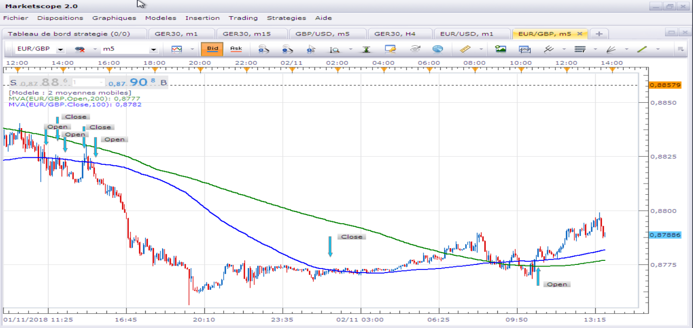

# MA Price Cross Touch Strategy

> Source: https://fxcodebase.com/code/viewtopic.php?f=31&t=63839  
> Forum: 31 · Topic 63839 · 16 post(s)

---

## MA Price Cross Touch Strategy

**Apprentice** · Mon Sep 05, 2016 4:43 am

Based on signal.
[viewtopic.php?f=29&t=20226](https://fxcodebase.com/code/viewtopic.php?f=29&t=20226)

With this strategy, you can define up to two moving averages.
If prices cross or touch one or any of moving averages, the signal/trades is given.

Up Cross/Touch
Long Trade

Down Cross/Touch
Short Trade

 [MA Price Cross Touch Strategy.lua](files/107972/MA%20Price%20Cross%20Touch%20Strategy.lua)

---

## Re: MA Price Cross Touch Strategy

**leeh111** · Mon Oct 17, 2016 7:52 am

Hi would it be possible to add an option to this strategy ?? it would be good if there could be a confirmation of the second candle closing on the same side of the ema as the first candle..

 [16817](files/108633/stratpic.JPG)

it would eliminate some false signals from a choppy market.. hopefully somebody can add this

update: also would be great if there could be a fixed trailing stop option added as it seems the strategy uses a dynamic trailing stop,,

cheers

---

## Re: MA Price Cross Touch Strategy

**Apprentice** · Tue Oct 18, 2016 8:23 am

Your request is added to the development list, Under Id Number 3654
 If someone is interested to do this task, please contact me.

---

## Re: MA Price Cross Touch Strategy

**Apprentice** · Sun Dec 18, 2016 7:11 am

Strategy was revised and updated.

---

## Re: MA Price Cross Touch Strategy

**TrendingEddie** · Wed Sep 19, 2018 11:54 am

Hi, Thanks for doing great job.
I have a problem with this strategy. Strategy is not working any more. I wanted to run the strategy on 2h chart but no success. After I tried other settings and time frames, but nothing happened, no messages, no error or trades? Strategy runs in backtest mode, but when I add it to live charts strategies is not working

THANK YOU

---

## Re: MA Price Cross Touch Strategy

**Apprentice** · Thu Sep 27, 2018 2:53 am

Try it now.

---

## Re: MA Price Cross Touch Strategy

**Avignon** · Fri Nov 02, 2018 9:48 am

Hello,

Is possible to customize the strategy?

 

Thank you.

---

## Re: MA Price Cross Touch Strategy

**Apprentice** · Sat Nov 03, 2018 4:59 am

I'm not sure I understand entry rules.
Can you please write them down?

---

## Re: MA Price Cross Touch Strategy

**Avignon** · Sun Nov 04, 2018 7:29 pm

The opening and closing of the trade is given when the price touches or crosses the shortest moving average but only if the longest moving average confirms the trend.

Thank you.

I found [that](http://www.fxcodebase.com/code/viewtopic.php?f=31&t=2403) but I did not manage to make it work.

---

## Re: MA Price Cross Touch Strategy

**Apprentice** · Mon Nov 05, 2018 6:32 am

Your request is added to the development list under Id Number 4300

---

## Re: MA Price Cross Touch Strategy

**Apprentice** · Tue Nov 06, 2018 7:14 am

Try this version.
[viewtopic.php?f=31&t=66893](https://fxcodebase.com/code/viewtopic.php?f=31&t=66893)

---

## Re: MA Price Cross Touch Strategy

**AEKARAOLE** · Wed Aug 21, 2019 6:03 am

Hi,
I have a problem with the strategy “MA Price Cross Touch Strategy”.
For example: in timeframe H4, If prices cross or touch only one time the moving average, the strategy sents no-stop emails, instead sending just one email.
This is happens only when I choose the setting live (live/end of turn)

Can you check it please?
Thank you

---

## Re: MA Price Cross Touch Strategy

**Apprentice** · Thu Aug 22, 2019 4:31 pm

When you select Live, will the strategy will send multiple emails?
Can you confirm?

---

## Re: MA Price Cross Touch Strategy

**AEKARAOLE** · Fri Aug 23, 2019 3:28 am

of course,
that’s exactly happens

---

## Re: MA Price Cross Touch Strategy

**foreveryoung** · Fri Feb 28, 2020 4:39 pm

Hi Apprentice

This strategy shall not accept a lot size greater than 100.

Regards
Nik

---

## Re: MA Price Cross Touch Strategy

**Apprentice** · Sun Mar 01, 2020 4:29 pm

Try it now.
