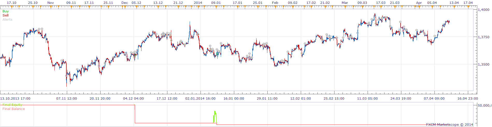

# MA - QQE - GHLA STRATEGY

> Source: https://fxcodebase.com/code/viewtopic.php?f=31&t=60686  
> Forum: 31 · Topic 60686 · 3 post(s)

---

## MA - QQE - GHLA STRATEGY

**Apprentice** · Tue May 13, 2014 5:23 am

Based on the request.
[viewtopic.php?f=27&t=60684](https://fxcodebase.com/code/viewtopic.php?f=27&t=60684)

Open Long
1.Price> GHLA
2. MA> GHLA
3.QQE cross over TS Fast
4. qqe> Buy Entry Level
5. qqe <Buy Exit Level

Exit Long
Price / GHLA Cross Under

Inversely for Short.

 [MA - QQE - GHLA STRATEGY.lua](files/93981/MA%20-%20QQE%20-%20GHLA%20STRATEGY.lua)

You need to install this two indicators.
Qualitative Quantitative Estimation (QQE)
[viewtopic.php?f=17&t=1347&hilit=QQE](https://fxcodebase.com/code/viewtopic.php?f=17&t=1347&hilit=QQE)
Gann HiLo Activator
[viewtopic.php?f=17&t=227&p=320&hilit=ghla#p320](https://fxcodebase.com/code/viewtopic.php?f=17&t=227&p=320&hilit=ghla#p320)

The Strategy was revised and updated on December 11, 2018.

---

## Re: MA - QQE - GHLA STRATEGY

**Apprentice** · Tue May 13, 2014 5:47 am

Short Note.
This is an example or strategy development should not be done.
Too tight, too many parameters added at once.
Alternative.
Start with one condition, gradually add additional logic.

---

## Re: MA - QQE - GHLA STRATEGY

**Apprentice** · Sun Dec 11, 2016 8:07 am

Strategy was revised and updated.
