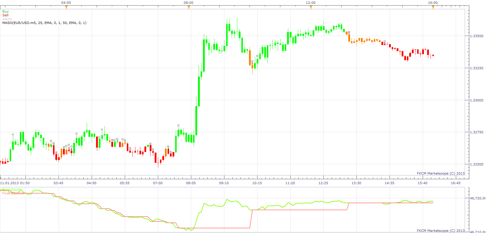

# MA Slope Oscilator Strategy

> Source: https://fxcodebase.com/code/viewtopic.php?f=31&t=31812  
> Forum: 31 · Topic 31812 · 18 post(s)

---

## MA Slope Oscilator Strategy

**Apprentice** · Wed Feb 06, 2013 6:20 pm

The strategy is based on the MASO indicator.
[viewtopic.php?f=17&t=2431](https://fxcodebase.com/code/viewtopic.php?f=17&t=2431)

Strategy use simple logic.
Buy on Green MASO Indications.
Sell ​​on Red MASO Indications.
U can use Optional Exit, if we do not have an unambiguous indication.

 [MA Slope Oscilator Strategy.lua](files/54240/MA%20Slope%20Oscilator%20Strategy.lua)

Please install MA_Slope indicator
[viewtopic.php?t=1122&f=17#p2143](https://fxcodebase.com/code/viewtopic.php?t=1122&f=17#p2143)

The Strategy was revised and updated on January 19, 2019.

---

## Re: MA Slope Oscilator Strategy

**Ramp711** · Fri Feb 22, 2013 12:36 am

Hi Apprentice, can you please include the maximum number of positions that can be opened at any time "selection"

---

## Re: MA Slope Oscilator Strategy

**Ramp711** · Fri Feb 22, 2013 6:42 am

Hi Apprentice, can you please include a confirmation selection (Confirmation before opneing position) and the following settings to apply:

"Ma Slope Paramaters selection"

I want to use a third Ma Slope to confirm entry, this to be set under the confirmation selection

Thanks

---

## Re: MA Slope Oscilator Strategy

**fxcyberman** · Fri Feb 22, 2013 8:56 am

can it be able to have an option that two consecutive colors changed to open trade rather than only one color changed. i.e. like red red, green green, => confirmed. red green red , green red green => no action.

---

## Re: MA Slope Oscilator Strategy

**Apprentice** · Sat Feb 23, 2013 7:30 am

Your requests are added to the development list.

---

## Re: MA Slope Oscilator Strategy

**Ramp711** · Tue Mar 05, 2013 6:16 am

Hi Apprentice

Any feedback on the requested changes?

---

## Re: MA Slope Oscilator Strategy

**Ramp711** · Mon Mar 11, 2013 2:43 pm

Hi Apprentice

Can you please make the following changes:

I want to be able to reverse the signal of each Ma slope confirmation, therefore have a selection to reverse each Ma slope confirmation.

---

## Re: MA Slope Oscilator Strategy

**Apprentice** · Tue Mar 12, 2013 5:17 am

Something like this.
Open reverse trade on confirmation.

If i have 1 long positon , open 1 short position, effectively go to market neutral.
or
If i have 1 long positon , close long, then open short.

---

## Re: MA Slope Oscilator Strategy

**Ramp711** · Tue Mar 12, 2013 10:37 am

More of, i want to reverse each signal individually, each signal can be reversed to give either a buy/sell depending on the reverse selector.

---

## Re: MA Slope Oscilator Strategy

**Ramp711** · Wed Mar 20, 2013 4:16 pm

Hi Apprentice

Any progress on the requested changes?

---

## Re: MA Slope Oscilator Strategy

**Ramp711** · Wed Mar 20, 2013 4:22 pm

I find this strategy very useful. The following settings are working well on the Eur/JPY 5 min chart.

**1st MA Slope**
Price Source: Close
1st Ma Period: 2
Method: MVA
Slope: 0.0
Bars: 1

Second Ma Slope
Price Source: Weighted
Second MA Period: 200
Method: MVA
Slope: 0.0
Bars: 1

Optional Exit: No
Type of Signal: direct

Everything else should be left as per default

Generates quite an incredible number of pips with fractional lots. Back test on current Yen period, 2013 quite different to 2012.

---

## Re: MA Slope Oscilator Strategy

**Ramp711** · Thu Apr 25, 2013 8:31 am

Hi Apprentice, i would like to add three more slope parameters, this is the current code for two slopes:
Please help with the codingfor three more slopes

Code: [Select all](https://fxcodebase.com/code/)
`indicator1:update(core.UpdateLast);
      indicator2:update(core.UpdateLast);

    if period < first +1  then
        return ;
    end

    local now = core.host:execute("getServerTime");
    now = now - math.floor(now);

    if now >= OpenTime and now <= CloseTime then

     if   indicator1.DATA:colorI(period) ==  core.rgb(0, 255, 0)
      and  indicator2.DATA:colorI(period) ==  core.rgb(0, 255, 0)
      and ( indicator1.DATA:colorI(period-1) ~=  core.rgb(0, 255, 0)
      or  indicator2.DATA:colorI(period-1) ~=  core.rgb(0, 255, 0))
      then

            if Direction then
                BUY();
            else
                SELL();
            end

      elseif   indicator1.DATA:colorI(period) ==  core.rgb( 255,0, 0)
      and  indicator2.DATA:colorI(period) ==  core.rgb( 255,0, 0)
      and ( indicator1.DATA:colorI(period-1) ~=  core.rgb( 255,0, 0)
      or  indicator2.DATA:colorI(period-1) ~=  core.rgb( 255,0, 0))

       then
            if Direction then
                SELL();
            else
                BUY();
            end
        end

      if Exit then
                  if    indicator1.DATA:colorI(period) ==  core.rgb( 255,0, 0)
                  or  indicator2.DATA:colorI(period) ==  core.rgb( 255,0, 0)
                then
                        if   Direction then
                                 if haveTrades("B") then
                                    exit("B");
                                    Signal ("Close Long");
                                 end
                        else
                               if haveTrades("S") then
                                    exit("S");
                                    Signal ("Close Short");
                                 end

                        end
                 end
    if   indicator1.DATA:colorI(period) ==  core.rgb(0, 255, 0)
             or  indicator2.DATA:colorI(period) ==  core.rgb(0, 255, 0)
                then
                           if   Direction then
                              if haveTrades("S") then
                                 exit("S");
                                 Signal ("Close Short");
                              end`

---

## Re: MA Slope Oscilator Strategy

**Apprentice** · Mon Apr 29, 2013 4:49 am

Please explain ...
U need MASO indicator/stratetgy, based on a 5 MA slopes...

---

## Re: MA Slope Oscilator Strategy

**Ramp711** · Mon Apr 29, 2013 6:12 am

Yes i need a MASO strategy based on 5 MA slopes. The one you have created already has two, i need the option to use three more MA slopes.

Thanks in Advance

---

## Re: MA Slope Oscilator Strategy

**Apprentice** · Fri May 03, 2013 4:20 am

Your request is added to the development list.

---

## Re: MA Slope Oscilator Strategy

**Apprentice** · Fri Dec 09, 2016 7:42 am

Strategy was revised and updated.

---

## Re: MA Slope Oscilator Strategy

**albertparis** · Fri Feb 10, 2017 10:10 am

Hello,
can you add :

1 Custom identifier

2 Max number of open position in any direction

3 Max number of position in one direction

Thank you in advance for your work

---

## Re: MA Slope Oscilator Strategy

**Apprentice** · Sat Feb 11, 2017 5:51 am

Strategy was revised and updated.
