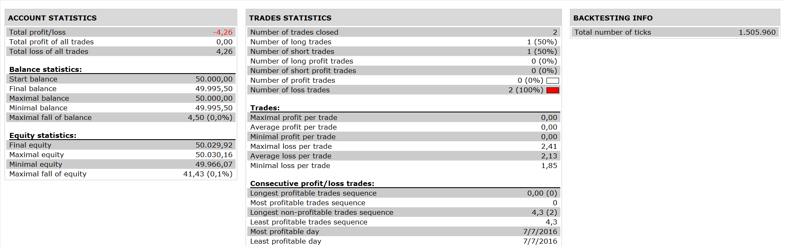

# MA STOCH_MACD STATEGY

> Source: https://fxcodebase.com/code/viewtopic.php?f=31&t=63998  
> Forum: 31 · Topic 63998 · 2 post(s)

---

## MA STOCH_MACD STATEGY

**Apprentice** · Thu Oct 20, 2016 6:32 am

 

INDICATORS
1. MA PERIOD 200
2. STOCHASTIC WITH DEFAULT PARAMETERS
3. MACD WITH DEFAULT PARAMETERS
DATA SOURCE WILL BE STOCHASTIC D LINE
BUY LEVEL:0
SELL LEVEL:0

Open Long
1. PRICE > MA {AND}
2. MACD > SIGNAL AND SIGNAL < BUY LEVEL {AND}
3.STOCHATIC K CROSS OVER STOCHASTIC D LINE

Open Short
1. PRICE< MA {AND}
2. MACD<SIGNAL AND SIGNAL> SELL LEVEL {AND}
3. STOCHATIC K CROSS UNDER STOCHASTIC D LINE.

 [MA STOCH_MACD STATEGY.lua](files/108701/MA%20STOCH_MACD%20STATEGY.lua)

The Strategy was revised and updated on January 18, 2019.

---

## Re: MA STOCH_MACD STATEGY

**Apprentice** · Sun Dec 18, 2016 7:34 am

Strategy was revised and updated.
