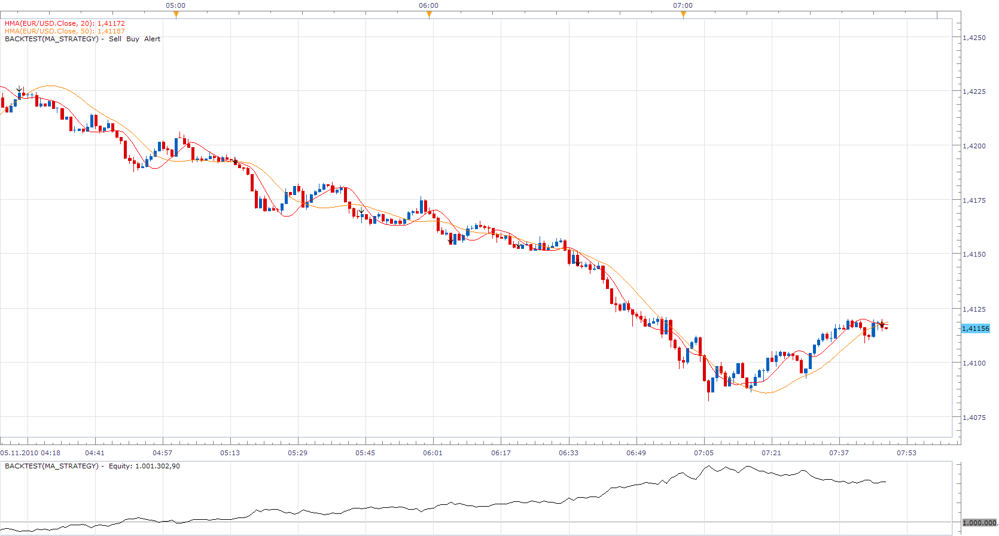
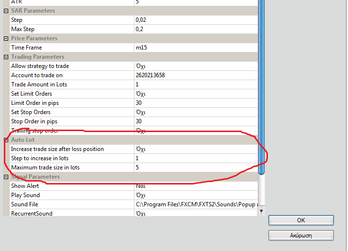
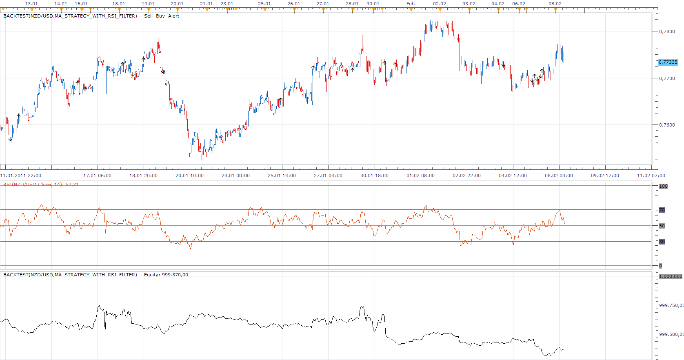

# MA Strategy

> Source: https://fxcodebase.com/code/viewtopic.php?f=31&t=2602  
> Forum: 31 · Topic 2602 · 36 post(s)

---

## MA Strategy

**Apprentice** · Fri Nov 05, 2010 7:07 am

This is a strategy that is pre-installed inside the platform,
known as the MA Advisor.

I have changed the name to make it able to install it.

I have added HMA indicator, verification,
which ensures that the faster moving average has a shorter time frame.

Option, which can determine the type of position, which strategy will open, Long, Short or Both.

 [ma_strategy.lua](files/5845/ma_strategy.lua)

The Strategy was revised and updated on December 17, 2018.

---

## Re: MA Strategy

**SNT1983** · Sun Nov 07, 2010 10:50 am

Hi,

Can I receive trading opened buy email?

---

## Re: MA Strategy

**Apprentice** · Sun Nov 07, 2010 11:04 am

Added to the developmental cue.

---

## Re: MA Strategy

**SNT1983** · Thu Nov 18, 2010 4:04 am

hi,

why this strategy open trades at the end of the candle and not in real time? I've used chart in h4.

what have I to do to open in real time at the moment of crossing?

13257405	**EUR/USD	10,000	11/8/10 2:00 PM**	1.39432 Mkt 11/8/10 2:57 PM 1.39028	29.06	0.00	0.00	0.00	29.06	L

13290095	**GBP/USD	10,000	11/9/10 6:00 PM**	1.60378 Mkt 11/9/10 6:45 PM 1.60127	18.17	0.00	0.00	0.00	18.17	L

13309733	**USD/CHF	10,000	11/10/10 2:00 PM** 0.97015 Mkt 11/10/10 2:54 PM	0.97272 19.28	0.00	0.00	0.00	19.28	L

13343842	**USD/CAD	10,000	11/11/10 6:00 PM** 1.00677 Mkt 11/12/10 7:38 AM	1.00928 18.32	0.00	-0.18	0.00	18.14	L

13400193	**GBP/USD	10,000	11/15/10 10:00 PM**	1.60510 11/16/10 7:19 AM 1.60259	18.47	0.00	0.00	0.00	18.47	L

---

## Re: MA Strategy

**mazdaq100** · Wed Dec 22, 2010 4:21 am

I'm sorry, this is probably a really novice question, but I am having trouble getting this strategy to work. I have saved the two files above to a directory and loaded the .lua file up through the Manage Custom Strategies.

However, when I try to load up the .rc file through Manage Custom Strategies, the file doesn't appear as it is only looking for .lua files. I have tried running the above strategy but I get an error message and I presume this is because the .rc file hasn't been installed.

Would be very grateful if anyone can help me out on this?

Thanks.

---

## Re: MA Strategy

**Apprentice** · Wed Dec 22, 2010 5:56 am

. rc contains only the localization, it is required when installing the strategy.
After installation of the strategy . rc is no longer needed.

---

## Re: MA Strategy

**mazdaq100** · Wed Dec 22, 2010 6:33 am

Thanks, I realised the reason it wasn't working was I didn't have the HMA indicator installed. Sorry, all working now.

---

## Re: MA Strategy

**Rpleandro** · Thu Dec 30, 2010 2:17 pm

Hi this looks like a good promising strategy, in my back test it more than quadrupled the account in only a month. I don't understand how or when the strategy closes a trade. I want to trade in one direction only ( long or short ) it seems that if a trade opens in one direction, it should close when the moving averages cross back in the opposite direction and wait until they cross back in the original direction and re-enter. So far the strategy opens several positions in the same direction and and closes for no reason. I am thanking you in advance for your help...

---

## Re: MA Strategy

**alepan72** · Sun Jan 23, 2011 2:18 pm

Hi all!
Im thinking that it 's better for traders, to include in all of strategies, the option that increases the lots for every anlucky trade.
Is it possible to add this option?

e.g. as photo below

 

Thanx a lot and kisses from greece!!!

---

## Re: MA Strategy

**alepan72** · Tue Jan 25, 2011 4:24 am

Also, I wonder if it's possible to change the type of stop loss. Can you change the trailling stop option to a simple stop order? The trailling methode can be added as extra fuction....
Thanx for your services!

---

## Re: MA Strategy

**basicstrategy** · Mon Feb 07, 2011 5:51 am

Hi,

i would like to know how to add a RSI filter to this strategy (in the code):

when RSI > 50, only allow buy entries when the fast ma crosses above the slow ma
when RSI < 50, only allow sell entries when the fast ma crosses below the slow ma

Thank you very much in advance.

BasicStrategy

---

## Re: MA Strategy

**Apprentice** · Mon Feb 07, 2011 10:27 am

I'll write you an example tomorrow.

---

## Re: MA Strategy

**basicstrategy** · Tue Feb 08, 2011 3:01 am

thank you very very much Apprentice )

---

## Re: MA Strategy

**Apprentice** · Tue Feb 08, 2011 7:16 am

MA Strategy with RSI Filter

 

 [ma_strategy_with_rsi_filter.lua](files/8010/ma_strategy_with_rsi_filter.lua)

---

## Re: MA Strategy

**basicstrategy** · Tue Feb 08, 2011 9:09 am

thank you VERY MUCH Apprentice, you are the best !

---

## Re: MA Strategy

**basicstrategy** · Thu Feb 10, 2011 5:32 am

Apprentice, your addition of RSI as filter really reduces the losses ! Thank you !!

Please, would you mind adding a "Set Stop Loss" parameter ? (there is already a "Set Limit" and a "Set Trailing Stop" but no "Set Stop Loss" yet).

Thank you very much in advance.

BasicStrategy

---

## Re: MA Strategy

**basicstrategy** · Thu Feb 10, 2011 5:20 pm

Hi Apprentice,

i have another idea regarding a filter to only buy when the trend is up and to only sell when the trend is down using 3 moving averages (fast (F), slow (S) and very slow (VS) ) :

case 1 : Fast crossover Slow above VerySlow = buy
case 2 : Fast crossdown Slow above VerySlow = do nothing
case 3 : Fast crossdown Slow below VerySlow = sell
case 4 : Fast crossover Slow below VerySlow = do nothing

i would be very thankfull for your help in coding this (i'm sure it's a piece of cake for you ...)

Thank you very much in advance.

basicStrategy

---

## Re: MA Strategy

**Apprentice** · Fri Feb 11, 2011 4:47 am

Added to developmental cue.

---

## Re: MA Strategy

**basicstrategy** · Sat Feb 12, 2011 8:52 am

Apprentice,

I have an even better idea (slight modification) :

case 1 : Fast crossover Slow above VerySlow = buy
case 2 : Fast crossdown Slow above VerySlow = [b]close long positions[/b]
case 3 : Fast crossdown Slow below VerySlow = sell
case 4 : Fast crossover Slow below VerySlow = **close short positions**

Thank you again for your hard work and your help

BasicStrategy

---

## Re: MA Strategy

**Apprentice** · Mon Feb 14, 2011 8:19 am

Requested can be found here.
[viewtopic.php?f=31&t=3402](https://fxcodebase.com/code/viewtopic.php?f=31&t=3402)

---

## Re: MA Strategy

**basicstrategy** · Mon Feb 14, 2011 12:15 pm

once again thank you very much for your help Apprentice
you are very kind !
basicstrategy

---

## Re: MA Strategy

**basicstrategy** · Fri Feb 18, 2011 10:46 am

hi, it's me again ...

can you add "Averages.lua" in MA_ADVISOR (MA Strategy) or at least NONLAGMA2.lua please ?

thank you very much in advance.

BasicStrategy

---

## Re: MA Strategy

**darth4X** · Tue Jun 07, 2011 8:45 am

I certainly appreciate this Apprentice! This does exactly what I thought it would...I was wondering however, when I set the variable to allow this strategy to trade, it enters the orders but does not include the stops/limit orders even though I have set the variable for it to do so. Am I missing something? Thanks a million!

---

## Re: MA Strategy

**Apprentice** · Tue Jun 07, 2011 11:25 am

As far as I know, Us citizens can not have this type of orders.

---

## Re: MA Strategy

**Apprentice** · Wed Jun 15, 2011 1:29 pm

Stop/Limit Bug Fixed

---

## Re: MA Strategy

**Raygeek** · Wed Jun 03, 2015 11:10 am

Hi Apprentice,

I am using this strategy but it seems that the choice on direction of trade (Both, Long or Short) is not working : would you mind taking a look ?

Thank you very much

---

## Re: MA Strategy

**Raygeek** · Thu Jun 04, 2015 12:32 am

Hello Apprentice,
Yesterday I asked you to check into the selection for the trade direction (Long, Short or Both) but I figure it is because of the way I use the strategy. Let me explain :
I am using this strategy to generate trades on the change of direction of the Hull moving average (HMA).
I do this by selecting the same indicator (HMA) with the same period with no shift on the fast MA and a shift of 1 on the slow MA.
The trades are properly generated in the right direction but I cannot limit them to Long only or Short only.
Can you see a way to remedy this ?

Thank you

Raygeek

---

## Re: MA Strategy

**Apprentice** · Fri Jun 05, 2015 6:54 am

If I understand you, you want to add Shift option.

Can you define all the trading conditions for such a strategy.
if ... then
Buy
if ... then
Sell

---

## Re: MA Strategy

**Raygeek** · Thu Jun 18, 2015 4:15 pm

Hi, Apprentice, sorry to come back late, I am abroad right now.

The shift option, as you call it, exists already as a field in the definition of the fast and the slow moving averages that are being used this MA Strategy.

When you set the shift to 0 on the fast MA and 1 on the slow MA, EVERY OTHER FIELD BEING IDENTICAL, it allows to capture the change of direction on an INDIVIDUAL MA.

The system captures the change of direction properly when doing that, so no problem there (i.e. it goes long when HMA (x) shift (0) crosses UP HMA (x) shift (1) and inversely when it crosses down.

The only problem is that I cannot set the strategy to go ONLY long or ONLY short, it remains active in both directions whatever the choice in the setup.

My guess is that, since the system compares the SAME MA with itself (even though one is shifted one time period), it cannot decide if it is a long or short postion.

A change in the calculation process to appropriately capture the value of the MA when shifted (1) period might help.

Hope this is clearer.

00000000000000000000000000000000

Ultimately, I wish to combine the following conditions:

1. Go ONLY LONG when HULL MA (x) turns positive (see above) AND SUPERTREND (y,z) is positive.

2. Go ONLY SHORT when HULL MA (x) turns negative (see above) AND SUPERTREND (y,z) is negative.

Hope you can help.

All the best

Thanks a lot

Raygeek

---

## Re: MA Strategy

**Raygeek** · Mon Jun 29, 2015 4:35 pm

Hi Apprentice,

Please disregard my latest requests, I have gone further with my designs and backtests and have come to the conclusion that the ultimate engine that I would like to use would work differently, actually using super trend as major indicator with extra conditions.

As a consequence, I will post my request in the NR Supertrend post.

Sorry for disturbance if any.

Best Regards

Raygeek

---

## Re: MA Strategy

**Enchantinggust** · Tue Aug 11, 2015 7:40 am

Hello, I'm new to coding LUA and was hoping you could add Ehler's super smoother filter to the list of indicators. I tried doing it by myself, but couldn't get the strategy to read the already imported Ehler's super smoother filter indicator already posted on the forum.

Thanks

---

## Re: MA Strategy

**Apprentice** · Sun Aug 16, 2015 4:57 am

Can you provide indicator link.

---

## Re: MA Strategy

**Enchantinggust** · Mon Aug 17, 2015 7:31 pm

[http://fxcodebase.com/code/viewtopic.php?f=17&t=61032&p=100148&hilit=Super#p100148](https://fxcodebase.com/code/viewtopic.php?f=17&t=61032&p=100148&hilit=Super#p100148)

---

## Re: MA Strategy

**Janine4lane** · Tue Aug 18, 2015 9:25 am

> **Apprentice wrote:**
>
>
> ma_strategy.png
>
>
>
> This is a strategy that is pre-installed inside the platform,
> known as the MA Advisor.
>
> I have changed the name to make it able to install it.
>
> I have added HMA indicator, verification,
> which ensures that the faster moving average has a shorter time frame.
>
> Option, which can determine the type of position, which strategy will open, Long, Short or Both.
>
>
>
> ma_strategy.lua

Hi - I am very keen on this strategy but can I ask for some alterations - I am new to this site so who do I contact for this - thanks

---

## Re: MA Strategy

**Apprentice** · Thu Aug 20, 2015 6:45 am

Can you specify, alternatives we are talking about.

---

## Re: MA Strategy

**Apprentice** · Tue Dec 13, 2016 4:48 am

Strategy was revised and updated.
