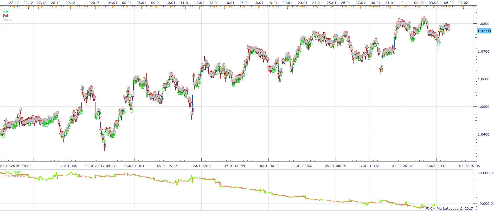
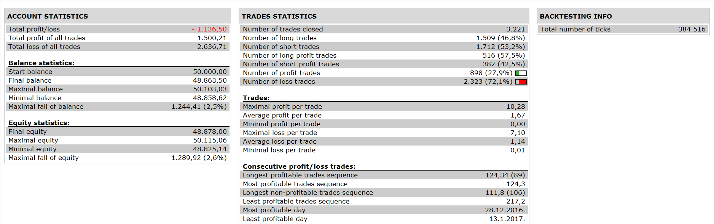

# MA TRADE VOLUME INDEX STRATEGY

> Source: https://fxcodebase.com/code/viewtopic.php?f=31&t=64824  
> Forum: 31 · Topic 64824 · 1 post(s)

---

## MA TRADE VOLUME INDEX STRATEGY

**Apprentice** · Fri Jun 23, 2017 5:39 am

 

Open Long:
TVI> TMVA
PRICE CROSS OVER MA of Low
Open Short:
TVI< TMVA
PRICE CROSS UNDER MA of High

 [MA TRADE VOLUME INDEX STRATEGY.lua](files/113056/MA%20TRADE%20VOLUME%20INDEX%20STRATEGY.lua)

Trade Volume Index Is available here.
[viewtopic.php?f=17&t=60565&p=113045#p113045](https://fxcodebase.com/code/viewtopic.php?f=17&t=60565&p=113045#p113045)

The Strategy was revised and updated on January 19, 2019.
