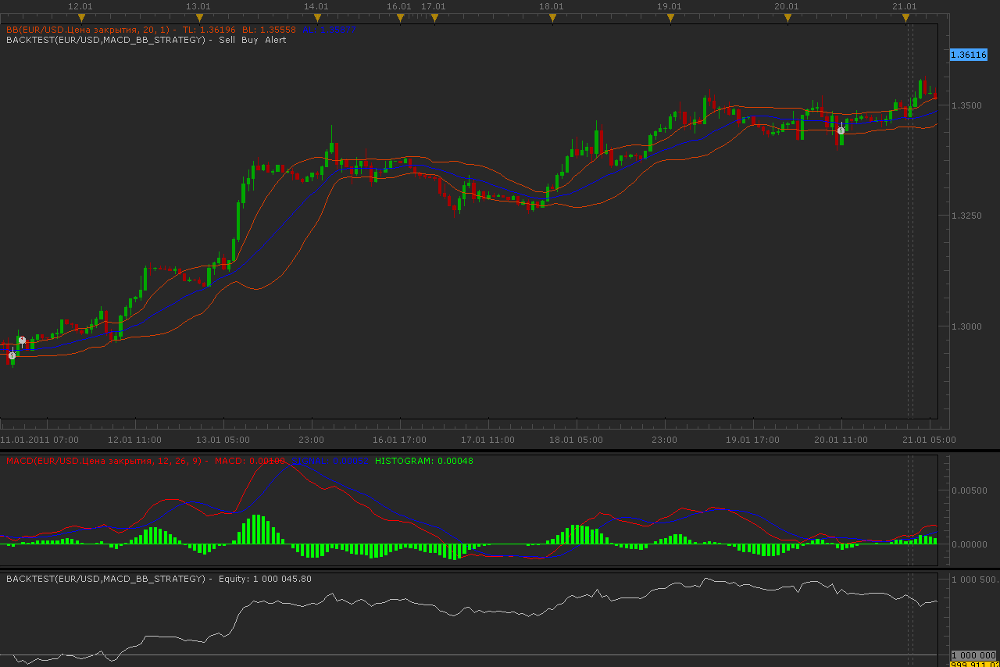
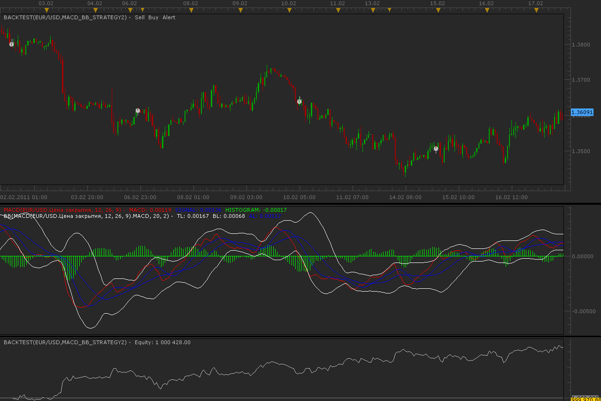

# MACD and Bollinger Bands strategy

> Source: https://fxcodebase.com/code/viewtopic.php?f=31&t=3348  
> Forum: 31 · Topic 3348 · 13 post(s)

---

## MACD and Bollinger Bands strategy

**Alexander.Gettinger** · Tue Feb 08, 2011 4:12 am

Strategy based on 2 indicators: MACD and Bollinger Bands.

BUY condition:
MACD lines crosses over BB top line.

SELL condition:
MACD lines crosses under BB bottom line.

 

Download:

 [MACD_BB_Strategy.lua](files/8002/MACD_BB_Strategy.lua)

The Strategy was revised and updated on December 10, 2018.

---

## Re: MACD and Bollinger Bands strategy

**psaros** · Tue Feb 08, 2011 1:19 pm

thank you but this is not the result I expected:
 the strategy: Buy when the MACD indicator crosses the upper Bollinger
 sale if the MACD indicator crosses down the lower Bollinger

---

## Re: MACD and Bollinger Bands strategy

**Alexander.Gettinger** · Thu Feb 10, 2011 3:44 am

You draw Bollinger bands on base MACD?
If this possible, please, post the picture.

---

## Re: MACD and Bollinger Bands strategy

**psaros** · Thu Feb 10, 2011 3:49 pm

picture macd with bands bollinger

---

## Re: MACD and Bollinger Bands strategy

**Alexander.Gettinger** · Fri Feb 18, 2011 12:15 am

Bolinger Bands use MACD as source data.

BUY condition:
MACD lines crosses over BB top line.

SELL condition:
MACD lines crosses under BB bottom line.

 

Download:

 [MACD_BB_Strategy2.lua](files/8217/MACD_BB_Strategy2.lua)

---

## Re: MACD and Bollinger Bands strategy

**Hybrid** · Fri Feb 18, 2011 10:10 am

Alexander,

Would you please post the BB MACD Oscillator that appears on the screenshot in your last post.

Thank you.

---

## Re: MACD and Bollinger Bands strategy

**Hybrid** · Sat Feb 19, 2011 12:17 pm

Alexander,

Please disregard my last request. I figured out that all I have to do is to change the data source.

---

## Re: MACD and Bollinger Bands strategy

**psaros** · Mon Feb 21, 2011 5:35 am

it's OK
Thank you for your help

---

## Re: MACD and Bollinger Bands strategy

**amorgos89** · Mon Apr 14, 2014 9:58 am

hello,
is it possible to have strategy:
buy when macd crosses over low bollinger
sell when macd crosses under up bollinger
thank you

---

## Re: MACD and Bollinger Bands strategy

**superleo** · Mon Apr 14, 2014 5:17 pm

CAN YOU ADD EMA 200 WITH THIS STRATEGY AS FOLLOWS

INDICATORS:

1.MACD WITH DEFAULT PARAMETERS

2.BOLLIGER BAND USES MACD AS SOURCE

3.MA(PREFERABLY EMA)
PERIOD:200
**BUY: SOURCE( CLOSE) > MA AND MACD CROSSES OVER UPPER BAND
SELL: SOURCE(CLOSE)< MA AND MACD CROSSES UNDER LOWER BAND**

---

## Re: MACD and Bollinger Bands strategy

**Apprentice** · Tue Apr 15, 2014 12:03 pm

Your request is added to the development list.

---

## Re: MACD and Bollinger Bands strategy

**Apprentice** · Fri Apr 18, 2014 6:49 am

Requested can be found here.
[viewtopic.php?f=31&t=60556&p=93581#p93581](https://fxcodebase.com/code/viewtopic.php?f=31&t=60556&p=93581#p93581)

---

## Re: MACD and Bollinger Bands strategy

**Apprentice** · Sun Dec 11, 2016 5:02 am

Strategy was revised and updated.
