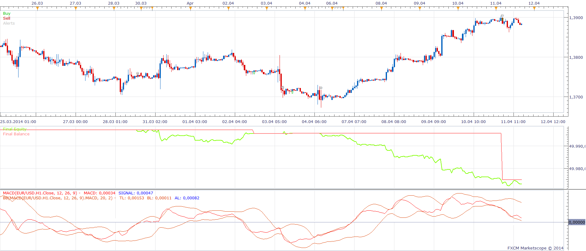

# MACD BB Strategy

> Source: https://fxcodebase.com/code/viewtopic.php?f=31&t=60557  
> Forum: 31 · Topic 60557 · 2 post(s)

---

## MACD BB Strategy

**Apprentice** · Fri Apr 18, 2014 9:18 am

Partly based on this request.
[viewtopic.php?f=27&t=60517](https://fxcodebase.com/code/viewtopic.php?f=27&t=60517)

INDICATORS
1.MACD
2.BOLLIGER BAND USES MACD OF CLOSE AS SOURCE

Open Long
 MACD Crosses Over Lower BB Band
MACD > 0
Open Short
MACD Crosses Under Upper BB Band
MACD < 0

Exit Long
Top Line CrossUnder

Exit Short
Bottom Line CrossOver

Strategy is designed as End of turn Instance.
Trades will executed as the very end of the current period.

Exit function will not affect the position of other Strategys.

 [MACD BB Strategy.lua](files/93585/MACD%20BB%20Strategy.lua)

The Strategy was revised and updated on December 11, 2018.

---

## Re: MACD BB Strategy

**Apprentice** · Sun Dec 11, 2016 5:38 am

Strategy was revised and updated.
